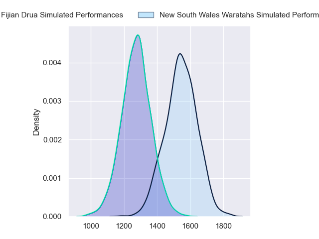
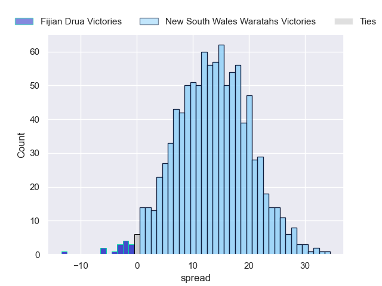
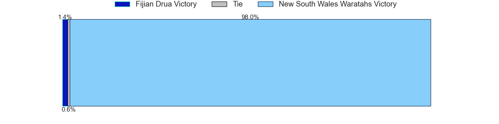

---  
layout: page  
title: Fijian Drua at New South Wales Waratahs  
date: 2023-05-20 05:35:00 18:00:00 -0500  
categories: match projection  
---
# Fijian Drua at New South Wales Waratahs

# Club Level Predictions

The first set of predictions treats a club as the smallest object, as the club develops its members, organizes a gameplan, and deploys its players as needed for each match. This club model has a prediction of 0.811, which translates to predicting New South Wales Waratahs to win by 13.5.

Each club has a rating and a rating deviation (simiar to a Glicko system), and expected performances can be generated. This allows for simulated matches and spreads like the ones below.
## Projected Performances

## Projected Spreads

## Projected Results

# Player Level Predictions

Treating teams instead as an entity made up of the currently active players, I have ratings for each player in an altogether different system. These can be combined to form team ratings once teamsheets are announced, weighting starters a bit higher than the reserves. After the match is played, players can be weighted by their minutes on the field, allowing for an accurate measure of the team's composition. With these compiled team ratings, we can make predictions, measure inaccuracy, and update the individual player ratings.
## Prediction without Player Minutes: New South Wales Waratahs by 9.1

New South Wales Waratahs by 5.1 on a neutral field

| Away Player             |   Away elo |   Away Percentile |   Number |   Home Percentile |   Home elo | Home Player          |
|:------------------------|-----------:|------------------:|---------:|------------------:|-----------:|:---------------------|
| Haereiti Hetet          |      95.95 |                86 |        1 |                81 |      91.94 | Tetera Faulkner      |
| Tevita Ikanivere        |     112.7  |                96 |        2 |                93 |     104.89 | Dave Porecki         |
| Jone Koroiduadua        |      86.37 |                70 |        3 |                70 |      86.58 | Harry Johnson-Holmes |
| Isoa Nasilasila         |     113.54 |                95 |        4 |                51 |      77.37 | Jed Holloway         |
| Te Ahiwaru Cirikidaveta |     105.26 |                90 |        5 |                85 |      98.88 | Hugh Sinclair        |
| Joseva Tamani           |      69.63 |                35 |        6 |                79 |      92.51 | Will Harris          |
| Vilive Miramira         |      75.69 |                47 |        7 |                99 |     141.75 | Michael Hooper       |
| Ratu Meli Derenalagi    |      93.91 |                80 |        8 |                76 |      90.51 | Langi Gleeson        |
| Peni Matawalu           |      88.31 |                71 |        9 |                95 |     113.48 | Jake Gordon          |
| Caleb Muntz             |      74.07 |                45 |       10 |                65 |      87.32 | Ben Donaldson        |
| Taniela Rakuro          |      77.56 |                53 |       11 |                90 |     103.14 | Dylan Pietsch        |
| Kalaveti Ravouvou       |     138.32 |                99 |       12 |                53 |      81.57 | Joey Walton          |
| Iosefo Masi             |      82.11 |                57 |       13 |                48 |      77.03 | Izaia Perese         |
| Selestino Ravutaumada   |      77.64 |                54 |       14 |                80 |      93.37 | Mark Nawaqanitawase  |
| Ilaisa Droasese         |      89.51 |                69 |       15 |                88 |     106.24 | Max Jorgensen        |
| Zuriel Togiatama        |      76.5  |                51 |       16 |                 8 |      50.26 | Mahe Vailanu         |
| Elia Canakaivata        |      79.18 |                53 |       20 |                59 |      81.15 | Taleni Seu           |
| Apisalome Vota          |      99.07 |                84 |       23 |                63 |      86.74 | Harry Wilson         |

