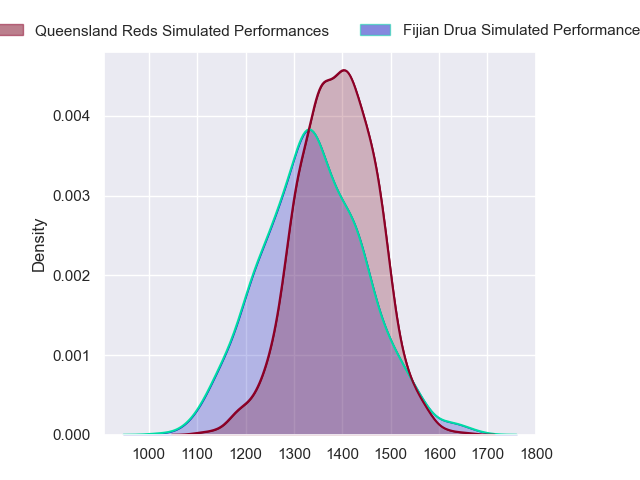
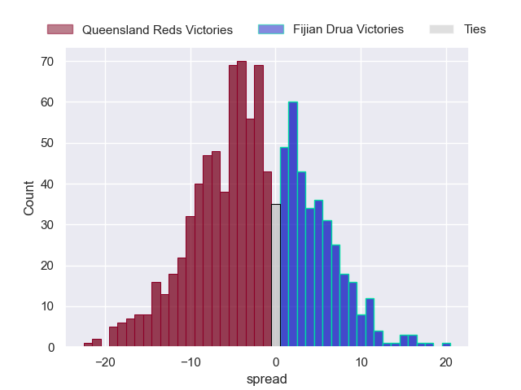

---  
layout: page  
title: Queensland Reds at Fijian Drua  
date: 2023-06-03 00:35:00 18:00:00 -0500  
categories: match projection  
---
# Queensland Reds at Fijian Drua

# Club Level Predictions

The first set of predictions treats a club as the smallest object, as the club develops its members, organizes a gameplan, and deploys its players as needed for each match. This club model has a prediction of 0.432, which translates to predicting Queensland Reds to win by 2.4.

Each club has a rating and a rating deviation (simiar to a Glicko system), and expected performances can be generated. This allows for simulated matches and spreads like the ones below.
## Projected Performances

## Projected Spreads

## Projected Results

# Player Level Predictions

Treating teams instead as an entity made up of the currently active players, I have ratings for each player in an altogether different system. These can be combined to form team ratings once teamsheets are announced, weighting starters a bit higher than the reserves. After the match is played, players can be weighted by their minutes on the field, allowing for an accurate measure of the team's composition. With these compiled team ratings, we can make predictions, measure inaccuracy, and update the individual player ratings.
## Prediction without Player Minutes: Queensland Reds by 7.1

Queensland Reds by 11.1 on a neutral field

| Away Player      |   Away elo |   Away Percentile |   Number |   Home Percentile |   Home elo | Home Player           |
|:-----------------|-----------:|------------------:|---------:|------------------:|-----------:|:----------------------|
| Peni Ravai       |      89.9  |                77 |        1 |                84 |      94.25 | Haereiti Hetet        |
| Matt Faessler    |      80.17 |                58 |        2 |                96 |     111.71 | Tevita Ikanivere      |
| Zane Nonggorr    |      91.18 |                79 |        3 |                17 |      61.62 | Mesake Doge           |
| Angus Blyth      |     109.41 |                93 |        4 |                95 |     115.76 | Isoa Nasilasila       |
| Ryan Smith       |      86.8  |                69 |        5 |                32 |      70.37 | Ratu Rotuisolia       |
| Seru Uru         |      75.47 |                43 |        6 |                23 |      64.72 | Joseva Tamani         |
| Fraser McReight  |      68.3  |                30 |        7 |                22 |      64.06 | Vilive Miramira       |
| Harry Wilson     |     102.1  |                88 |        8 |                60 |      83.33 | Ratu Meli Derenalagi  |
| Tate McDermott   |      97.34 |                82 |        9 |                40 |      74.13 | Frank Lomani          |
| James O'Connor   |      83.45 |                60 |       10 |                35 |      71.93 | Caleb Muntz           |
| Filipo Daugunu   |     104.78 |                90 |       11 |                99 |     137.95 | Kalaveti Ravouvou     |
| Hunter Paisami   |     113.77 |                94 |       12 |                81 |      97.48 | Teti Tela             |
| Josh Flook       |      75.99 |                46 |       13 |                31 |      69.65 | Iosefo Masi           |
| Suliasi Vunivalu |      95.62 |                81 |       14 |                44 |      75.13 | Eroni Sau             |
| Jock Campbell    |      87.57 |                65 |       15 |                28 |      67.34 | Selestino Ravutaumada |
| Dane Zander      |      86.81 |                81 |       17 |                65 |      81.95 | Meli Tuni             |
| Sef Fa'agase     |      85.97 |                67 |       18 |                36 |      70.79 | Samuela Tawake        |
| Lopeti Faifua    |      87.08 |                64 |       20 |                52 |      77.75 | Elia Canakaivata      |
| Kalani Thomas    |      88.96 |                72 |       21 |                68 |      87.37 | Peni Matawalu         |
| Lawson Creighton |      88.58 |                68 |       23 |                52 |      78.25 | Michael Naitokani     |

