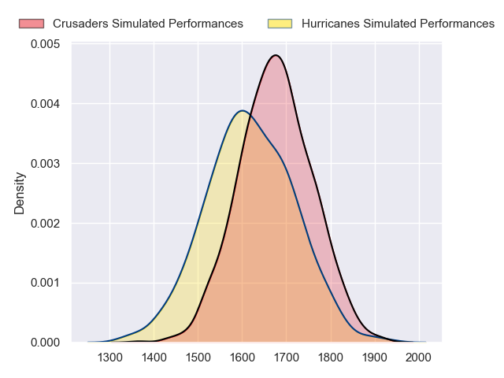
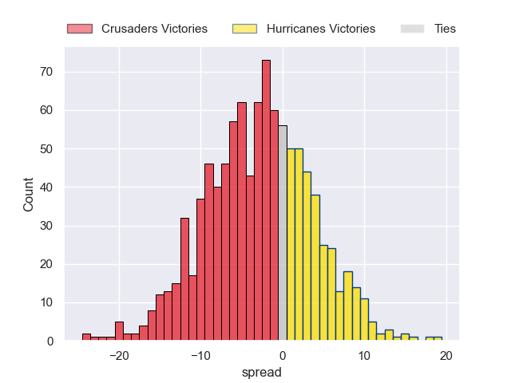

---  
layout: page  
title: Crusaders at Hurricanes  
date: 2023-06-03 03:05:00 18:00:00 -0500  
categories: match projection  
---
# Crusaders at Hurricanes

# Club Level Predictions

The first set of predictions treats a club as the smallest object, as the club develops its members, organizes a gameplan, and deploys its players as needed for each match. This club model has a prediction of 0.418, which translates to predicting Crusaders to win by 2.9.

Each club has a rating and a rating deviation (simiar to a Glicko system), and expected performances can be generated. This allows for simulated matches and spreads like the ones below.
## Projected Performances

## Projected Spreads

## Projected Results

# Player Level Predictions

Treating teams instead as an entity made up of the currently active players, I have ratings for each player in an altogether different system. These can be combined to form team ratings once teamsheets are announced, weighting starters a bit higher than the reserves. After the match is played, players can be weighted by their minutes on the field, allowing for an accurate measure of the team's composition. With these compiled team ratings, we can make predictions, measure inaccuracy, and update the individual player ratings.
## Prediction without Player Minutes: Crusaders by 0.8

Crusaders by 4.8 on a neutral field

| Away Player            |   Away elo |   Away Percentile |   Number |   Home Percentile |   Home elo | Home Player         |
|:-----------------------|-----------:|------------------:|---------:|------------------:|-----------:|:--------------------|
| Tamaiti Williams       |      98.07 |                88 |        1 |                86 |      97.11 | Tevita Mafileo      |
| Codie Taylor           |      93.52 |                81 |        2 |                98 |     120.75 | Dane Coles          |
| Quinten Strange        |      75.68 |                44 |        4 |                66 |      85.37 | James Blackwell     |
| Sam Whitelock          |     111.7  |                94 |        5 |                83 |      95.6  | Caleb Delany        |
| Scott Barrett          |     127.44 |                98 |        6 |                71 |      87.54 | Devan Flanders      |
| Tom Christie           |     103.86 |                90 |        7 |                82 |      94.45 | Du'Plessis Kirifi   |
| Christian Lio-Willie   |      83.57 |                63 |        8 |                97 |     117.93 | Ardie Savea         |
| Mitchell Drummond      |      88.87 |                70 |        9 |                80 |      94.88 | Cam Roigard         |
| Richie Mo'unga         |     141.78 |                99 |       10 |                79 |      95.95 | Brett Cameron       |
| Leicester Fainga'anuku |      78.98 |                51 |       11 |                93 |     109.24 | Kini Naholo         |
| Jack Goodhue           |      98.79 |                83 |       12 |                92 |     107.36 | Jordie Barrett      |
| Braydon Ennor          |     104.84 |                89 |       13 |                93 |     110.23 | Billy Proctor       |
| Dallas McLeod          |     105.27 |                91 |       14 |                14 |      58.25 | Daniel Sinkinson    |
| Will Jordan            |     125.02 |                96 |       15 |                58 |      84.51 | Joshua Moorby       |
| Brodie McAlister       |     105.44 |                91 |       16 |                73 |      88.3  | Jacob Devery        |
| Kershawl Sykes-Martin  |      91.95 |                80 |       17 |                62 |      83.36 | Pouri Rakete-Stones |
| Zach Gallagher         |      90.96 |                73 |       19 |                92 |     108.08 | Justin Sangster     |
| Sione Havili           |      76.12 |                45 |       20 |                11 |      56.23 | Brayden Iose        |
| Chay Fihaki            |     111.72 |                94 |       23 |                83 |      98.96 | Bailyn Sullivan     |

