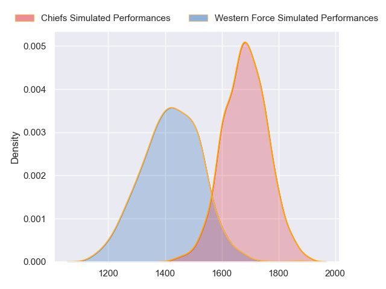
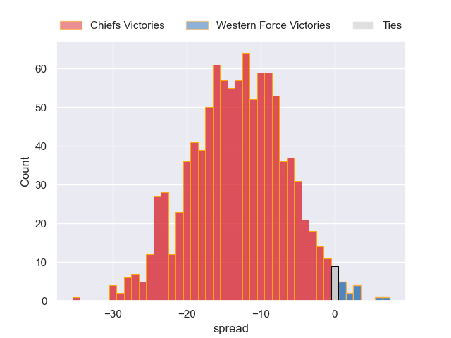
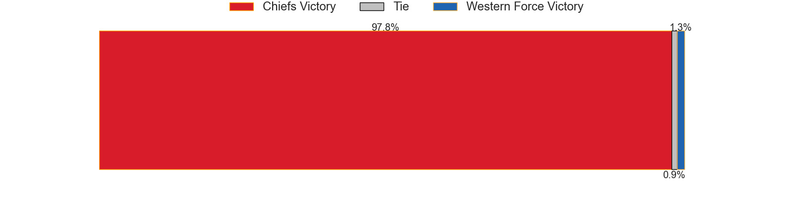

---  
layout: page  
title: Chiefs at Western Force  
date: 2023-06-03 08:00:00 18:00:00 -0500  
categories: match projection  
---
# Chiefs at Western Force

# Club Level Predictions

The first set of predictions treats a club as the smallest object, as the club develops its members, organizes a gameplan, and deploys its players as needed for each match. This club model has a prediction of 0.196, which translates to predicting Chiefs to win by 13.1.

Each club has a rating and a rating deviation (simiar to a Glicko system), and expected performances can be generated. This allows for simulated matches and spreads like the ones below.
## Projected Performances

## Projected Spreads

## Projected Results

# Player Level Predictions

Treating teams instead as an entity made up of the currently active players, I have ratings for each player in an altogether different system. These can be combined to form team ratings once teamsheets are announced, weighting starters a bit higher than the reserves. After the match is played, players can be weighted by their minutes on the field, allowing for an accurate measure of the team's composition. With these compiled team ratings, we can make predictions, measure inaccuracy, and update the individual player ratings.
## Prediction without Player Minutes: Chiefs by 3.6

Chiefs by 7.6 on a neutral field

| Away Player            |   Away elo |   Away Percentile |   Number |   Home Percentile |   Home elo | Home Player           |
|:-----------------------|-----------:|------------------:|---------:|------------------:|-----------:|:----------------------|
| Ollie Norris           |      94.32 |                85 |        1 |                46 |      76.21 | Angus Wagner          |
| Tyrone Thompson        |      88.7  |                75 |        2 |                95 |     109.91 | Folau Fainga'a        |
| John Ryan              |     100.81 |                90 |        3 |                73 |      87.98 | Santiago Medrano      |
| Laghlan McWhannell     |     102.36 |                88 |        4 |                48 |      77.75 | Jeremy Williams       |
| Naitoa Ah Kuoi         |     105.32 |                91 |        6 |                80 |      93.53 | Michael Wells         |
| Simon Parker           |      73.73 |                42 |        7 |                72 |      88.12 | Carlo Tizzano         |
| Samipeni Finau         |     106.7  |                92 |        8 |                85 |      99.9  | Rahboni Vosayaco      |
| Te Toiroa Tahuriorangi |      93.91 |                77 |        9 |                89 |     103.6  | Gareth Simpson        |
| Rameka Poihipi         |      97.77 |                81 |       10 |                53 |      80.85 | Max Burey             |
| Etene Nanai-Seturo     |      96.22 |                82 |       11 |                88 |     103.31 | Manasa Mataele        |
| Anton Lienert-Brown    |     119.17 |                97 |       12 |                98 |     124.4  | Hamish Stewart        |
| Alex Nankivell         |     103.17 |                88 |       13 |                75 |      92.91 | Sam Spink             |
| Liam Coombes-Fabling   |     100.34 |                86 |       14 |                24 |      64.82 | Zach Kibirige         |
| Shaun Stevenson        |      93.54 |                76 |       15 |                62 |      86.51 | Chase Tiatia          |
| Jared Proffit          |      79.96 |                56 |       17 |                85 |      97.32 | Tom Horton            |
| Atu Moli               |      94.23 |                84 |       18 |                66 |      84.64 | Siosifa Amone         |
| Manaaki Selby-Rickit   |      81.12 |                59 |       19 |                 1 |      37.07 | Felix Kalapu          |
| Pita Gus Sowakula      |      98.34 |                86 |       20 |                27 |      67.33 | Tim Anstee            |
| Cortez Ratima          |     101.1  |                86 |       21 |                75 |      91.82 | Issak Fines-Leleiwasa |

