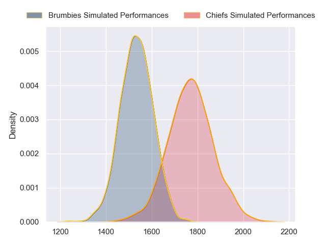
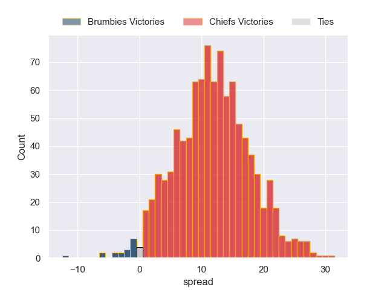

---  
layout: page  
title: Brumbies at Chiefs  
date: 2023-06-17 03:05:00 18:00:00 -0500  
categories: match projection  
---
# Brumbies at Chiefs

# Club Level Predictions

The first set of predictions treats a club as the smallest object, as the club develops its members, organizes a gameplan, and deploys its players as needed for each match. This club model has a prediction of 0.794, which translates to predicting Chiefs to win by 11.8.

Each club has a rating and a rating deviation (simiar to a Glicko system), and expected performances can be generated. This allows for simulated matches and spreads like the ones below.
## Projected Performances

## Projected Spreads

## Projected Results

# Player Level Predictions

Treating teams instead as an entity made up of the currently active players, I have ratings for each player in an altogether different system. These can be combined to form team ratings once teamsheets are announced, weighting starters a bit higher than the reserves. After the match is played, players can be weighted by their minutes on the field, allowing for an accurate measure of the team's composition. With these compiled team ratings, we can make predictions, measure inaccuracy, and update the individual player ratings.
## Prediction without Player Minutes: Chiefs by 14.0

Chiefs by 10.0 on a neutral field

| Away Player      |   Away elo |   Away Percentile |   Number |   Home Percentile |   Home elo | Home Player         |
|:-----------------|-----------:|------------------:|---------:|------------------:|-----------:|:--------------------|
| James Slipper    |     144.33 |               100 |        1 |                77 |      90.06 | Aidan Ross          |
| Lachlan Lonergan |      63.75 |                22 |        2 |                96 |     113.6  | Samisoni Taukei'aho |
| Sefo Kautai      |      86.57 |                71 |        3 |                70 |      83.71 | George Dyer         |
| Nick Frost       |      70.41 |                32 |        4 |                96 |     117.56 | Brodie Retallick    |
| Cadeyrn Neville  |     111.61 |                94 |        5 |                35 |      71.86 | Tupou Vaa'i         |
| Tom Hooper       |      74.55 |                41 |        6 |                91 |     105.31 | Samipeni Finau      |
| Pete Samu        |      87.69 |                68 |        7 |                99 |     131.67 | Sam Cane            |
| Rob Valetini     |     107.06 |                92 |        8 |                99 |     130.77 | Luke Jacobson       |
| Nic White        |     126.79 |                99 |        9 |               100 |     138.68 | Brad Weber          |
| Jack Debreczeni  |      94.66 |                77 |       10 |                58 |      83.03 | Damian McKenzie     |
| Ollie Sapsford   |      84.29 |                64 |       11 |                81 |      95.28 | Etene Nanai-Seturo  |
| Tamati Tua       |      96.18 |                79 |       12 |                97 |     119.28 | Anton Lienert-Brown |
| Len Ikitau       |     104.26 |                89 |       13 |                89 |     103.87 | Alex Nankivell      |
| Andy Muirhead    |     107.5  |                92 |       14 |                57 |      81.28 | Emoni Narawa        |
| Tom Wright       |      96.79 |                77 |       15 |                72 |      91.96 | Shaun Stevenson     |
| Connal McInerney |     120.48 |                97 |       16 |                77 |      90.81 | Tyrone Thompson     |
| Blake Schoupp    |      90.12 |                75 |       17 |                84 |      94.58 | Ollie Norris        |
| Rhys Van Nek     |      83.71 |                61 |       18 |                90 |      99.77 | John Ryan           |
| Darcy Swain      |      78.12 |                51 |       19 |                93 |     106.43 | Naitoa Ah Kuoi      |
| Luke Reimer      |      98.73 |                86 |       20 |                82 |      95.37 | Pita Gus Sowakula   |
| Ryan Lonergan    |      94.74 |                76 |       21 |                85 |     100.07 | Cortez Ratima       |
| Noah Lolesio     |      91.46 |                73 |       22 |                79 |      95.65 | Josh Ioane          |
| Corey Toole      |      74.92 |                43 |       23 |                82 |      97.88 | Rameka Poihipi      |

