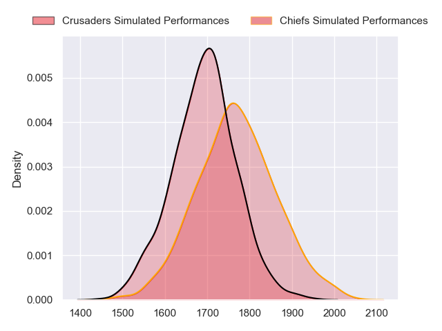
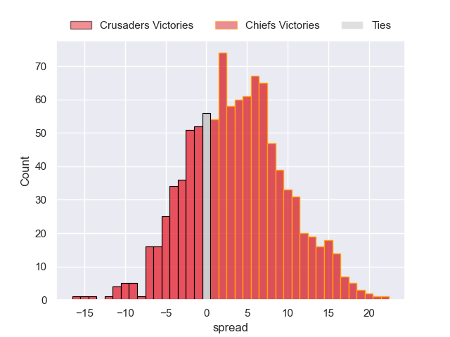

---  
layout: page  
title: Crusaders at Chiefs  
date: 2023-06-24 03:05:00 18:00:00 -0500  
categories: match projection  
---
# Crusaders at Chiefs

# Club Level Predictions

The first set of predictions treats a club as the smallest object, as the club develops its members, organizes a gameplan, and deploys its players as needed for each match. This club model has a prediction of 0.61, which translates to predicting Chiefs to win by 3.8.

Each club has a rating and a rating deviation (simiar to a Glicko system), and expected performances can be generated. This allows for simulated matches and spreads like the ones below.
## Projected Performances

## Projected Spreads

## Projected Results

# Player Level Predictions

Treating teams instead as an entity made up of the currently active players, I have ratings for each player in an altogether different system. These can be combined to form team ratings once teamsheets are announced, weighting starters a bit higher than the reserves. After the match is played, players can be weighted by their minutes on the field, allowing for an accurate measure of the team's composition. With these compiled team ratings, we can make predictions, measure inaccuracy, and update the individual player ratings.
## Prediction without Player Minutes: Chiefs by 2.1

Crusaders by 1.9 on a neutral field

| Away Player            |   Away elo |   Away Percentile |   Number |   Home Percentile |   Home elo | Home Player         |
|:-----------------------|-----------:|------------------:|---------:|------------------:|-----------:|:--------------------|
| Tamaiti Williams       |      92.3  |                81 |        1 |                77 |      89.81 | Aidan Ross          |
| Codie Taylor           |      92.91 |                81 |        2 |                96 |     113.22 | Samisoni Taukei'aho |
| Oli Jager              |     106.36 |                94 |        3 |                60 |      81.54 | George Dyer         |
| Scott Barrett          |     127.87 |                98 |        4 |                95 |     115.88 | Brodie Retallick    |
| Sam Whitelock          |     111.85 |                94 |        5 |                36 |      72.06 | Tupou Vaa'i         |
| Sione Havili           |      78.3  |                52 |        6 |                83 |      97.95 | Pita Gus Sowakula   |
| Tom Christie           |     109.36 |                93 |        7 |                98 |     129.42 | Sam Cane            |
| Christian Lio-Willie   |      89.93 |                72 |        8 |                99 |     130.78 | Luke Jacobson       |
| Mitchell Drummond      |      93.17 |                76 |        9 |               100 |     138.32 | Brad Weber          |
| Richie Mo'unga         |     143.86 |                99 |       10 |                63 |      87.37 | Damian McKenzie     |
| Leicester Fainga'anuku |      80.44 |                56 |       11 |                80 |      94.97 | Etene Nanai-Seturo  |
| Jack Goodhue           |     103.29 |                87 |       12 |                96 |     116.99 | Anton Lienert-Brown |
| Braydon Ennor          |     106.91 |                90 |       13 |                85 |     101.09 | Alex Nankivell      |
| Dallas McLeod          |     107.19 |                91 |       14 |                56 |      80.45 | Emoni Narawa        |
| Will Jordan            |     128.01 |                97 |       15 |                73 |      92.97 | Shaun Stevenson     |
| Kershawl Sykes-Martin  |      93.44 |                79 |       17 |                79 |      90.2  | Ollie Norris        |
| Quinten Strange        |      79.23 |                52 |       19 |                93 |     106.8  | Naitoa Ah Kuoi      |
| Dom Gardiner           |      86.37 |                67 |       20 |                89 |     102.48 | Samipeni Finau      |
| Willi Heinz            |      95.41 |                77 |       21 |                85 |      99.94 | Cortez Ratima       |
| Fergus Burke           |      89.35 |                64 |       22 |                71 |      89.9  | Josh Ioane          |
| Chay Fihaki            |     115.57 |                95 |       23 |                75 |      92.89 | Rameka Poihipi      |

