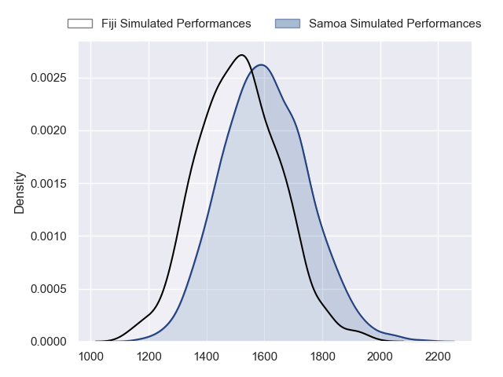
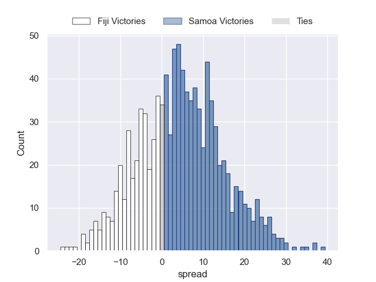
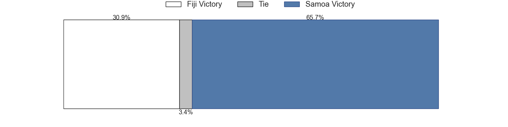

---  
layout: page  
title: Fiji at Samoa  
date: 2023-07-28 22:00:00 18:00:00 -0500  
categories: match projection  
---
# Fiji at Samoa

# Club Level Predictions

The first set of predictions treats a club as the smallest object, as the club develops its members, organizes a gameplan, and deploys its players as needed for each match. This club model has a prediction of 0.627, which translates to predicting Samoa to win by 4.6.

Each club has a rating and a rating deviation (simiar to a Glicko system), and expected performances can be generated. This allows for simulated matches and spreads like the ones below.
## Projected Performances

## Projected Spreads

## Projected Results

# Player Level Predictions

Treating teams instead as an entity made up of the currently active players, I have ratings for each player in an altogether different system. These can be combined to form team ratings once teamsheets are announced, weighting starters a bit higher than the reserves. After the match is played, players can be weighted by their minutes on the field, allowing for an accurate measure of the team's composition. With these compiled team ratings, we can make predictions, measure inaccuracy, and update the individual player ratings.
## Prediction without Player Minutes: Samoa by 2.7

Fiji by 1.3 on a neutral field

| Away Player             |   Away elo |   Away Percentile |   Number |   Home Percentile |   Home elo | Home Player           |
|:------------------------|-----------:|------------------:|---------:|------------------:|-----------:|:----------------------|
| Eroni Mawi              |      47.05 |                 3 |        1 |                41 |      74.94 | Jordan Lay            |
| Te Ahiwaru Cirikidaveta |      91.93 |                71 |        4 |                63 |      86.97 | Chris Vui             |
| Isoa Nasilasila         |     123.65 |                96 |        5 |                79 |      94.08 | Taleni Seu            |
| Ratu Meli Derenalagi    |      84.72 |                61 |        6 |                61 |      83.18 | Steven Luatua         |
| Caleb Muntz             |      78.93 |                46 |       10 |                90 |     110.34 | Christian Leali'ifano |
| Kalaveti Ravouvou       |     142.08 |                99 |       11 |                60 |      84.87 | Tumua Manu            |
| Semi Radradra           |      92.69 |                70 |       12 |                58 |      84.62 | Duncan Paia'aua       |
| Iosefo Masi             |      68.91 |                29 |       13 |                49 |      78.23 | Stacey Ili            |
| Ilaisa Droasese         |      71.73 |                33 |       15 |                41 |      75.15 | Danny Toala           |
| Joseva Tamani           |      67.74 |                26 |       19 |                55 |      82.81 | Brian Alainu'uese     |

