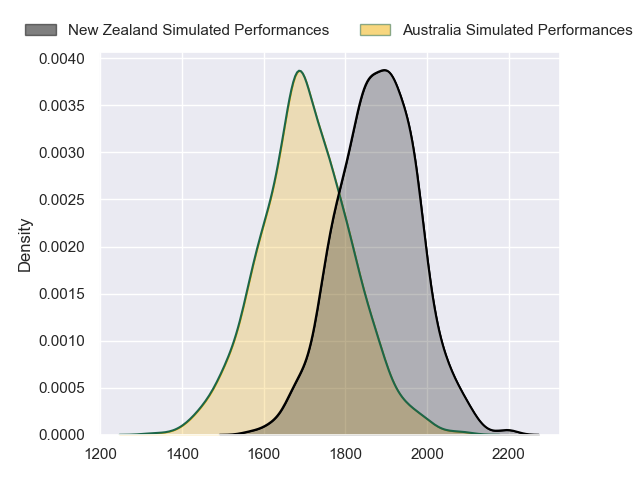
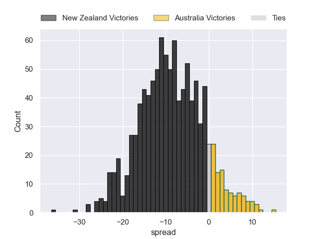
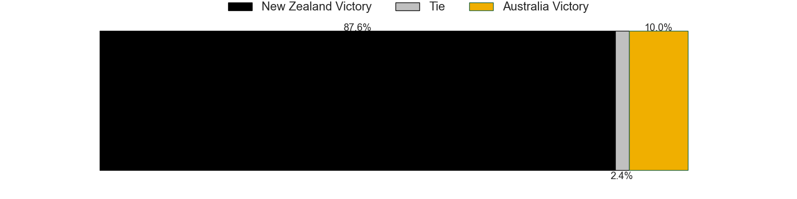

---  
layout: page  
title: New Zealand at Australia  
date: 2023-07-29 05:45:00 18:00:00 -0500  
categories: match projection  
---
# New Zealand at Australia

# Club Level Predictions

The first set of predictions treats a club as the smallest object, as the club develops its members, organizes a gameplan, and deploys its players as needed for each match. This club model has a prediction of 0.282, which translates to predicting New Zealand to win by 8.7.

Each club has a rating and a rating deviation (simiar to a Glicko system), and expected performances can be generated. This allows for simulated matches and spreads like the ones below.
## Projected Performances

## Projected Spreads

## Projected Results

# Player Level Predictions

Treating teams instead as an entity made up of the currently active players, I have ratings for each player in an altogether different system. These can be combined to form team ratings once teamsheets are announced, weighting starters a bit higher than the reserves. After the match is played, players can be weighted by their minutes on the field, allowing for an accurate measure of the team's composition. With these compiled team ratings, we can make predictions, measure inaccuracy, and update the individual player ratings.
## Prediction without Player Minutes: New Zealand by 23.2

New Zealand by 27.2 on a neutral field

| Away Player         |   Away elo |   Away Percentile |   Number |   Home Percentile |   Home elo | Home Player         |
|:--------------------|-----------:|------------------:|---------:|------------------:|-----------:|:--------------------|
| Codie Taylor        |      83.46 |                61 |        2 |                69 |      87.33 | Dave Porecki        |
| Tyrel Lomax         |     124.04 |                98 |        3 |                93 |     107.65 | Allan Alaalatoa     |
| Brodie Retallick    |     107.08 |                89 |        4 |                13 |      59.35 | Nick Frost          |
| Scott Barrett       |     111.32 |                92 |        5 |                60 |      84.77 | Will Skelton        |
| Shannon Frizell     |      86.72 |                67 |        6 |                35 |      72.19 | Jed Holloway        |
| Dalton Papali'i     |      95.88 |                87 |        7 |                37 |      73.19 | Tom Hooper          |
| Ardie Savea         |      98.81 |                82 |        8 |                54 |      81.84 | Rob Valetini        |
| Aaron Smith         |      80.11 |                51 |        9 |                82 |      96.42 | Tate McDermott      |
| Richie Mo'unga      |     133.39 |                98 |       10 |                65 |      81.25 | Carter Gordon       |
| Mark Telea          |      93.43 |                74 |       11 |                34 |      72.32 | Marika Koroibete    |
| Jordie Barrett      |      90.25 |                68 |       12 |                30 |      69.65 | Samu Kerevi         |
| Rieko Ioane         |      67.49 |                25 |       13 |                52 |      82.15 | Jordan Petaia       |
| Will Jordan         |     122.29 |                97 |       14 |                55 |      82.14 | Mark Nawaqanitawase |
| Beauden Barrett     |     130.05 |                97 |       15 |                82 |     101.77 | Andrew Kellaway     |
| Samisoni Taukei'aho |     110.49 |                94 |       16 |                50 |      73.67 | Jordan Uelese       |
| Ofa Tu'ungafasi     |      98.97 |                90 |       17 |                98 |     125.37 | James Slipper       |
| Sam Whitelock       |     113.04 |                93 |       19 |                31 |      70.74 | Richie Arnold       |
| Cam Roigard         |      93.82 |                74 |       21 |                87 |     105.66 | Nic White           |
| Anton Lienert-Brown |     118.55 |                95 |       22 |                15 |      60.06 | Quade Cooper        |
| Caleb Clarke        |      82.11 |                56 |       23 |                44 |      76.5  | Izaia Perese        |

