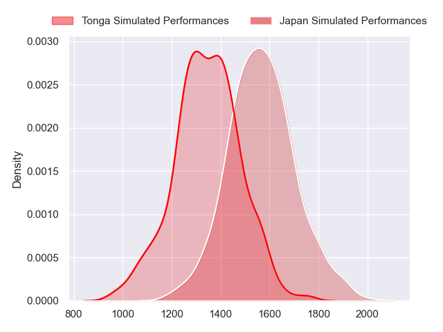
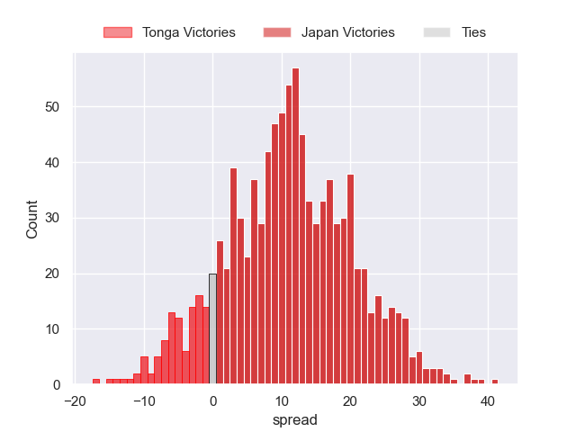
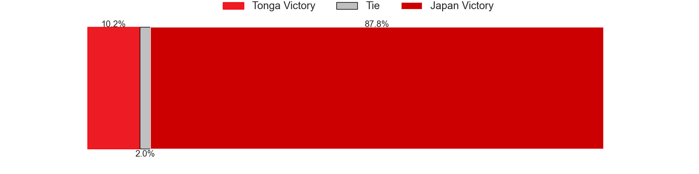

---  
layout: page  
title: Tonga at Japan  
date: 2023-07-29 06:30:00 18:00:00 -0500  
categories: match projection  
---
# Tonga at Japan

# Club Level Predictions

The first set of predictions treats a club as the smallest object, as the club develops its members, organizes a gameplan, and deploys its players as needed for each match. This club model has a prediction of 0.756, which translates to predicting Japan to win by 11.2.

Each club has a rating and a rating deviation (simiar to a Glicko system), and expected performances can be generated. This allows for simulated matches and spreads like the ones below.
## Projected Performances

## Projected Spreads

## Projected Results

# Player Level Predictions

Treating teams instead as an entity made up of the currently active players, I have ratings for each player in an altogether different system. These can be combined to form team ratings once teamsheets are announced, weighting starters a bit higher than the reserves. After the match is played, players can be weighted by their minutes on the field, allowing for an accurate measure of the team's composition. With these compiled team ratings, we can make predictions, measure inaccuracy, and update the individual player ratings.
## Prediction without Player Minutes: Japan by 8.1

Japan by 4.1 on a neutral field

| Away Player         |   Away elo |   Away Percentile |   Number |   Home Percentile |   Home elo | Home Player     |
|:--------------------|-----------:|------------------:|---------:|------------------:|-----------:|:----------------|
| Siegfried Fisi'ihoi |      73.13 |                36 |        1 |                53 |      79.99 | Keita Inagaki   |
| Samiuela Moli       |      54.93 |                10 |        2 |                42 |      74.23 | Atsushi Sakate  |
| Leva Fifita         |      74.37 |                37 |        4 |                38 |      74.7  | Amato Fakatava  |
| Vaea Fifita         |      72.09 |                36 |        6 |                44 |      76.27 | Jack Cornelsen  |
| William Havili      |     107.91 |                88 |       10 |                50 |      81.32 | Seungsin Lee    |
| Afusipa Taumoepeau  |      73.82 |                39 |       13 |                68 |      90.4  | Dylan Riley     |
| Solomone Kata       |      73.95 |                39 |       14 |                54 |      81.96 | Jone Naikabula  |
| Charles Piutau      |      91.66 |                69 |       15 |                44 |      76.73 | Ryohei Yamanaka |
| Tanginoa Halaifonua |      69.84 |                30 |       19 |                45 |      77.25 | James Moore     |

