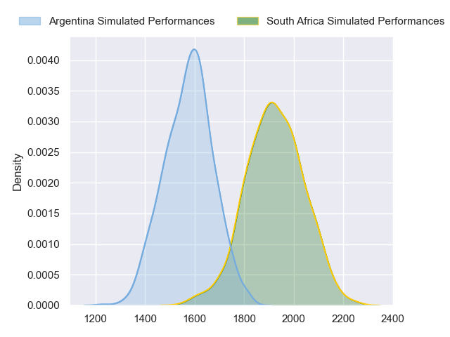
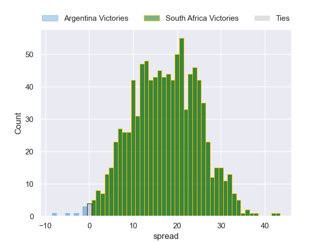
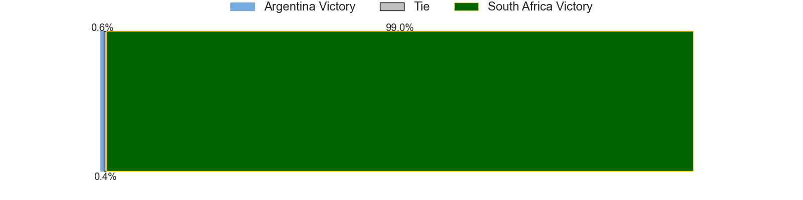

---  
layout: page  
title: Argentina at South Africa  
date: 2023-07-29 11:05:00 18:00:00 -0500  
categories: match projection  
---
# Argentina at South Africa

# Club Level Predictions

The first set of predictions treats a club as the smallest object, as the club develops its members, organizes a gameplan, and deploys its players as needed for each match. This club model has a prediction of 0.873, which translates to predicting South Africa to win by 17.4.

Each club has a rating and a rating deviation (simiar to a Glicko system), and expected performances can be generated. This allows for simulated matches and spreads like the ones below.
## Projected Performances

## Projected Spreads

## Projected Results

# Player Level Predictions

Treating teams instead as an entity made up of the currently active players, I have ratings for each player in an altogether different system. These can be combined to form team ratings once teamsheets are announced, weighting starters a bit higher than the reserves. After the match is played, players can be weighted by their minutes on the field, allowing for an accurate measure of the team's composition. With these compiled team ratings, we can make predictions, measure inaccuracy, and update the individual player ratings.
## Prediction without Player Minutes: South Africa by 18.5

South Africa by 14.5 on a neutral field

| Away Player            |   Away elo |   Away Percentile |   Number |   Home Percentile |   Home elo | Home Player          |
|:-----------------------|-----------:|------------------:|---------:|------------------:|-----------:|:---------------------|
| Thomas Gallo           |      74.22 |                37 |        1 |                94 |     108.09 | Steven Kitshoff      |
| Julian Montoya         |     113.79 |                95 |        2 |                79 |      99.35 | Malcolm Marx         |
| Francisco Gomez Kodela |      90.42 |                74 |        3 |                93 |     105.53 | Frans Malherbe       |
| Lucas Paulos           |      69.72 |                23 |        4 |                78 |      95.58 | Eben Etzebeth        |
| Tomas Lavanini         |      86.52 |                64 |        5 |                76 |      94.31 | Marvin Orie          |
| Pablo Matera           |      98.78 |                84 |        6 |                71 |      89.31 | Marco van Staden     |
| Santiago Grondona      |      79.98 |                53 |        7 |                76 |      95.95 | Pieter-Steph du Toit |
| Juan Martin Gonzalez   |     100.9  |                84 |        8 |                67 |      92.04 | Duane Vermeulen      |
| Santiago Carreras      |      92.91 |                71 |       10 |                85 |     105.85 | Manie Libbok         |
| Juan Imhoff            |      90.2  |                69 |       11 |                71 |      91.05 | Kurt-Lee Arendse     |
| Santiago Chocobares    |      84.65 |                58 |       12 |                84 |     102.33 | Damian de Allende    |
| Lucio Cinti            |     100.6  |                82 |       13 |                55 |      82.67 | Jesse Kriel          |
| Mateo Carreras         |      82.19 |                55 |       14 |                67 |      88.79 | Cheslin Kolbe        |
| Juan Cruz Mallia       |      78.65 |                50 |       15 |                80 |      99.89 | Willie Le Roux       |
| Gonzalo Bertranou      |      86.98 |                64 |       21 |                78 |      96.88 | Faf de Klerk         |
| Matias Moroni          |      73.82 |                32 |       23 |                80 |     100.34 | Damian Willemse      |

