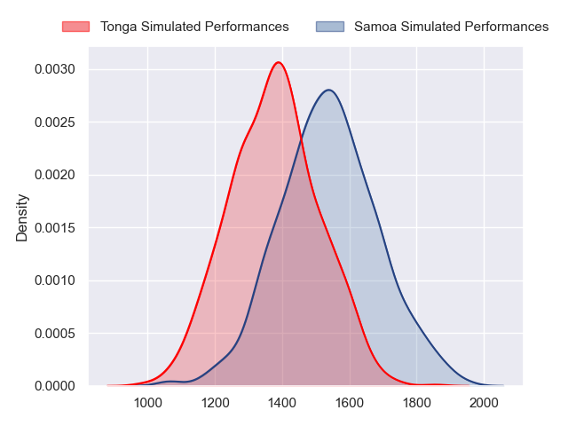
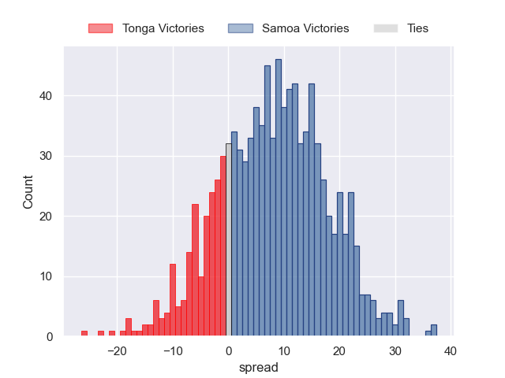

---  
layout: page  
title: Tonga at Samoa  
date: 2023-08-04 22:00:00 18:00:00 -0500  
categories: match projection  
---
# Tonga at Samoa

# Club Level Predictions

The first set of predictions treats a club as the smallest object, as the club develops its members, organizes a gameplan, and deploys its players as needed for each match. This club model has a prediction of 0.709, which translates to predicting Samoa to win by 8.1.

Each club has a rating and a rating deviation (simiar to a Glicko system), and expected performances can be generated. This allows for simulated matches and spreads like the ones below.
## Projected Performances

## Projected Spreads

## Projected Results

# Player Level Predictions

Treating teams instead as an entity made up of the currently active players, I have ratings for each player in an altogether different system. These can be combined to form team ratings once teamsheets are announced, weighting starters a bit higher than the reserves. After the match is played, players can be weighted by their minutes on the field, allowing for an accurate measure of the team's composition. With these compiled team ratings, we can make predictions, measure inaccuracy, and update the individual player ratings.
## Prediction without Player Minutes: Tonga by 3.1

Tonga by 7.1 on a neutral field

| Away Player         |   Away elo |   Away Percentile |   Number |   Home Percentile |   Home elo | Home Player           |
|:--------------------|-----------:|------------------:|---------:|------------------:|-----------:|:----------------------|
| Siegfried Fisi'ihoi |      94.2  |                80 |        1 |                98 |     125.9  | Charlie Faumuina      |
| Leva Fifita         |      78.29 |                46 |        4 |                32 |      71.06 | Chris Vui             |
| Steve Mafi          |      99    |                82 |        5 |                87 |     102    | Brian Alainu'uese     |
| Tanginoa Halaifonua |      95.52 |                75 |        6 |                43 |      77.92 | Miracle Faiilagi      |
| Sione Havili        |      85.93 |                65 |        7 |                47 |      77.8  | Jack Lam              |
| Vaea Fifita         |     126.23 |                98 |        8 |                94 |     115.57 | Steven Luatua         |
| Sonatane Takulua    |      85.23 |                58 |        9 |                32 |      70.35 | Jonathan Taumateine   |
| William Havili      |     112.25 |                91 |       10 |                79 |      96.43 | D'Angelo Leuila       |
| Afusipa Taumoepeau  |      88.79 |                66 |       11 |                11 |      53.07 | Ed Fidow              |
| Pita Ahki           |      96.76 |                77 |       12 |                96 |     120.15 | Duncan Paia'aua       |
| Solomone Kata       |     113.12 |                93 |       14 |                68 |      90.34 | Nigel Ah Wong         |
| Paula Ngauamo       |      88.71 |                68 |       16 |                91 |     106.1  | Luteru Tolai          |
| Solomone Funaki     |      72.84 |                31 |       20 |                97 |     121.16 | Fritz Lee             |
| Otumaka Mausia      |      90    |                62 |       22 |                80 |     100.28 | Christian Leali'ifano |
| Malakai Fekitoa     |     112.44 |                91 |       23 |                54 |      82.58 | Neria Fomai           |

