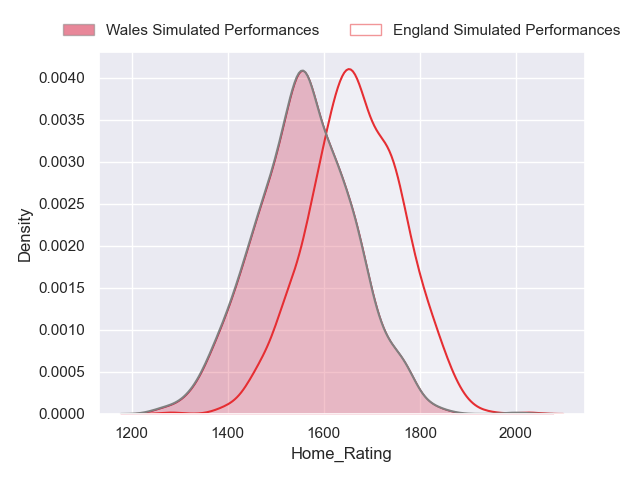
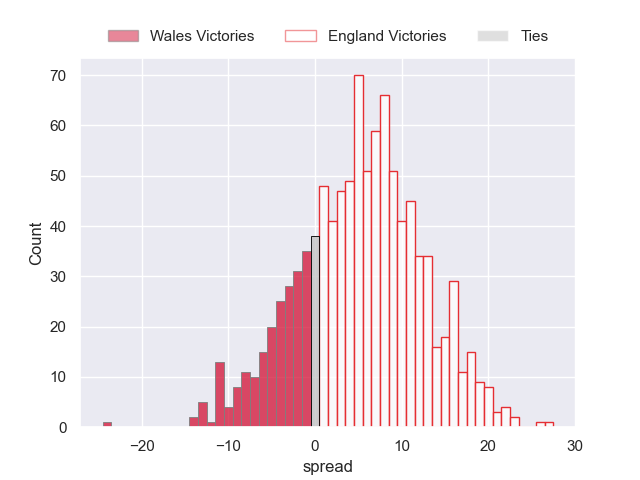
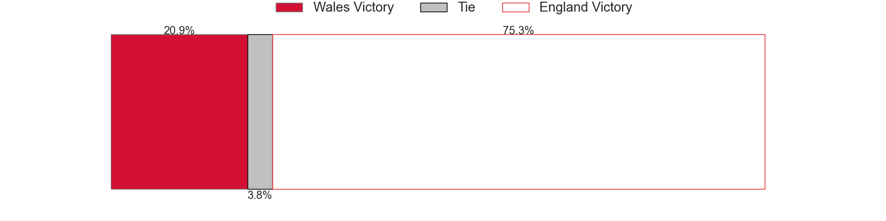

---  
layout: page  
title: Wales at England  
date: 2023/08/12 18:00:00 -0500  
categories: match projection  
---
# Wales at England

# Club Level Predictions

The first set of predictions treats a club as the smallest object, as the club develops its members, organizes a gameplan, and deploys its players as needed for each match. This club model has a prediction of 0.675, which translates to predicting England to win by 6.7.

Each club has a rating and a rating deviation (simiar to a Glicko system), and expected performances can be generated. This allows for simulated matches and spreads like the ones below.
## Projected Performances

## Projected Spreads

## Projected Results

# Player Level Predictions - Version 1

Treating teams instead as an entity made up of the currently active players, I have ratings for each player in an altogether different system. These can be combined to form team ratings once teamsheets are announced, weighting starters a bit higher than the reserves. After the match is played, players can be weighted by their minutes on the field, allowing for an accurate measure of the team's composition. With these compiled team ratings, we can make predictions, measure inaccuracy, and update the individual player ratings.
## Prediction without Player Minutes: Wales by 2.8

Wales by 6.8 on a neutral field

| Away Player     |   Away elo |   Away Percentile |   Number |   Home Percentile |   Home elo | Home Player         |
|:----------------|-----------:|------------------:|---------:|------------------:|-----------:|:--------------------|
| Tomos Williams  |     104.76 |                85 |        9 |                88 |     103.28 | Jack van Poortvliet |
| Christ Tshiunza |      82.06 |                57 |       19 |                62 |      85.39 | Jonny Hill          |
| Dan Biggar      |     135.68 |                98 |       22 |                93 |     112.9  | George Ford         |

# Player Level Predictions - Version 2

Treating teams instead as an entity made up of the currently active players, I have ratings for each player in an altogether different system. These can be combined to form team ratings once teamsheets are announced, weighting starters a bit higher than the reserves. After the match is played, players can be weighted by their minutes on the field, allowing for an accurate measure of the team's composition. With these compiled team ratings, we can make predictions, measure inaccuracy, and update the individual player ratings.
## Prediction without Player Minutes: England by 14.8

England by 11.1 on a neutral pitch

| Away Player     |   Away elo |   Away variance |   Number |   Home variance |   Home elo | Home Player         |
|:----------------|-----------:|----------------:|---------:|----------------:|-----------:|:--------------------|
| Gareth Thomas   |      46.65 |              50 |        1 |           50    |      58.54 | Jack van Poortvliet |
| Dewi Lake       |      46.65 |              50 |        2 |           50    |      46.65 | Joe Marler          |
| Rhys Davies     |      46.65 |              50 |        3 |           50    |      38.48 | Will Stuart         |
| Josh Adams      |      46.65 |              50 |        4 |           50    |      83.37 | George Martin       |
| Liam Williams   |      46.65 |              50 |        5 |           50    |      46.65 | Courtney Lawes      |
| Dan Lydiate     |      46.65 |              50 |        6 |           50    |      95.95 | Ben Earl            |
| Tommy Reffell   |      46.65 |              50 |        7 |           50    |      46.65 | Billy Vunipola      |
| Taine Plumtree  |      61.29 |              50 |        8 |           50    |      93.18 | Joe Marchant        |
| Tomos Williams  |      74.76 |              50 |        9 |           50    |     141.24 | Owen Farrell        |
| Owen Williams   |      46.65 |              50 |       10 |           50    |      63.83 | Elliot Daly         |
| Tom Rogers      |      46.65 |              50 |       11 |           50    |      46.65 | Ollie Lawrence      |
| Nick Tompkins   |     101.98 |              50 |       12 |           50    |      46.65 | Henry Arundell      |
| Joe Roberts     |      46.65 |              50 |       13 |           49.59 |      63.33 | Freddie Steward     |
| Tomas Francis   |      46.65 |              50 |       14 |           50    |     115.23 | Jamie George        |
| Adam Beard      |      46.65 |              50 |       15 |           50    |     114.52 | Maro Itoje          |
| Keiran Williams |      46.65 |              50 |       16 |           50    |     101.37 | George Ford         |
| Dan Biggar      |     122.8  |              50 |       17 |           50    |      50.11 | Theo Dan            |
| Kemsley Mathias |      46.65 |              50 |       18 |           50    |      51.82 | Ellis Genge         |
| Dillon Lewis    |      46.65 |              50 |       19 |           50    |      46.65 | Dan Cole            |
| Christ Tshiunza |      38.82 |              50 |       20 |           50    |      45.75 | Jonny Hill          |
| Taine Basham    |      46.65 |              50 |       21 |           50    |      46.65 | Jack Willis         |
| Kieran Hardy    |      46.65 |              50 |       22 |           50    |      46.65 | Ben Youngs          |
| Sam Parry       |      46.65 |              50 |       23 |           50    |      64.89 | Max Malins          |

