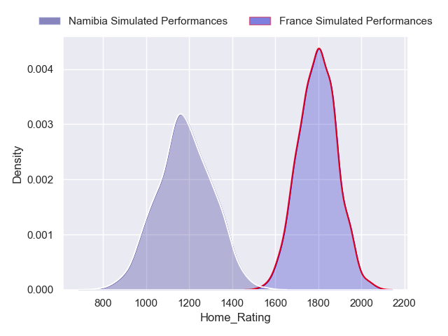
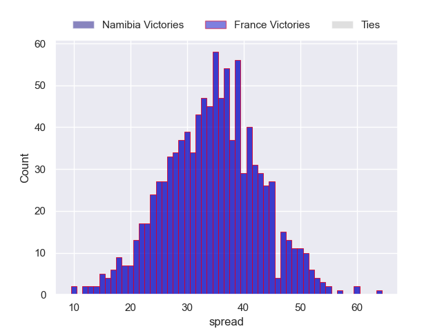
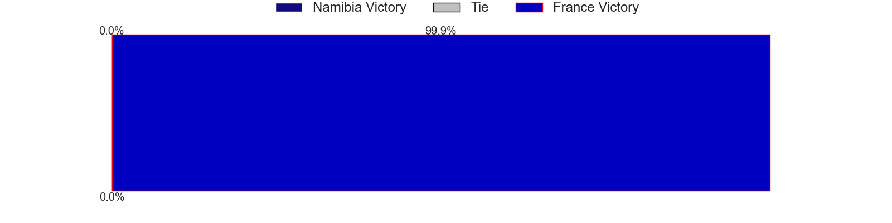
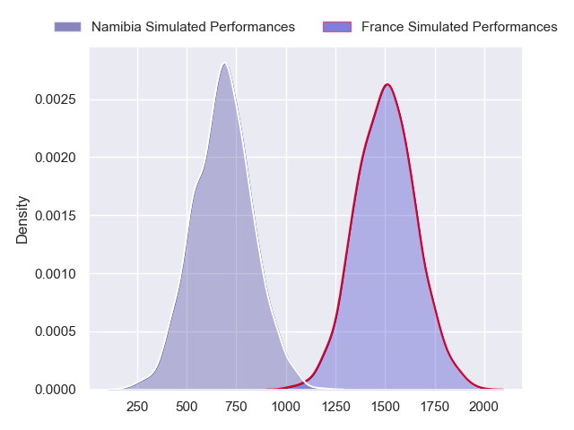
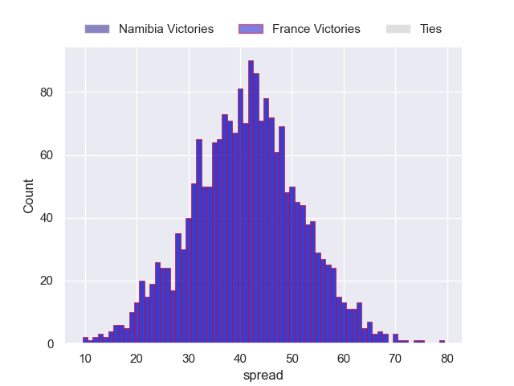

---  
layout: page  
title: Namibia at France  
date: 2023/09/21 18:00:00 -0500  
categories: match projection  
---
# Namibia at France

# Club Level Predictions

The first set of predictions treats a club as the smallest object, as the club develops its members, organizes a gameplan, and deploys its players as needed for each match. This club model has a prediction of 0.984, which translates to predicting France to win by 38.5.

Each club has a rating and a rating deviation (simiar to a Glicko system), and expected performances can be generated. This allows for simulated matches and spreads like the ones below.
## Projected Performances - Club Model

## Projected Spreads - Club Model

## Projected Results - Club Model

# Player Level Predictions - Version 2

Treating teams instead as an entity made up of the currently active players, I have ratings for each player in an altogether different system. These can be combined to form team ratings once teamsheets are announced, weighting starters a bit higher than the reserves. After the match is played, players can be weighted by their minutes on the field, allowing for an accurate measure of the team's composition. With these compiled team ratings, we can make predictions, measure inaccuracy, and update the individual player ratings.
## Prediction without Player Minutes: France by 34.1

France by 30.4 on a neutral pitch

## Projected Performances - Player Model

## Projected Spreads - Player Model

## Projected Results - Player Model

| Away Player              |   Away elo |   Number |   Home elo | Home Player          |
|:-------------------------|-----------:|---------:|-----------:|:---------------------|
| Des Sethie               |      41.94 |        1 |      96.38 | Cyril Baille         |
| Louis van der Westhuizen |      67.24 |        2 |      83.04 | Peato Mauvaka        |
| Aranos Coetzee           |      47.79 |        3 |     122.86 | Uini Atonio          |
| Mahepisa Tjeriko         |      63.93 |        4 |      60.89 | Cameron Woki         |
| Adriaan Ludick           |      45.63 |        5 |      76.66 | Thibaud Flament      |
| Max Katjijeko            |      39.63 |        6 |     118.68 | Francois Cros        |
| Johan Retief             |      51.47 |        7 |     107.8  | Charles Ollivon      |
| Prince Gaoseb            |      19.41 |        8 |     107.52 | Anthony Jelonch      |
| Jacques Theron           |      46.65 |        9 |     134.02 | Antoine Dupont       |
| Cliven Loubser           |      61.35 |       10 |      93.14 | Matthieu Jalibert    |
| JC Greyling              |      17.36 |       11 |      58.75 | Louis Bielle-Biarrey |
| Danco Burger             |      46.65 |       12 |     115.9  | Jonathan Danty       |
| Johan Deysel             |      46.65 |       13 |      98.85 | Gael Fickou          |
| Gerswin Mouton           |      46.65 |       14 |      78.28 | Damian Penaud        |
| Andre van der Berg       |      30.95 |       15 |     118.04 | Thomas Ramos         |
| Obert Nortje             |      46.65 |       16 |      78.35 | Pierre Bourgarit     |
| Jason Benade             |      24.82 |       17 |      79.26 | Reda Wardi           |
| Haitembu Shifuka         |      46.65 |       18 |     100.43 | Dorian Aldegheri     |
| PJ van Lill              |      85.45 |       19 |      47.58 | Romain Taofifenua    |
| Richard Hardwick         |      52.2  |       20 |      37.63 | Paul Boudehent       |
| Oela Blaauw              |      46.65 |       21 |      87.36 | Baptiste Couilloud   |
| Alcino Izaacs            |      46.65 |       22 |      51.79 | Yoram Moefana        |
| Divan Rossouw            |      33.14 |       23 |      66.18 | Melvyn Jaminet       |

