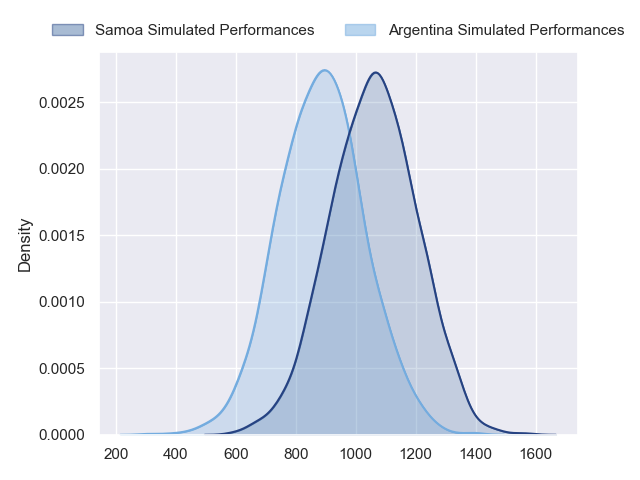
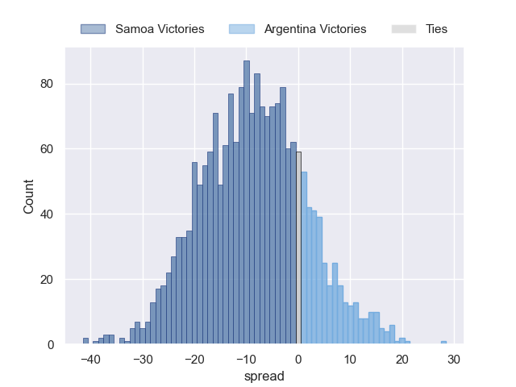
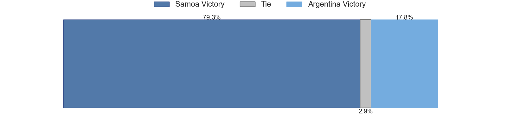

---  
layout: page  
title: Samoa at Argentina  
date: 2023/09/22 18:00:00 -0500  
categories: match projection  
---
# Samoa at Argentina

# Club Level Predictions

The first set of predictions treats a club as the smallest object, as the club develops its members, organizes a gameplan, and deploys its players as needed for each match. This club model has a prediction of 0.666, which translates to predicting Argentina to win by 6.4.

Each club has a rating and a rating deviation (simiar to a Glicko system), and expected performances can be generated. This allows for simulated matches and spreads like the ones below.
## Projected Performances - Club Model

## Projected Spreads - Club Model

## Projected Results - Club Model

# Player Level Predictions - Version 2

Treating teams instead as an entity made up of the currently active players, I have ratings for each player in an altogether different system. These can be combined to form team ratings once teamsheets are announced, weighting starters a bit higher than the reserves. After the match is played, players can be weighted by their minutes on the field, allowing for an accurate measure of the team's composition. With these compiled team ratings, we can make predictions, measure inaccuracy, and update the individual player ratings.
## Prediction without Player Minutes: Samoa by 7.1

Samoa by 7.1 on a neutral pitch

## Projected Performances - Player Model

## Projected Spreads - Player Model

## Projected Results - Player Model

| Away Player           |   Away elo |   Number |   Home elo | Home Player            |
|:----------------------|-----------:|---------:|-----------:|:-----------------------|
| James Lay             |      51.88 |        1 |      55.97 | Thomas Gallo           |
| Seilala Lam           |      63.85 |        2 |      77.02 | Julian Montoya         |
| Paul Alo-Emile        |      77.48 |        3 |       5.76 | Eduardo Bello          |
| Brian Alainu'uese     |      72.06 |        4 |      43.47 | Guido Petti            |
| Chris Vui             |      58.84 |        5 |      50.11 | Matias Alemanno        |
| Theo McFarland        |      68    |        6 |     116.95 | Pablo Matera           |
| Fritz Lee             |      89.22 |        7 |      34.67 | Marcos Kremer          |
| Steven Luatua         |     101.74 |        8 |      62.55 | Juan Martin Gonzalez   |
| Jonathan Taumateine   |      48.35 |        9 |      49.58 | Gonzalo Bertranou      |
| Christian Leali'ifano |      73.26 |       10 |      69.4  | Santiago Carreras      |
| Ben Lam               |      46.65 |       11 |      43.98 | Mateo Carreras         |
| Tumua Manu            |      92.53 |       12 |      31.28 | Santiago Chocobares    |
| Ulupano Seuteni       |      55.07 |       13 |     104.96 | Matias Moroni          |
| Nigel Ah Wong         |      84.72 |       14 |      44.71 | Emiliano Boffelli      |
| Duncan Paia'aua       |      72.31 |       15 |      81.35 | Juan Cruz Mallia       |
| Sama Malolo           |      46.3  |       16 |      85.19 | Agustin Creevy         |
| Charlie Faumuina      |     134.68 |       17 |      36.23 | Mayco Vivas            |
| Michael Ala'alatoa    |      70.14 |       18 |      73.43 | Francisco Gomez Kodela |
| Taleni Seu            |      65.59 |       19 |      45.37 | Pedro Rubiolo          |
| Jordan Taufua         |     102.66 |       20 |      91.1  | Rodrigo Bruni          |
| Melani Matavao        |      51.35 |       21 |      46.65 | Tomas Cubelli          |
| D'Angelo Leuila       |      47.23 |       22 |      85.82 | Nicolas Sanchez        |
| Danny Toala           |      40.94 |       23 |      45.89 | Lucio Cinti            |

