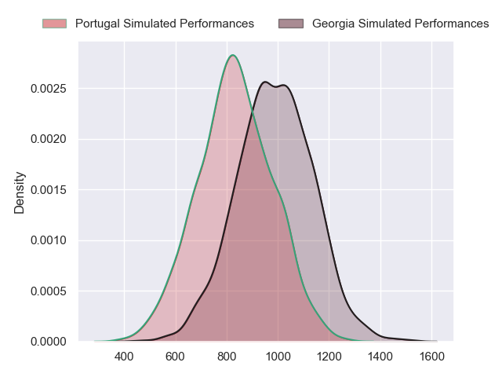
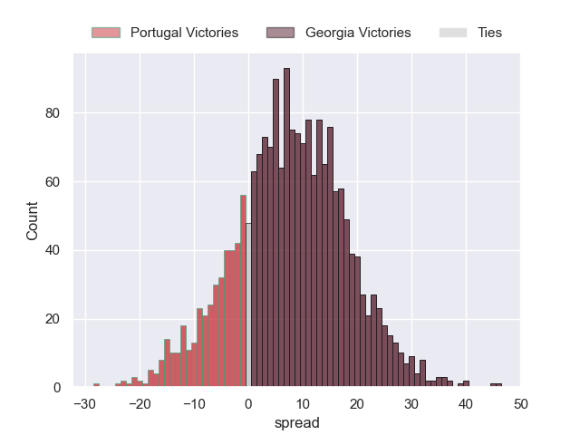
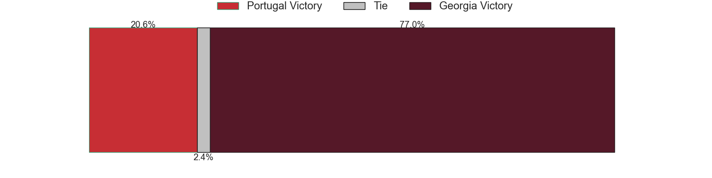

---  
layout: page  
title: Portugal at Georgia  
date: 2023/09/23 18:00:00 -0500  
categories: match projection  
---
# Portugal at Georgia

# Club Level Predictions

The first set of predictions treats a club as the smallest object, as the club develops its members, organizes a gameplan, and deploys its players as needed for each match. This club model has a prediction of 0.783, which translates to predicting Georgia to win by 11.3.

Each club has a rating and a rating deviation (simiar to a Glicko system), and expected performances can be generated. This allows for simulated matches and spreads like the ones below.
## Projected Performances - Club Model

## Projected Spreads - Club Model

## Projected Results - Club Model

# Player Level Predictions - Version 2

Treating teams instead as an entity made up of the currently active players, I have ratings for each player in an altogether different system. These can be combined to form team ratings once teamsheets are announced, weighting starters a bit higher than the reserves. After the match is played, players can be weighted by their minutes on the field, allowing for an accurate measure of the team's composition. With these compiled team ratings, we can make predictions, measure inaccuracy, and update the individual player ratings.
## Prediction without Player Minutes: Georgia by 6.2

Georgia by 6.2 on a neutral pitch

## Projected Performances - Player Model

## Projected Spreads - Player Model

## Projected Results - Player Model

| Away Player              |   Away elo |   Number |   Home elo | Home Player           |
|:-------------------------|-----------:|---------:|-----------:|:----------------------|
| Francisco Fernandes      |      46.65 |        1 |      67.39 | Mikheil Nariashvili   |
| Mike Tadjer              |      21.08 |        2 |      67.1  | Shalva Mamukashvili   |
| Diogo Hasse Ferreira     |      46.65 |        3 |      60.51 | Beka Gigashvili       |
| Jose Madeira             |      46.65 |        4 |      50.29 | Lado Chachanidze      |
| Steevy Cerqueira         |      43.52 |        5 |      12.14 | Konstantin Mikautadze |
| Joao Granate             |      67.23 |        6 |      45.3  | Tornike Jalagonia     |
| Nicolas Martins          |      56.66 |        7 |      46.65 | Beka Saghinadze       |
| Rafael Simoes            |      71.09 |        8 |      76.38 | Beka Gorgadze         |
| Samuel Marques           |      64.74 |        9 |      54.96 | Gela Aprasidze        |
| Jeronimo Portela         |      78.51 |       10 |      56.65 | Tedo Abzhandadze      |
| Rodrigo Marta            |      94.29 |       11 |      95.2  | Sandro Todua          |
| Tomas Appleton           |      56.15 |       12 |      80.38 | Merab Sharikadze      |
| Pedro Bettencourt        |      46.65 |       13 |      86.81 | Giorgi Kveseladze     |
| Raffaele Storti          |      71.57 |       14 |      94.03 | Aka Tabutsadze        |
| Nuno Sousa Guedes        |      46.65 |       15 |      84.12 | Davit Niniashvili     |
| David Costa              |      46.99 |       16 |      42.84 | Tengiz Zamtaradze     |
| Lionel Campergue         |      46.65 |       17 |      54.2  | Guram Gogichashvili   |
| Anthony Alves            |      39.8  |       18 |      36.87 | Guram Papidze         |
| Martim Belo              |      47.26 |       19 |     130.73 | Nodar Cheishvili      |
| David Wallis de Carvalho |      46.65 |       20 |      58.84 | Giorgi Tsutskiridze   |
| Thibault de Freitas      |      47.56 |       21 |      53.1  | Vasil Lobzhanidze     |
| Pedro Lucas              |      46.85 |       22 |      88.98 | Luka Matkava          |
| Manuel Cardoso Pinto     |      46.65 |       23 |      90.73 | Demur Tapladze        |

