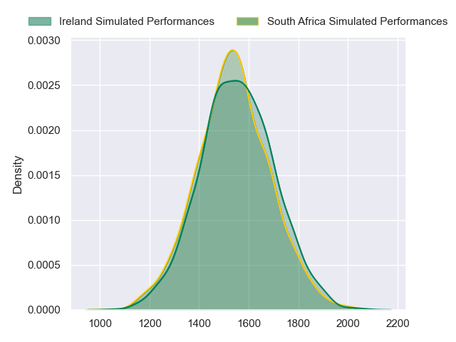
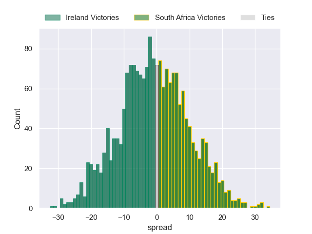

---  
layout: page  
title: Ireland at South Africa  
date: 2023/09/23 18:00:00 -0500  
categories: match projection  
---
# Ireland at South Africa

# Club Level Predictions

The first set of predictions treats a club as the smallest object, as the club develops its members, organizes a gameplan, and deploys its players as needed for each match. This club model has a prediction of 0.687, which translates to predicting South Africa to win by 7.1.

Each club has a rating and a rating deviation (simiar to a Glicko system), and expected performances can be generated. This allows for simulated matches and spreads like the ones below.
## Projected Performances - Club Model

## Projected Spreads - Club Model

## Projected Results - Club Model

# Player Level Predictions - Version 2

Treating teams instead as an entity made up of the currently active players, I have ratings for each player in an altogether different system. These can be combined to form team ratings once teamsheets are announced, weighting starters a bit higher than the reserves. After the match is played, players can be weighted by their minutes on the field, allowing for an accurate measure of the team's composition. With these compiled team ratings, we can make predictions, measure inaccuracy, and update the individual player ratings.
## Prediction without Player Minutes: Ireland by 0.7

Ireland by 0.7 on a neutral pitch

## Projected Performances - Player Model

## Projected Spreads - Player Model

## Projected Results - Player Model

| Away Player         |   Away elo |   Number |   Home elo | Home Player          |
|:--------------------|-----------:|---------:|-----------:|:---------------------|
| Andrew Porter       |      78.25 |        1 |      97.96 | Steven Kitshoff      |
| Ronan Kelleher      |      75.69 |        2 |     102.19 | Bongi Mbonambi       |
| Tadhg Furlong       |      90.43 |        3 |      86.16 | Frans Malherbe       |
| Tadhg Beirne        |     135.05 |        4 |     112.78 | Eben Etzebeth        |
| James Ryan          |      88.52 |        5 |     115.01 | Franco Mostert       |
| Peter O'Mahony      |      97.69 |        6 |     115.63 | Siya Kolisi          |
| Josh van der Flier  |     117.59 |        7 |      80.58 | Pieter-Steph du Toit |
| Caelan Doris        |     108.04 |        8 |      80.1  | Jasper Wiese         |
| Jamison Gibson-Park |     115.21 |        9 |     109.92 | Faf de Klerk         |
| Johnny Sexton       |     111.12 |       10 |      76.5  | Manie Libbok         |
| James Lowe          |     167.21 |       11 |     138.17 | Cheslin Kolbe        |
| Bundee Aki          |     116.93 |       12 |      90.38 | Damian de Allende    |
| Garry Ringrose      |     115.14 |       13 |     136.17 | Jesse Kriel          |
| Mack Hansen         |      73.4  |       14 |     111.73 | Kurt-Lee Arendse     |
| Hugo Keenan         |     116.5  |       15 |     113.17 | Damian Willemse      |
| Dan Sheehan         |      58.96 |       16 |      91.34 | Deon Fourie          |
| Dave Kilcoyne       |      80.88 |       17 |     107.92 | Ox Nche              |
| Finlay Bealham      |      89.87 |       18 |      56.87 | Trevor Nyakane       |
| Iain Henderson      |      71.93 |       19 |     107.54 | Jean Kleyn           |
| Ryan Baird          |      68.96 |       20 |     117.59 | RG Snyman            |
| Conor Murray        |     111.29 |       21 |      69.45 | Marco van Staden     |
| Jack Crowley        |      55.9  |       22 |      68.89 | Kwagga Smith         |
| Robbie Henshaw      |      92.13 |       23 |      87.03 | Cobus Reinach        |

