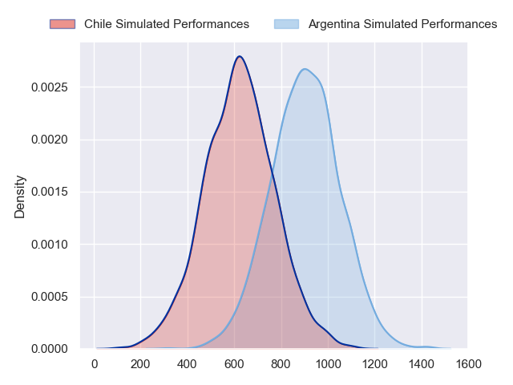
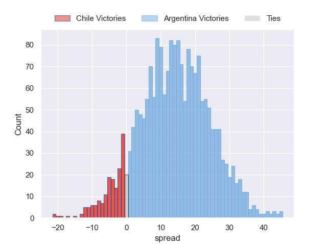
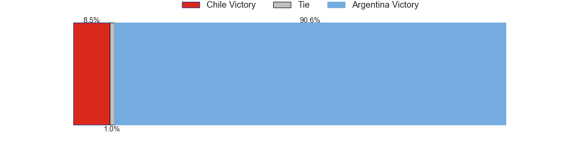

---  
layout: page  
title: Chile at Argentina  
date: 2023/09/30 18:00:00 -0500  
categories: match projection  
---
# Chile at Argentina

# Club Level Predictions

The first set of predictions treats a club as the smallest object, as the club develops its members, organizes a gameplan, and deploys its players as needed for each match. This club model has a prediction of 0.891, which translates to predicting Argentina to win by 24.3.

Each club has a rating and a rating deviation (simiar to a Glicko system), and expected performances can be generated. This allows for simulated matches and spreads like the ones below.
## Projected Performances - Club Model

## Projected Spreads - Club Model

## Projected Results - Club Model

# Player Level Predictions - Version 2

Treating teams instead as an entity made up of the currently active players, I have ratings for each player in an altogether different system. These can be combined to form team ratings once teamsheets are announced, weighting starters a bit higher than the reserves. After the match is played, players can be weighted by their minutes on the field, allowing for an accurate measure of the team's composition. With these compiled team ratings, we can make predictions, measure inaccuracy, and update the individual player ratings.
## Prediction without Player Minutes: Argentina by 11.4

Argentina by 11.4 on a neutral pitch

## Projected Performances - Player Model

## Projected Spreads - Player Model

## Projected Results - Player Model

| Away Player          |   Away elo |   Number |   Home elo | Home Player            |
|:---------------------|-----------:|---------:|-----------:|:-----------------------|
| Javier Carrasco      |      39.08 |        1 |      57.56 | Joel Sclavi            |
| Augusto Bohme        |      46.65 |        2 |      85.19 | Agustin Creevy         |
| Matias Dittus        |      36.09 |        3 |       5.76 | Eduardo Bello          |
| Santiago Pedrero     |      46.65 |        4 |      43.47 | Guido Petti            |
| Javier Eissmann      |       4.9  |        5 |      45.37 | Pedro Rubiolo          |
| Martin Sigren        |      46.65 |        6 |      62.55 | Juan Martin Gonzalez   |
| Clemente Saavedra    |      46.65 |        7 |      34.67 | Marcos Kremer          |
| Raimundo Martinez    |      46.65 |        8 |      90.19 | Facundo Isa            |
| Marcelo Torrealba    |      22.46 |        9 |      41.78 | Tomas Cubelli          |
| Rodrigo Fernandez    |      46.65 |       10 |      85.82 | Nicolas Sanchez        |
| Jose Ignacio Larenas |      46.65 |       11 |     116.66 | Juan Imhoff            |
| Matias Garafulic     |      46.65 |       12 |     102.6  | Jeronimo de la Fuente  |
| Domingo Saavedra     |      46.65 |       13 |      45.89 | Lucio Cinti            |
| Santiago Videla      |      46.65 |       14 |      46.65 | Rodrigo Isgro          |
| Inaki Ayarza         |      46.65 |       15 |      44.04 | Martin Bogado          |
| Tomas Dussaillant    |      46.65 |       16 |      48.96 | Ignacio Ruiz           |
| Salvador Lues        |      46.65 |       17 |      36.23 | Mayco Vivas            |
| Esteban Inostroza    |      46.65 |       18 |      73.43 | Francisco Gomez Kodela |
| Augusto Sarmiento    |      46.65 |       19 |      50.11 | Matias Alemanno        |
| Alfonso Escobar      |      46.65 |       20 |      46.65 | Joaquin Oviedo         |
| Ignacio Silva        |      46.65 |       21 |      47.75 | Lautaro Bazan Velez    |
| Nicolas Herreros     |      46.65 |       22 |      69.4  | Santiago Carreras      |
| Francisco Urroz      |      46.65 |       23 |      81.35 | Juan Cruz Mallia       |

