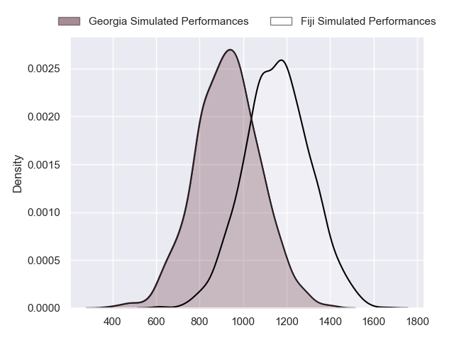
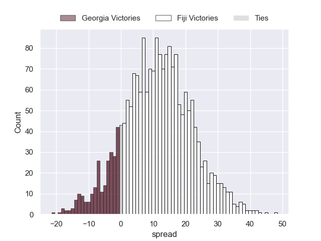
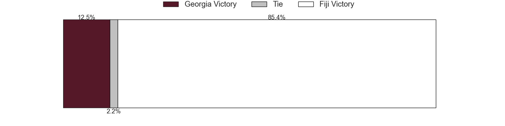

---  
layout: page  
title: Georgia at Fiji  
date: 2023/09/30 18:00:00 -0500  
categories: match projection  
---
# Georgia at Fiji

# Club Level Predictions

The first set of predictions treats a club as the smallest object, as the club develops its members, organizes a gameplan, and deploys its players as needed for each match. This club model has a prediction of 0.698, which translates to predicting Fiji to win by 7.5.

Each club has a rating and a rating deviation (simiar to a Glicko system), and expected performances can be generated. This allows for simulated matches and spreads like the ones below.
## Projected Performances - Club Model

## Projected Spreads - Club Model

## Projected Results - Club Model

# Player Level Predictions - Version 2

Treating teams instead as an entity made up of the currently active players, I have ratings for each player in an altogether different system. These can be combined to form team ratings once teamsheets are announced, weighting starters a bit higher than the reserves. After the match is played, players can be weighted by their minutes on the field, allowing for an accurate measure of the team's composition. With these compiled team ratings, we can make predictions, measure inaccuracy, and update the individual player ratings.
## Prediction without Player Minutes: Fiji by 9.5

Fiji by 9.5 on a neutral pitch

## Projected Performances - Player Model

## Projected Spreads - Player Model

## Projected Results - Player Model

| Away Player           |   Away elo |   Number |   Home elo | Home Player                    |
|:----------------------|-----------:|---------:|-----------:|:-------------------------------|
| Mikheil Nariashvili   |      67.39 |        1 |      50.33 | Eroni Mawi                     |
| Tengiz Zamtaradze     |      42.84 |        2 |      66.07 | Sam Matavesi                   |
| Beka Gigashvili       |      60.51 |        3 |      57.37 | Luke Tagi                      |
| Lasha Jaiani          |      63.06 |        4 |      74.97 | Isoa Nasilasila                |
| Konstantin Mikautadze |      12.14 |        5 |      49.47 | Te Ahiwaru Cirikidaveta        |
| Mikheil Gachechiladze |     -36.9  |        6 |      83.81 | Lekima Tagitagivalu            |
| Beka Saghinadze       |      79.88 |        7 |     113.75 | Levani Botia                   |
| Tornike Jalagonia     |      45.3  |        8 |      47.45 | Viliame Mata                   |
| Vasil Lobzhanidze     |      53.1  |        9 |      50.53 | Simione Kuruvoli               |
| Luka Matkava          |      88.98 |       10 |      83.69 | Teti Tela                      |
| Davit Niniashvili     |      84.12 |       11 |     134.03 | Semi Radradra                  |
| Giorgi Kveseladze     |      86.81 |       12 |     107.98 | Josua Tuisova                  |
| Demur Tapladze        |      90.73 |       13 |     138.88 | Waisea Nayacalevu Vuidravuwalu |
| Aka Tabutsadze        |      94.03 |       14 |      75.35 | Selestino Ravutaumada          |
| Mirian Modebadze      |      87.96 |       15 |      67.14 | Ilaisa Droasese                |
| Luka Nioradze         |      46.65 |       16 |      69.58 | Tevita Ikanivere               |
| Nika Abuladze         |      72.5  |       17 |      43.1  | Peni Ravai Kovekalou           |
| Irakli Aptsiauri      |      46.65 |       18 |      16.36 | Samu Tawake                    |
| Nodar Cheishvili      |     130.73 |       19 |      67.97 | Temo Mayanavanua               |
| Luka Ivanishvili      |      75.31 |       20 |      88.91 | Albert Tuisue                  |
| Gela Aprasidze        |      54.96 |       21 |      53.2  | Frank Lomani                   |
| Tedo Abzhandadze      |      56.65 |       22 |      64.4  | Vilimoni Botitu                |
| Tornike Kakhoidze     |      46.65 |       23 |      60.17 | Vinaya Habosi                  |

