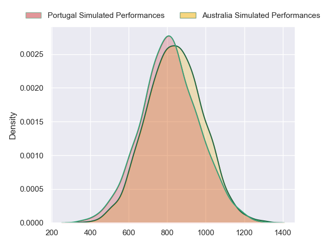
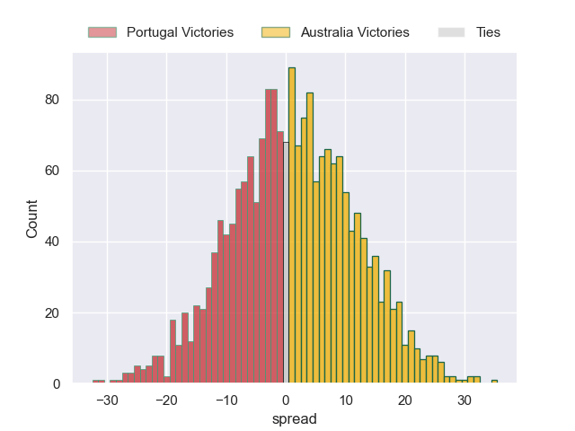

---  
layout: page  
title: Portugal at Australia  
date: 2023/10/01 18:00:00 -0500  
categories: match projection  
---
# Portugal at Australia

# Club Level Predictions

The first set of predictions treats a club as the smallest object, as the club develops its members, organizes a gameplan, and deploys its players as needed for each match. This club model has a prediction of 0.861, which translates to predicting Australia to win by 16.7.

Each club has a rating and a rating deviation (simiar to a Glicko system), and expected performances can be generated. This allows for simulated matches and spreads like the ones below.
## Projected Performances - Club Model

## Projected Spreads - Club Model

## Projected Results - Club Model

# Player Level Predictions - Version 2

Treating teams instead as an entity made up of the currently active players, I have ratings for each player in an altogether different system. These can be combined to form team ratings once teamsheets are announced, weighting starters a bit higher than the reserves. After the match is played, players can be weighted by their minutes on the field, allowing for an accurate measure of the team's composition. With these compiled team ratings, we can make predictions, measure inaccuracy, and update the individual player ratings.
## Prediction without Player Minutes: Australia by 1.0

Australia by 1.0 on a neutral pitch

## Projected Performances - Player Model

## Projected Spreads - Player Model

## Projected Results - Player Model

| Away Player              |   Away elo |   Number |   Home elo | Home Player           |
|:-------------------------|-----------:|---------:|-----------:|:----------------------|
| David Costa              |      46.08 |        1 |      62.48 | Angus Bell            |
| Mike Tadjer              |      16.91 |        2 |      51.3  | Dave Porecki          |
| Diogo Hasse Ferreira     |      46.96 |        3 |      72.11 | James Slipper         |
| Jose Madeira             |      80.77 |        4 |      38.75 | Nick Frost            |
| Martim Belo              |      42.97 |        5 |      33.41 | Richie Arnold         |
| David Wallis de Carvalho |      45.93 |        6 |      48.91 | Tom Hooper            |
| Nicolas Martins          |      52.43 |        7 |      70.33 | Fraser McReight       |
| Thibault de Freitas      |      46.1  |        8 |      96.84 | Rob Valetini          |
| Samuel Marques           |      61.18 |        9 |      51.24 | Tate McDermott        |
| Jeronimo Portela         |      74.29 |       10 |      58.81 | Ben Donaldson         |
| Rodrigo Marta            |      90.08 |       11 |      64.19 | Marika Koroibete      |
| Tomas Appleton           |      51.94 |       12 |      67.41 | Lalakai Foketi        |
| Pedro Bettencourt        |      49.29 |       13 |      52.4  | Izaia Perese          |
| Raffaele Storti          |      72.04 |       14 |      34.83 | Mark Nawaqanitawase   |
| Nuno Sousa Guedes        |      43.57 |       15 |      65.02 | Andrew Kellaway       |
| Francisco Fernandes      |      43.49 |       16 |      44    | Matt Faessler         |
| Duarte Diniz             |      46.65 |       17 |      46.91 | Blake Schoupp         |
| Francisco Bruno          |      46.65 |       18 |      44.38 | Pone Fa'amausili      |
| Steevy Cerqueira         |      38.87 |       19 |      28.13 | Rob Leota             |
| Rafael Simoes            |      66.19 |       20 |      35.19 | Josh Kemeny           |
| Joao Belo                |      68.85 |       21 |      52.84 | Issak Fines-Leleiwasa |
| Joris Moura              |      45.49 |       22 |      48.93 | Carter Gordon         |
| Manuel Cardoso Pinto     |      49.23 |       23 |      34.98 | Suliasi Vunivalu      |

