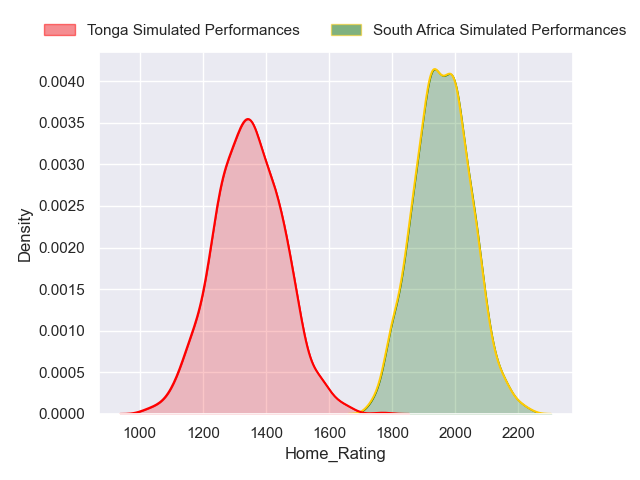
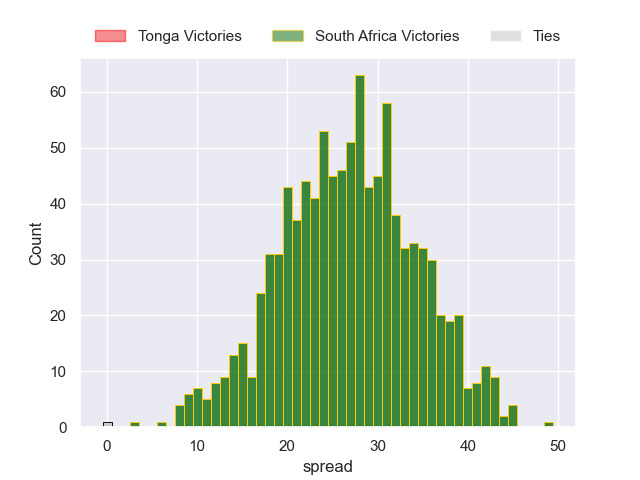
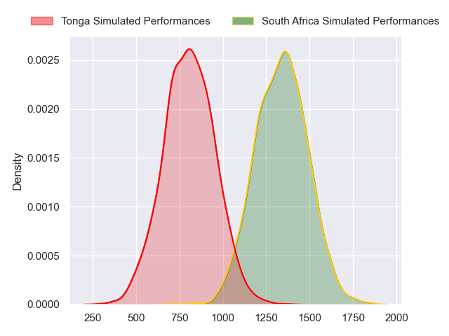
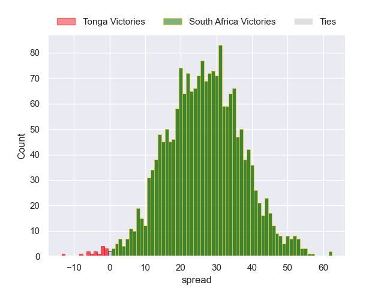
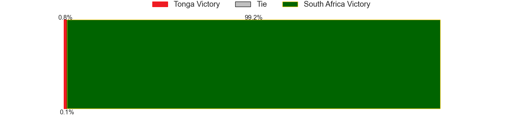

---  
layout: page  
title: Tonga at South Africa  
date: 2023/10/01 18:00:00 -0500  
categories: match projection  
---
# Tonga at South Africa

# Club Level Predictions

The first set of predictions treats a club as the smallest object, as the club develops its members, organizes a gameplan, and deploys its players as needed for each match. This club model has a prediction of 0.973, which translates to predicting South Africa to win by 33.8.

Each club has a rating and a rating deviation (simiar to a Glicko system), and expected performances can be generated. This allows for simulated matches and spreads like the ones below.
## Projected Performances - Club Model

## Projected Spreads - Club Model

## Projected Results - Club Model

# Player Level Predictions - Version 2

Treating teams instead as an entity made up of the currently active players, I have ratings for each player in an altogether different system. These can be combined to form team ratings once teamsheets are announced, weighting starters a bit higher than the reserves. After the match is played, players can be weighted by their minutes on the field, allowing for an accurate measure of the team's composition. With these compiled team ratings, we can make predictions, measure inaccuracy, and update the individual player ratings.
## Prediction without Player Minutes: South Africa by 21.9

South Africa by 21.9 on a neutral pitch

## Projected Performances - Player Model

## Projected Spreads - Player Model

## Projected Results - Player Model

| Away Player          |   Away elo |   Number |   Home elo | Home Player       |
|:---------------------|-----------:|---------:|-----------:|:------------------|
| Siegfried Fisi'ihoi  |      42.9  |        1 |     107.71 | Ox Nche           |
| Paula Ngauamo        |      61.48 |        2 |      91.37 | Deon Fourie       |
| Ben Tameifuna        |      84.83 |        3 |      48.27 | Vincent Koch      |
| Leva Fifita          |      12.9  |        4 |     111.79 | Eben Etzebeth     |
| Sam Lousi            |      72.08 |        5 |      47.88 | Marvin Orie       |
| Tanginoa Halaifonua  |      24.13 |        6 |     114.4  | Siya Kolisi       |
| Sione Havili Talitui |      95.88 |        7 |     126.15 | Duane Vermeulen   |
| Semisi Paea          |      45.82 |        8 |      79.18 | Jasper Wiese      |
| Augustine Pulu       |      46.31 |        9 |      87.32 | Cobus Reinach     |
| William Havili       |      51.84 |       10 |      46.65 | Handre Pollard    |
| Anzelo Tuitavuki     |      46.65 |       11 |     107.44 | Makazole Mapimpi  |
| Pita Ahki            |      38.97 |       12 |     107.16 | Andre Esterhuizen |
| Malakai Fekitoa      |      71.96 |       13 |     120.92 | Canan Moodie      |
| Fine Inisi           |      28.56 |       14 |      44.74 | Grant Williams    |
| Charles Piutau       |      70.99 |       15 |     106.34 | Willie le Roux    |
| Samiuela Moli        |      31.38 |       16 |      69.52 | Marco van Staden  |
| Tau Koloamatangi     |      63.27 |       17 |      97.03 | Steven Kitshoff   |
| Joe Apikotoa         |      54.51 |       18 |      56.92 | Trevor Nyakane    |
| Adam Coleman         |     119.28 |       19 |     113.79 | Franco Mostert    |
| Sione Vailanu        |      44.75 |       20 |      68.96 | Kwagga Smith      |
| Sonatane Takulua     |      12.09 |       21 |      67.24 | Jaden Hendrikse   |
| Patrick Pellegrini   |      86.41 |       22 |      74.83 | Manie Libbok      |
| Afusipa Taumoepeau   |      68.71 |       23 |     134.39 | Jesse Kriel       |

