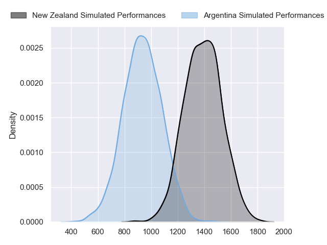
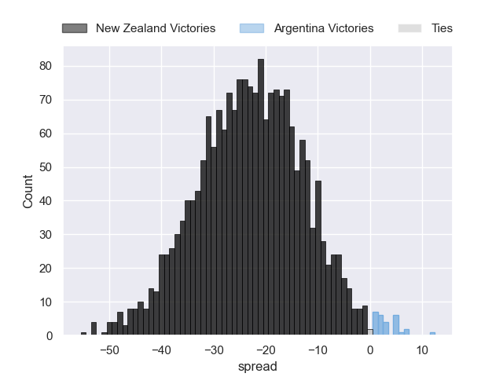

---  
layout: page  
title: New Zealand at Argentina  
date: 2023/10/20 18:00:00 -0500  
categories: match projection  
---
# New Zealand at Argentina

# Club Level Predictions

The first set of predictions treats a club as the smallest object, as the club develops its members, organizes a gameplan, and deploys its players as needed for each match. This club model has a prediction of 0.336, which translates to predicting New Zealand to win by 5.8.

Each club has a rating and a rating deviation (similar to a Glicko rating), and expected performances can be generated. This allows for simulated matches and spreads like the ones below.
## Projected Performances - Club Model

## Projected Spreads - Club Model

## Projected Results - Club Model

# Player Level Predictions - Version 2

Treating teams instead as an entity made up of the currently active players, I have ratings for each player in an altogether different system. These can be combined to form team ratings once teamsheets are announced, weighting starters a bit higher than the reserves. After the match is played, players can be weighted by their minutes on the field, allowing for an accurate measure of the team's composition. With these compiled team ratings, we can make predictions, measure inaccuracy, and update the individual player ratings.
## Prediction without Player Minutes: New Zealand by 19.0

New Zealand by 19.0 on a neutral pitch

## Projected Performances - Player Model

## Projected Spreads - Player Model

## Projected Results - Player Model

| Away Player         |   Away elo |   Number |   Home elo | Home Player            |
|:--------------------|-----------:|---------:|-----------:|:-----------------------|
| Ethan de Groot      |      50.05 |        1 |      58.82 | Thomas Gallo           |
| Codie Taylor        |     102.24 |        2 |      79.48 | Julian Montoya         |
| Tyrel Lomax         |      68.44 |        3 |      75.87 | Francisco Gomez Kodela |
| Samuel Whitelock    |     140.2  |        4 |      51.86 | Guido Petti            |
| Scott Barrett       |      96.92 |        5 |      61.84 | Tomas Lavanini         |
| Shannon Frizell     |      58.11 |        6 |      68.47 | Juan Martin Gonzalez   |
| Sam Cane            |     106.52 |        7 |      40.02 | Marcos Kremer          |
| Ardie Savea         |     101.84 |        8 |      93.9  | Facundo Isa            |
| Aaron Smith         |     101.83 |        9 |      51.91 | Gonzalo Bertranou      |
| Richie Mo'unga      |     117.18 |       10 |      71.02 | Santiago Carreras      |
| Mark Telea          |      94.55 |       11 |      47.64 | Mateo Carreras         |
| Jordie Barrett      |      81.51 |       12 |      33.95 | Santiago Chocobares    |
| Rieko Ioane         |      55.21 |       13 |      46.09 | Lucio Cinti            |
| Will Jordan         |      99.81 |       14 |      47.61 | Emiliano Boffelli      |
| Beauden Barrett     |     142.78 |       15 |      85.39 | Juan Cruz Mallia       |
| Samisoni Taukei'aho |      75.23 |       16 |      88.11 | Agustin Creevy         |
| Tamaiti Williams    |      62.2  |       17 |      59.72 | Joel Sclavi            |
| Fletcher Newell     |      21.33 |       18 |      11.2  | Eduardo Bello          |
| Brodie Retallick    |     138.29 |       19 |      54.29 | Matias Alemanno        |
| Dalton Papalii      |     108.5  |       20 |      92.14 | Rodrigo Bruni          |
| Finlay Christie     |      55.35 |       21 |      49    | Lautaro Bazan Velez    |
| Damian McKenzie     |     104.46 |       22 |      91.09 | Nicolas Sanchez        |
| Anton Lienert-Brown |      73.59 |       23 |     108.1  | Matias Moroni          |

