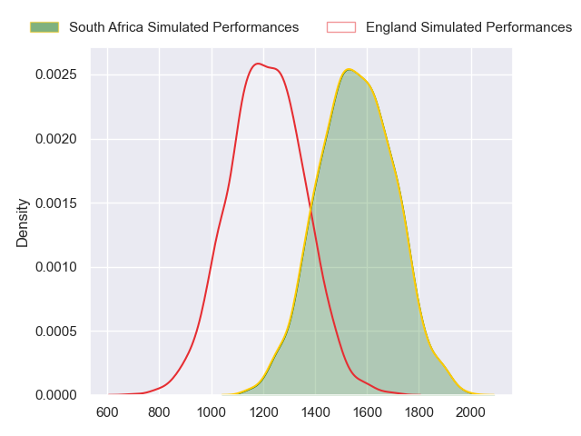
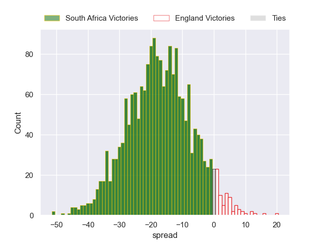
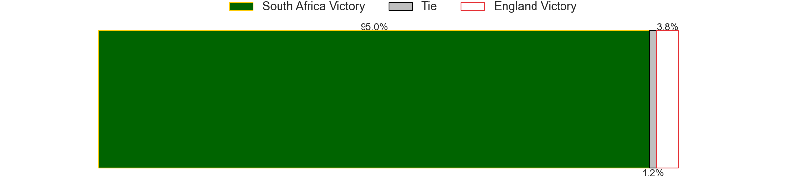

---  
layout: page  
title: South Africa at England  
date: 2023/10/21 18:00:00 -0500  
categories: match projection  
---
# South Africa at England

# Club Level Predictions

The first set of predictions treats a club as the smallest object, as the club develops its members, organizes a gameplan, and deploys its players as needed for each match. This club model has a prediction of 0.258, which translates to predicting South Africa to win by 9.7.

Each club has a rating and a rating deviation (similar to a Glicko rating), and expected performances can be generated. This allows for simulated matches and spreads like the ones below.
## Projected Performances - Club Model

## Projected Spreads - Club Model

## Projected Results - Club Model

# Player Level Predictions - Version 2

Treating teams instead as an entity made up of the currently active players, I have ratings for each player in an altogether different system. These can be combined to form team ratings once teamsheets are announced, weighting starters a bit higher than the reserves. After the match is played, players can be weighted by their minutes on the field, allowing for an accurate measure of the team's composition. With these compiled team ratings, we can make predictions, measure inaccuracy, and update the individual player ratings.
## Prediction without Player Minutes: South Africa by 13.7

South Africa by 13.7 on a neutral pitch

## Projected Performances - Player Model

## Projected Spreads - Player Model

## Projected Results - Player Model

| Away Player          |   Away elo |   Number |   Home elo | Home Player     |
|:---------------------|-----------:|---------:|-----------:|:----------------|
| Steven Kitshoff      |      97.03 |        1 |      96.6  | Joe Marler      |
| Bongi Mbonambi       |     101.24 |        2 |     110.62 | Jamie George    |
| Frans Malherbe       |      84.96 |        3 |      47.65 | Dan Cole        |
| Eben Etzebeth        |     111.79 |        4 |     107.39 | Maro Itoje      |
| Franco Mostert       |     113.79 |        5 |      68    | George Martin   |
| Siya Kolisi          |     114.4  |        6 |      86.85 | Courtney Lawes  |
| Pieter-Steph du Toit |      78.79 |        7 |      67.86 | Tom Curry       |
| Duane Vermeulen      |     126.15 |        8 |      94.9  | Ben Earl        |
| Cobus Reinach        |      87.32 |        9 |      67.96 | Alex Mitchell   |
| Manie Libbok         |      74.83 |       10 |     131.99 | Owen Farrell    |
| Cheslin Kolbe        |     136.39 |       11 |      64.11 | Elliot Daly     |
| Damian de Allende    |      88.57 |       12 |     104.06 | Manu Tuilagi    |
| Jesse Kriel          |     134.39 |       13 |      82.6  | Joe Marchant    |
| Kurt-Lee Arendse     |     109.93 |       14 |      41.87 | Jonny May       |
| Damian Willemse      |     111.9  |       15 |      55.87 | Freddie Steward |
| Deon Fourie          |      91.37 |       16 |      44.25 | Theo Dan        |
| Ox Nche              |     107.71 |       17 |      34.52 | Ellis Genge     |
| Vincent Koch         |      48.27 |       18 |      62.98 | Kyle Sinckler   |
| RG Snyman            |     117.09 |       19 |      60.23 | Ollie Chessum   |
| Kwagga Smith         |      68.96 |       20 |     122.55 | Billy Vunipola  |
| Faf de Klerk         |     108.42 |       21 |     135.06 | Danny Care      |
| Handre Pollard       |     103.35 |       22 |      97.24 | George Ford     |
| Willie le Roux       |     106.34 |       23 |      56.08 | Ollie Lawrence  |

