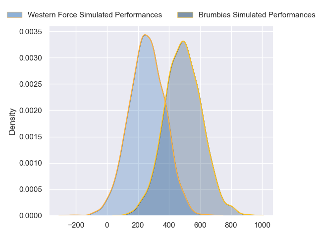
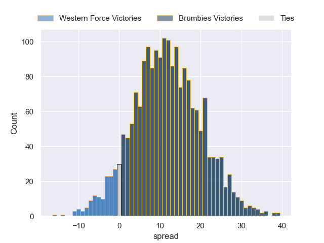

---  
layout: page  
title: Western Force at Brumbies  
date: 2024-03-08 18:00:00 -0500  
categories: "Super Rugby Pacific 2024" match projection  
---
# Western Force at Brumbies

# Club Level Predictions

The first set of predictions treats a club as the smallest object, as the club develops its members, organizes a gameplan, and deploys its players as needed for each match. This club model has a prediction of 0.872, which translates to predicting Brumbies to win by 17.6.

Each club has a rating and a rating deviation (similar to a Glicko rating), and expected performances can be generated. This allows for simulated matches and spreads like the ones below.
## Projected Performances - Club Model

## Projected Spreads - Club Model

## Projected Results - Club Model

# Player Level Predictions - Version 2

Treating teams instead as an entity made up of the currently active players, I have ratings for each player in an altogether different system. These can be combined to form team ratings once teamsheets are announced, weighting starters a bit higher than the reserves. After the match is played, players can be weighted by their minutes on the field, allowing for an accurate measure of the team's composition. With these compiled team ratings, we can make predictions, measure inaccuracy, and update the individual player ratings.
## Prediction without Player Minutes: Brumbies by 11.8

Brumbies by 7.2 on a neutral pitch

## Projected Performances - Player Model

## Projected Spreads - Player Model

## Projected Results - Player Model

| Away Player           |   Away Percentile |   Number |   Home Percentile | Home Player      |
|:----------------------|------------------:|---------:|------------------:|:-----------------|
| Ryan Coxon            |             24.7  |        1 |             92.28 | James Slipper    |
| Tom Horton            |             51.89 |        2 |              8.87 | Lachlan Lonergan |
| Santiago Medrano      |              6.9  |        3 |             18.98 | Sefo Kautai      |
| Jeremy Williams       |             17.76 |        4 |             40.82 | Nick Frost       |
| Tom Franklin          |             92.82 |        5 |             38.94 | Darcy Swain      |
| Michael Wells         |              1.73 |        6 |             68    | Tom Hooper       |
| Carlo Tizzano         |             13.73 |        7 |             58.7  | Luke Reimer      |
| Will Harris           |             58.45 |        8 |             96.54 | Rob Valetini     |
| Nic White             |             99.2  |        9 |             75.45 | Ryan Lonergan    |
| Ben Donaldson         |             54.96 |       10 |             76.51 | Noah Lolesio     |
| Chase Tiatia          |             77.49 |       11 |             28.83 | Corey Toole      |
| Hamish Stewart        |             82.33 |       12 |             45.47 | Tamati Tua       |
| Bayley Kuenzle        |             12.13 |       13 |             80.45 | Len Ikitau       |
| Harry Potter          |             49.95 |       14 |             93.25 | Andy Muirhead    |
| Max Burey             |              8.85 |       15 |             53.35 | Tom Wright       |
| Feleti Kaitu'u        |             28.68 |       16 |             52.08 | Billy Pollard    |
| Charlie Hancock       |             41.87 |       17 |             41.33 | Blake Schoupp    |
| Tiaan Tauakipulu      |            nan    |       18 |             63.12 | Rhys Van Nek     |
| Lopeti Faifua         |             27.53 |       19 |             98.24 | Cadeyrn Neville  |
| Tim Anstee            |             14.05 |       20 |             85.51 | Jahrome Brown    |
| Ollie Callan          |              5.95 |       21 |            nan    | Klayton Thorn    |
| Issak Fines-Leleiwasa |             66.67 |       22 |            nan    | Declan Meredith  |
| George Poolman        |            nan    |       23 |             82.1  | Ollie Sapsford   |

