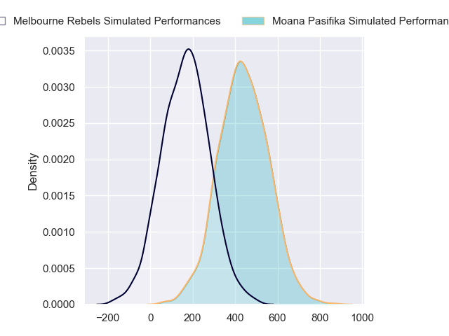
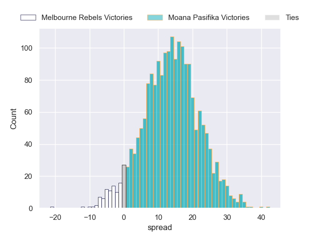
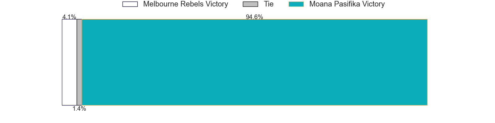

---  
layout: page  
title: Melbourne Rebels at Moana Pasifika  
date: 2024-03-08 18:00:00 -0500  
categories: "Super Rugby Pacific 2024" match projection  
---
# Melbourne Rebels at Moana Pasifika

# Club Level Predictions

The first set of predictions treats a club as the smallest object, as the club develops its members, organizes a gameplan, and deploys its players as needed for each match. This club model has a prediction of 0.382, which translates to predicting Melbourne Rebels to win by 0.6.

Our Over/Under is 59.5 - and combined with the spread above, we have a predicted scoreline of 30 to 29

Each club has a rating and a rating deviation (similar to a Glicko rating), and expected performances can be generated. This allows for simulated matches and spreads like the ones below.
## Projected Performances - Club Model

## Projected Spreads - Club Model

## Projected Results - Club Model

# Player Level Predictions - Version 2

Treating teams instead as an entity made up of the currently active players, I have ratings for each player in an altogether different system. These can be combined to form team ratings once teamsheets are announced, weighting starters a bit higher than the reserves. After the match is played, players can be weighted by their minutes on the field, allowing for an accurate measure of the team's composition. With these compiled team ratings, we can make predictions, measure inaccuracy, and update the individual player ratings.
## Prediction without Player Minutes: Moana Pasifika by 14.0

Moana Pasifika by 11.7 on a neutral pitch

## Projected Performances - Player Model

## Projected Spreads - Player Model

## Projected Results - Player Model

| Away Player          |   Away Percentile |   Number |   Home Percentile | Home Player           |
|:---------------------|------------------:|---------:|------------------:|:----------------------|
| Matt Gibbon          |             74.93 |        1 |             49.68 | Abraham Pole          |
| Jordan Uelese        |             26.23 |        2 |             75.09 | Sama Malolo           |
| Sam Talakai          |             17.89 |        3 |             79.11 | Sione Mafileo         |
| Josh Canham          |             47.18 |        4 |             95.29 | Tom Savage            |
| Lukhan Salakaia-Loto |              7.41 |        5 |             41.18 | Allan Craig           |
| Josh Kemeny          |             17.51 |        6 |             93.62 | Jacob Norris          |
| Vaiolini Ekuasi      |             28.64 |        7 |             94.92 | Sione Havili Talitui  |
| Rob Leota            |             19.25 |        8 |             38.03 | Lotu Inisi            |
| Ryan Louwrens        |             95.81 |        9 |              4.79 | Ere Enari             |
| Carter Gordon        |             51.82 |       10 |             52.78 | William Havili        |
| Andrew Kellaway      |             78.23 |       11 |             24.87 | Anzelo Tuitavuki      |
| David Feliuai        |             46.53 |       12 |             99.18 | Julian Savea          |
| Filipo Daugunu       |             86.92 |       13 |             37.81 | Henry Taefu           |
| Lachie Anderson      |             37.19 |       14 |             85.51 | Pepesana Patafilo     |
| Jake Strachan        |             16.46 |       15 |             22.49 | Danny Toala           |
| Ethan Dobbins        |            nan    |       16 |            nan    | Thomas Maka           |
| Isaac Aedo Kailea    |            nan    |       17 |            nan    | Sateki Latu           |
| Taniela Tupou        |             97.82 |       18 |            nan    | Sekope Kepu           |
| Tuaina Taii Tualima  |             62.12 |       19 |            nan    | Ola Tauelangi         |
| Daniel Maiava        |            nan    |       20 |            nan    | Irie Papuni           |
| James Tuttle         |             65.87 |       21 |            nan    | Melani Matavao        |
| Lukas Ripley         |             52.18 |       22 |             87.17 | Christian Leali'ifano |
| Glen Vaihu           |             21.86 |       23 |             58.84 | Kyren Taumoefolau     |

