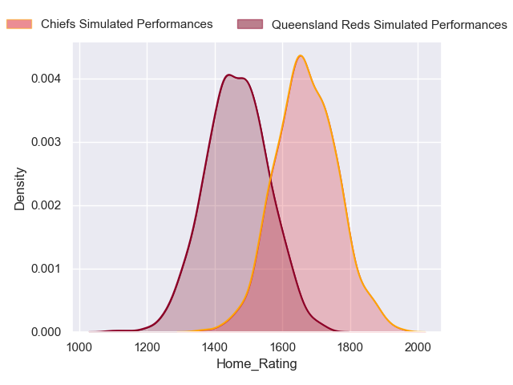
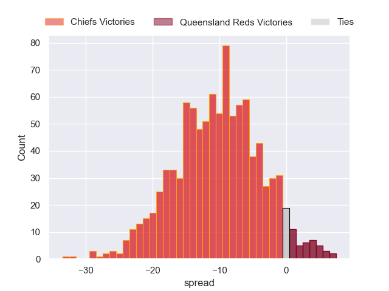
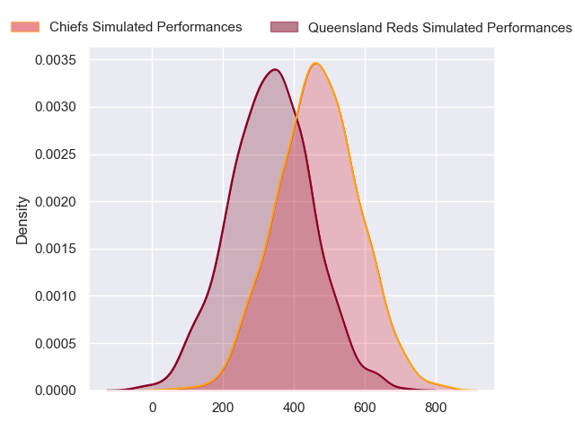
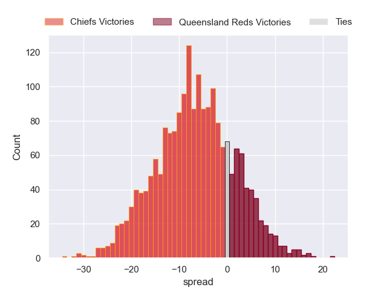

---  
layout: page  
title: Chiefs at Queensland Reds  
date: 2024-03-09 18:00:00 -0500  
categories: "Super Rugby Pacific 2024" match projection  
---
# Chiefs at Queensland Reds

# Club Level Predictions

The first set of predictions treats a club as the smallest object, as the club develops its members, organizes a gameplan, and deploys its players as needed for each match. This club model has a prediction of 0.176, which translates to predicting Chiefs to win by 10.2.

Our Over/Under is 55.5 - and combined with the spread above, we have a predicted scoreline of 33 to 23

Each club has a rating and a rating deviation (similar to a Glicko rating), and expected performances can be generated. This allows for simulated matches and spreads like the ones below.
## Projected Performances - Club Model

## Projected Spreads - Club Model

## Projected Results - Club Model

# Player Level Predictions - Version 2

Treating teams instead as an entity made up of the currently active players, I have ratings for each player in an altogether different system. These can be combined to form team ratings once teamsheets are announced, weighting starters a bit higher than the reserves. After the match is played, players can be weighted by their minutes on the field, allowing for an accurate measure of the team's composition. With these compiled team ratings, we can make predictions, measure inaccuracy, and update the individual player ratings.
## Prediction without Player Minutes: Chiefs by 6.9

Chiefs by 11.6 on a neutral pitch

## Projected Performances - Player Model

## Projected Spreads - Player Model

## Projected Results - Player Model

| Away Player            |   Away Percentile |   Number |   Home Percentile | Home Player               |
|:-----------------------|------------------:|---------:|------------------:|:--------------------------|
| Aidan Ross             |             98.09 |        1 |             64.12 | Sef Fa'agase              |
| Samisoni Taukei'aho    |             92.26 |        2 |             59.43 | Matt Faessler             |
| George Dyer            |             83.65 |        3 |             57.77 | Zane Nonggorr             |
| Tupou Vaa'i            |             86.59 |        4 |             42.47 | Seru Uru                  |
| Naitoa Ah Kuoi         |             94.35 |        5 |             20.47 | Ryan Smith                |
| Samipeni Finau         |             92.97 |        6 |             94.59 | Liam Wright               |
| Simon Parker           |             44.37 |        7 |             90.81 | Fraser McReight           |
| Luke Jacobson          |             91.08 |        8 |             47.18 | Harry Wilson              |
| Cortez Ratima          |             70.66 |        9 |             74.85 | Tate McDermott            |
| Damian McKenzie        |             96.85 |       10 |             70.7  | Tom Lynagh                |
| Etene Nanai-Seturo     |             29.58 |       11 |             64.63 | Mac Grealy                |
| Rameka Poihipi         |             63.6  |       12 |             18.61 | Isaac Henry               |
| Daniel Rona            |             72.67 |       13 |             20.85 | Josh Flook                |
| Shaun Stevenson        |             93.3  |       14 |             23.04 | Suliasi Vunivalu          |
| Josh Ioane             |             55.45 |       15 |             50.27 | Jock Campbell             |
| Tyrone Thompson        |             72.45 |       16 |            nan    | Josh Nasser               |
| Ollie Norris           |             79.75 |       17 |             40.96 | Peni Ravai Kovekalou      |
| Reuben O'Neill         |             19.16 |       18 |            nan    | Jeff Toomaga-Allen        |
| Manaaki Selby-Rickit   |             21.06 |       19 |            nan    | Cormac Daly               |
| Wallace Sititi         |            nan    |       20 |            nan    | John Bryant               |
| Te Toiroa Tahuriorangi |             69.66 |       21 |             64.27 | Kalani Thomas             |
| Josh Jacomb            |            nan    |       22 |            nan    | Harry McLaughlin-Phillips |
| Anton Lienert-Brown    |             91.4  |       23 |            nan    | Tim Ryan                  |

