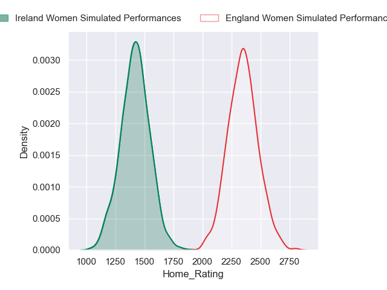
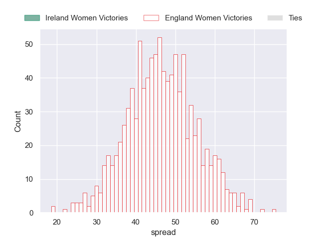

---  
layout: page  
title: Ireland Women at England Women  
date: 2024-04-20 18:00:00 -0500  
categories: "Guinness Women's Six Nations 2024" match projection imputed  
---
# Ireland Women at England Women

# Club Level Predictions

The first set of predictions treats a club as the smallest object, as the club develops its members, organizes a gameplan, and deploys its players as needed for each match. This club model has a prediction of 0.994, which translates to predicting England Women to win by 46.4.

Our Over/Under is 76.5 - and combined with the spread above, we have a predicted scoreline of 15 to 62

Each club has a rating and a rating deviation (similar to a Glicko rating), and expected performances can be generated. This allows for simulated matches and spreads like the ones below.
## Projected Performances - Club Model

## Projected Spreads - Club Model

## Projected Results - Club Model

