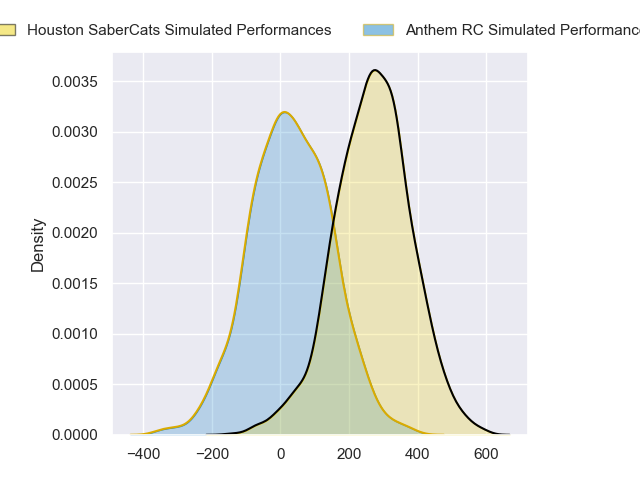
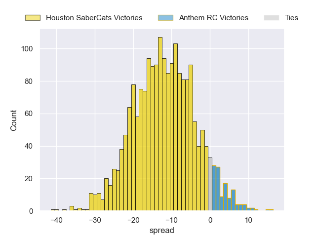
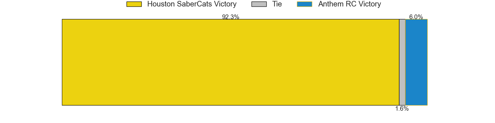

---  
layout: page  
title: Houston SaberCats at Anthem RC  
date: 2024-05-10 18:00:00 -0500  
categories: "Major League Rugby 2024" match projection  
---
# Houston SaberCats at Anthem RC

# Club Level Predictions

The first set of predictions treats a club as the smallest object, as the club develops its members, organizes a gameplan, and deploys its players as needed for each match. This club model has a prediction of 0.011, which translates to predicting Houston SaberCats to win by 36.1.

Our Over/Under is 49.5 - and combined with the spread above, we have a predicted scoreline of 43 to 7

Each club has a rating and a rating deviation (similar to a Glicko rating), and expected performances can be generated. This allows for simulated matches and spreads like the ones below.
## Projected Performances - Club Model

## Projected Spreads - Club Model

## Projected Results - Club Model

# Player Level Predictions

Treating teams instead as an entity made up of the currently active players, I have ratings for each player in an altogether different system. These can be combined to form team ratings once teamsheets are announced, weighting starters a bit higher than the reserves. After the match is played, players can be weighted by their minutes on the field, allowing for an accurate measure of the team's composition. With these compiled team ratings, we can make predictions, measure inaccuracy, and update the individual player ratings.
## Prediction without Player Minutes: Houston SaberCats by 12.1

Houston SaberCats by 14.3 on a neutral pitch

## Projected Performances - Player Model

## Projected Spreads - Player Model

## Projected Results - Player Model

| Away Player            |   Away Percentile |   Number |   Home Percentile | Home Player           |
|:-----------------------|------------------:|---------:|------------------:|:----------------------|
| Ezekiel Lindenmuth     |             86.3  |        1 |            nan    | Dan Hanson            |
| Tiaan Erasmus          |             67.5  |        2 |             18.83 | Connor Robinson       |
| Rob Cobb               |             67.35 |        3 |             26.09 | Joe Apikotoa          |
| Johan Momsen           |             77.65 |        4 |              6.07 | James Rivers          |
| Nathan Den Hoedt       |             44.39 |        5 |             24.97 | Lucas Gramlick        |
| Emmanuel Albert        |             60.78 |        6 |            nan    | Graeme Pedegana       |
| Ronan Murphy           |             78.48 |        7 |              2.31 | Albert O'Shannessey   |
| Gideon Van Wyk         |             60.43 |        8 |            nan    | Michael Ma'Afu        |
| Jay Renton             |            nan    |        9 |              9.24 | Siaosi Nai            |
| Aj Alatimu             |             56.03 |       10 |              4.94 | Te Rangatira Waitokia |
| Jeremy Misailegalu     |             69.96 |       11 |             16.67 | Josh Shetler          |
| Dominic Akina          |             55.53 |       12 |              8.75 | Junior Gafa           |
| Louritz Van Der Schyff |             34.56 |       13 |             37.93 | Dom Iacovino          |
| Seimou Smith           |            nan    |       14 |              2.91 | Tyren Al-Jiboori      |
| Drew Wild              |             73.39 |       15 |             36.05 | Tomasi Alosio         |
| Seth Smith             |             61.17 |       16 |             21.33 | Jack Manzo            |
| Larome White           |            nan    |       17 |              2.46 | Jake Turnbull         |
| Pono Davis             |            nan    |       18 |             16.65 | Stephan Bernal-Wendt  |
| Keni Nasoqeqe          |             74.52 |       19 |              6.02 | Shneil Singh          |
| Tomiwa Agbongbon       |             29.35 |       20 |             27.81 | Logan Weidner         |
| Carlo De Nysschen      |            nan    |       21 |            nan    | Sean Yacoubian        |
| Max Schumacher         |            nan    |       22 |             12.01 | Mateo Gadsden         |
| Drake Davis            |            nan    |       23 |             28.97 | Ulu Niutupuivaha      |

