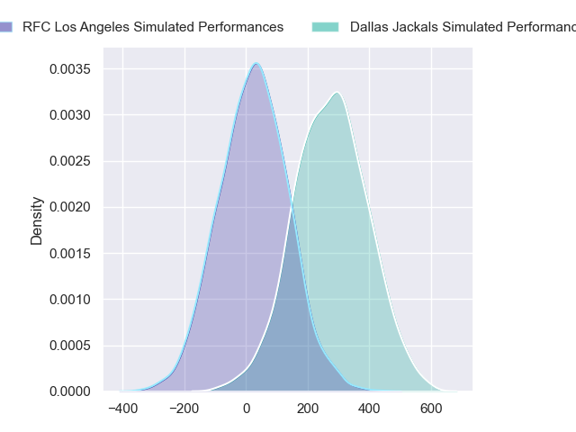
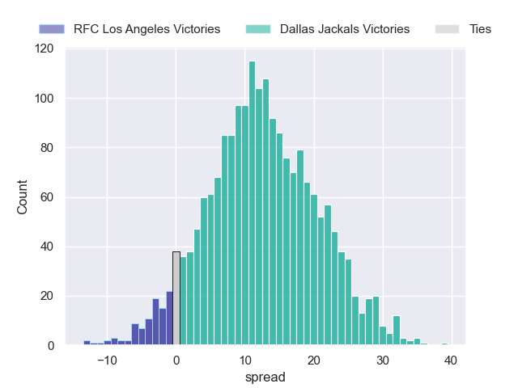
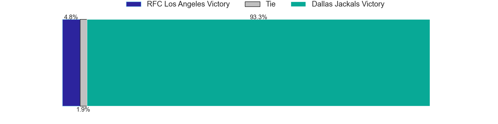

---  
layout: page  
title: RFC Los Angeles at Dallas Jackals  
date: 2024-05-10 18:00:00 -0500  
categories: "Major League Rugby 2024" match projection  
---
# RFC Los Angeles at Dallas Jackals

# Club Level Predictions

The first set of predictions treats a club as the smallest object, as the club develops its members, organizes a gameplan, and deploys its players as needed for each match. This club model has a prediction of 0.731, which translates to predicting Dallas Jackals to win by 12.6.

Our Over/Under is 68.5 - and combined with the spread above, we have a predicted scoreline of 28 to 40

Each club has a rating and a rating deviation (similar to a Glicko rating), and expected performances can be generated. This allows for simulated matches and spreads like the ones below.
## Projected Performances - Club Model

## Projected Spreads - Club Model

## Projected Results - Club Model

# Player Level Predictions

Treating teams instead as an entity made up of the currently active players, I have ratings for each player in an altogether different system. These can be combined to form team ratings once teamsheets are announced, weighting starters a bit higher than the reserves. After the match is played, players can be weighted by their minutes on the field, allowing for an accurate measure of the team's composition. With these compiled team ratings, we can make predictions, measure inaccuracy, and update the individual player ratings.
## Prediction without Player Minutes: Dallas Jackals by 12.8

Dallas Jackals by 10.4 on a neutral pitch

## Projected Performances - Player Model

## Projected Spreads - Player Model

## Projected Results - Player Model

| Away Player           |   Away Percentile |   Number |   Home Percentile | Home Player         |
|:----------------------|------------------:|---------:|------------------:|:--------------------|
| Dane Zander           |             11.81 |        1 |              0.08 | Liam Murray         |
| Ben Strang            |             10.33 |        2 |             65.33 | Dewald Kotze        |
| Alex Maughan          |             59.64 |        3 |             67.02 | Juan Pablo Zeiss    |
| Ben Mitchell          |             33.67 |        4 |             68    | Jero Gomez Vara     |
| Theo Vukasinovic      |             23.96 |        5 |             67.24 | Daemon Torres       |
| Michael Amiras        |             12.34 |        6 |             64.49 | Ronan Foley         |
| Matt Heaton           |             17.25 |        7 |             57.67 | Makeen Alikhan      |
| Jason Damm            |             10.62 |        8 |             61.74 | Sam Tuifua          |
| Niall Saunders        |             14.21 |        9 |             65.19 | Juan-Dee Oliver     |
| Dan Hollinshead       |              8.96 |       10 |             65.09 | Martin Elias        |
| Jack Shaw             |             18.7  |       11 |             63.86 | Nic Benn            |
| Jason Emery           |             14.75 |       12 |             43.56 | Connor Winchester   |
| James Stokes          |             18.12 |       13 |             72.39 | Mitchell Richardson |
| Andrew Coe            |             54.46 |       14 |             70.45 | Tomy Malanos        |
| Austin White          |             14.59 |       15 |             38.41 | Vaughen Isaacs      |
| Bruce Kauika-Petersen |             31.33 |       16 |             71.62 | Joaquín Horcada     |
| Wilton Rebolo         |              8.53 |       17 |            nan    | Connor Grindal      |
| Conor Young           |             15.67 |       18 |            nan    | Kyle Steeves        |
| Max Katjijeko         |             23.37 |       19 |            nan    | Ronnie Mcelligott   |
| Bruce Yun             |            nan    |       20 |            nan    | Cam Nelson          |
| Tas Smith             |             27.71 |       21 |            nan    | Brock Gallagher     |
| Jordan Chait          |            nan    |       22 |             50.25 | Marques Fuala'Au    |
| Seth Purdey           |             27.92 |       23 |             57.27 | Jason Tidwell       |

