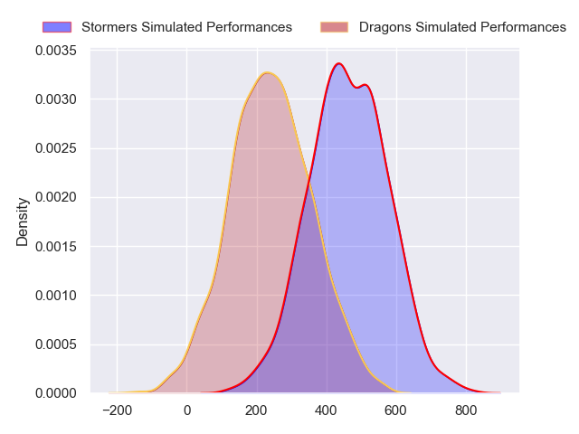
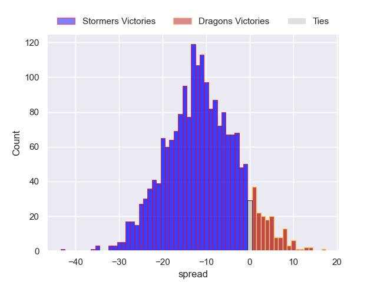
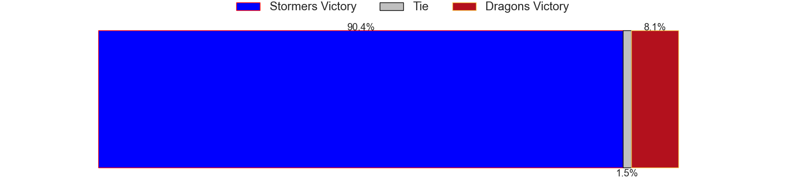

---  
layout: page  
title: Stormers at Dragons  
date: 2024-05-10 18:00:00 -0500  
categories: "United Rugby Championship 2023" match projection  
---
# Stormers at Dragons

# Club Level Predictions

The first set of predictions treats a club as the smallest object, as the club develops its members, organizes a gameplan, and deploys its players as needed for each match. This club model has a prediction of 0.154, which translates to predicting Stormers to win by 11.0.

Our Over/Under is 56.5 - and combined with the spread above, we have a predicted scoreline of 34 to 23

Each club has a rating and a rating deviation (similar to a Glicko rating), and expected performances can be generated. This allows for simulated matches and spreads like the ones below.
## Projected Performances - Club Model

## Projected Spreads - Club Model

## Projected Results - Club Model

# Player Level Predictions

Treating teams instead as an entity made up of the currently active players, I have ratings for each player in an altogether different system. These can be combined to form team ratings once teamsheets are announced, weighting starters a bit higher than the reserves. After the match is played, players can be weighted by their minutes on the field, allowing for an accurate measure of the team's composition. With these compiled team ratings, we can make predictions, measure inaccuracy, and update the individual player ratings.
## Prediction without Player Minutes: Stormers by 11.4

Stormers by 17.4 on a neutral pitch

## Projected Performances - Player Model

## Projected Spreads - Player Model

## Projected Results - Player Model

| Away Player          |   Away Percentile |   Number |   Home Percentile | Home Player        |
|:---------------------|------------------:|---------:|------------------:|:-------------------|
| Sti Sithole          |             67.68 |        1 |              3.69 | Rhodri Jones       |
| Joseph Dweba         |             64.95 |        2 |             91.2  | Elliot Dee         |
| Frans Malherbe       |             84.5  |        3 |             31.34 | Chris Coleman      |
| Salmaan Moerat       |             69.97 |        4 |              0.81 | Matthew Screech    |
| Ruben van Heerden    |             80.28 |        5 |             20.32 | George Nott        |
| Willie Engelbrecht   |             81.64 |        6 |             20.36 | Sean Lonsdale      |
| Ben-Jason Dixon      |             53.46 |        7 |              1.6  | Harrison Keddie    |
| Evan Roos            |             82.61 |        8 |             89.57 | Aaron Wainwright   |
| Herschel Jantjies    |             91.99 |        9 |              8.01 | Dane Blacker       |
| Manie Libbok         |             79.48 |       10 |             27    | Will Reed          |
| Angelo Davids        |             94.39 |       11 |            nan    | Christopher Hollis |
| Daniel du Plessis    |             88.82 |       12 |             64.14 | Aneurin Owen       |
| Wandisile Simelane   |             81.22 |       13 |             82.07 | Steffan Hughes     |
| Suleiman Hartzenberg |             68.64 |       14 |             37.27 | Rio Dyer           |
| Warrick Gelant       |             98.08 |       15 |             76.92 | Jordan Williams    |
| Andre-Hugo Venter    |             68.27 |       16 |             39.04 | Brodie Coghlan     |
| Brok Harris          |             99.92 |       17 |             62.59 | Rodrigo Martinez   |
| Neethling Fouche     |             84.41 |       18 |            nan    | Dimitri Arhip      |
| Adre Smith           |             82.31 |       19 |             10.47 | James Benjamin     |
| Hacjivah Dayimani    |             93.88 |       20 |             28.69 | Taine Basham       |
| Stefan Ungerer       |             18.33 |       21 |            nan    | Morgan Lloyd       |
| Jean-Luc du Plessis  |            nan    |       22 |              7.78 | Angus O'Brien      |
| Sacha Mngomezulu     |             73.42 |       23 |             86.08 | Sio Tomkinson      |

