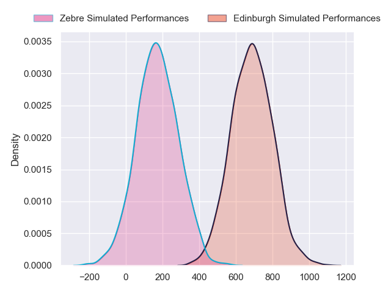
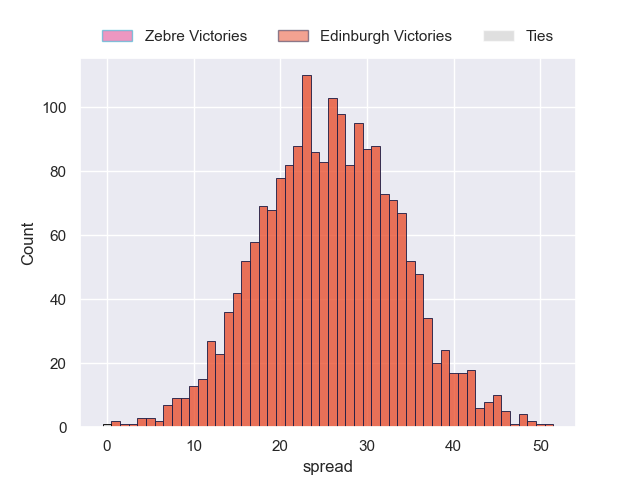
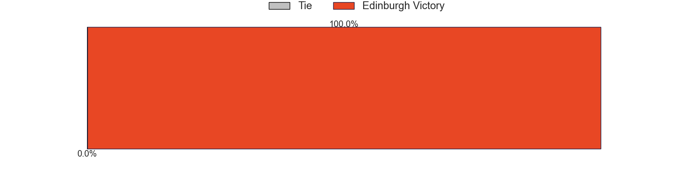

---  
layout: page  
title: Zebre at Edinburgh  
date: 2024-05-10 18:00:00 -0500  
categories: "United Rugby Championship 2023" match projection  
---
# Zebre at Edinburgh

# Club Level Predictions

The first set of predictions treats a club as the smallest object, as the club develops its members, organizes a gameplan, and deploys its players as needed for each match. This club model has a prediction of 0.821, which translates to predicting Edinburgh to win by 16.2.

Our Over/Under is 44.5 - and combined with the spread above, we have a predicted scoreline of 14 to 31

Each club has a rating and a rating deviation (similar to a Glicko rating), and expected performances can be generated. This allows for simulated matches and spreads like the ones below.
## Projected Performances - Club Model

## Projected Spreads - Club Model

## Projected Results - Club Model

# Player Level Predictions

Treating teams instead as an entity made up of the currently active players, I have ratings for each player in an altogether different system. These can be combined to form team ratings once teamsheets are announced, weighting starters a bit higher than the reserves. After the match is played, players can be weighted by their minutes on the field, allowing for an accurate measure of the team's composition. With these compiled team ratings, we can make predictions, measure inaccuracy, and update the individual player ratings.
## Prediction without Player Minutes: Edinburgh by 26.2

Edinburgh by 19.7 on a neutral pitch

## Projected Performances - Player Model

## Projected Spreads - Player Model

## Projected Results - Player Model

| Away Player            |   Away Percentile |   Number |   Home Percentile | Home Player         |
|:-----------------------|------------------:|---------:|------------------:|:--------------------|
| Muhamed Hasa           |             30.19 |        1 |             93.19 | Pierre Schoeman     |
| Giampietro Ribaldi     |             33.89 |        2 |             86.71 | Ewan Ashman         |
| Juan Pitinari          |             18.79 |        3 |             99.18 | WP Nel              |
| Matteo Canali          |             89.69 |        4 |             83.72 | Sam Skinner         |
| Andrea Zambonin        |             37.82 |        5 |             95.55 | Grant Gilchrist     |
| Giacomo Ferrari        |             47.83 |        6 |            100    | Jamie Ritchie       |
| Taina Fox-Matamua      |             72.42 |        7 |             60.58 | Hamish Watson       |
| Giovanni Licata        |             24.35 |        8 |             76.96 | Viliame Mata        |
| Thomas Dominguez       |             33.45 |        9 |             88.61 | Ali Price           |
| Giovanni Montemauri    |            nan    |       10 |             83.37 | Ben Healy           |
| Simone Gesi            |              5.81 |       11 |             87.12 | Duhan van der Merwe |
| Enrico Lucchin         |             67.09 |       12 |             93.57 | James Lang          |
| Fetuli Paea            |             69.73 |       13 |             68.25 | Mark Bennett        |
| Jacopo Trulla          |              5.13 |       14 |             84.39 | Matt Currie         |
| Geronimo Prisciantelli |             90.06 |       15 |             94.02 | Wes Goosen          |
| Tommaso Di Bartolomeo  |            nan    |       16 |             55.15 | Dave Cherry         |
| Samuele Taddei         |            nan    |       17 |             13.86 | Boan Venter         |
| Riccardo Genovese      |            nan    |       18 |             62.1  | Javan Sebastian     |
| Dave Sisi              |              5.06 |       19 |             88.57 | Marshall Sykes      |
| Bautista Stavile       |             33.2  |       20 |             92.39 | Luke Crosbie        |
| Gonzalo Garcia         |             38.79 |       21 |             80.07 | Ben Vellacott       |
| Damiano Mazza          |             70.25 |       22 |            nan    | Cameron Scott       |
| Lorenzo Pani           |             27.99 |       23 |              7.91 | Chris Dean          |

