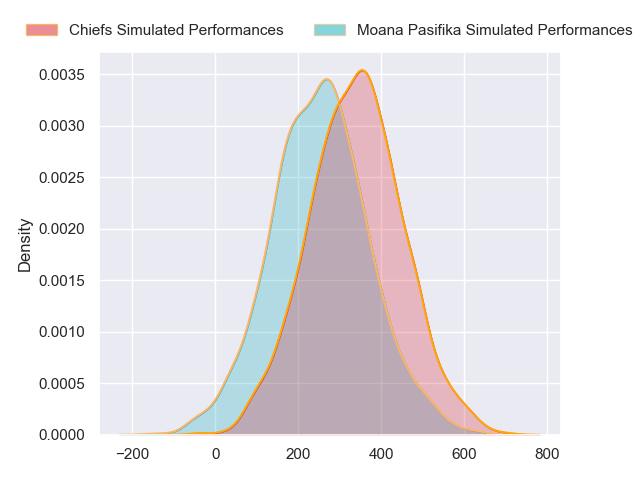
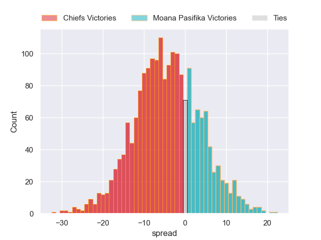

---  
layout: page  
title: Chiefs at Moana Pasifika  
date: 2024-05-10 18:00:00 -0500  
categories: "Super Rugby Pacific 2024" match projection  
---
# Chiefs at Moana Pasifika

# Club Level Predictions

The first set of predictions treats a club as the smallest object, as the club develops its members, organizes a gameplan, and deploys its players as needed for each match. This club model has a prediction of 0.089, which translates to predicting Chiefs to win by 16.9.

Our Over/Under is 60.5 - and combined with the spread above, we have a predicted scoreline of 39 to 22

Each club has a rating and a rating deviation (similar to a Glicko rating), and expected performances can be generated. This allows for simulated matches and spreads like the ones below.
## Projected Performances - Club Model

## Projected Spreads - Club Model

## Projected Results - Club Model

# Player Level Predictions

Treating teams instead as an entity made up of the currently active players, I have ratings for each player in an altogether different system. These can be combined to form team ratings once teamsheets are announced, weighting starters a bit higher than the reserves. After the match is played, players can be weighted by their minutes on the field, allowing for an accurate measure of the team's composition. With these compiled team ratings, we can make predictions, measure inaccuracy, and update the individual player ratings.
## Prediction without Player Minutes: Chiefs by 4.5

Chiefs by 6.9 on a neutral pitch

## Projected Performances - Player Model

## Projected Spreads - Player Model

## Projected Results - Player Model

| Away Player            |   Away Percentile |   Number |   Home Percentile | Home Player       |
|:-----------------------|------------------:|---------:|------------------:|:------------------|
| Ollie Norris           |             82.28 |        1 |            nan    | Sateki Latu       |
| Samisoni Taukei'aho    |             94.02 |        2 |             58.8  | Sama Malolo       |
| Reuben O'Neill         |             23.95 |        3 |             20.34 | Suetena Asomua    |
| Manaaki Selby-Rickit   |             11.73 |        4 |             64.78 | Semisi Paea       |
| Tupou Vaa'i            |             92.11 |        5 |             16.18 | Allan Craig       |
| Simon Parker           |             34.9  |        6 |             69.01 | Miracle Faiilagi  |
| Luke Jacobson          |             91.68 |        7 |             49.85 | Alamanda Motuga   |
| Wallace Sititi         |             41.96 |        8 |             10.22 | Lotu Inisi        |
| Xavier Roe             |             39.5  |        9 |            nan    | Aisea Halo        |
| Josh Jacomb            |             32.61 |       10 |             21.2  | D'Angelo Leuila   |
| Daniel Rona            |             78.22 |       11 |             91.97 | Neria Fomai       |
| Quinn Tupaea           |             90.08 |       12 |             26.27 | Lalomilo Lalomilo |
| Anton Lienert-Brown    |             92.83 |       13 |             72.57 | Pepesana Patafilo |
| Liam Coombes-Fabling   |             85.87 |       14 |             78.51 | Nigel Ah Wong     |
| Etene Nanai-Seturo     |             62.82 |       15 |             10.26 | Danny Toala       |
| Tyrone Thompson        |             74.75 |       16 |            nan    | Thomas Maka       |
| Jared Proffit          |             27.81 |       17 |             14.68 | Abraham Pole      |
| Sione Ahio             |            nan    |       18 |             47.99 | Sione Mafileo     |
| Hamilton Burr          |            nan    |       19 |             90.8  | Tom Savage        |
| Kaylum Boshier         |             55.17 |       20 |             42.63 | Irie Papuni       |
| Te Toiroa Tahuriorangi |             69.75 |       21 |            nan    | Siaosi Nginingini |
| Rameka Poihipi         |             76.16 |       22 |             69.87 | Otumaka Mausia    |
| Gideon Wrampling       |            nan    |       23 |             33.33 | Kyren Taumoefolau |

