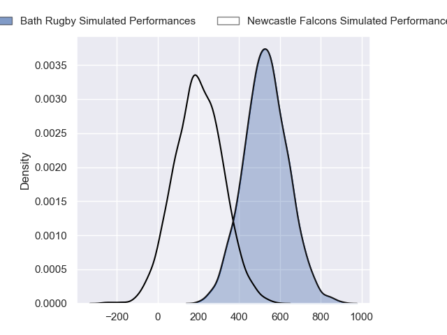
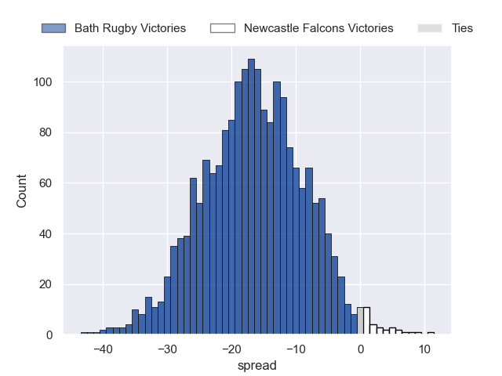
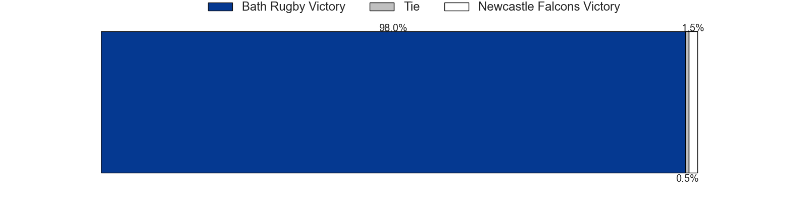

---  
layout: page  
title: Bath Rugby at Newcastle Falcons  
date: 2024-05-10 18:00:00 -0500  
categories: "Gallagher Premiership 2023" match projection  
---
# Bath Rugby at Newcastle Falcons

# Club Level Predictions

The first set of predictions treats a club as the smallest object, as the club develops its members, organizes a gameplan, and deploys its players as needed for each match. This club model has a prediction of 0.224, which translates to predicting Bath Rugby to win by 7.1.

Our Over/Under is 55.5 - and combined with the spread above, we have a predicted scoreline of 31 to 24

Each club has a rating and a rating deviation (similar to a Glicko rating), and expected performances can be generated. This allows for simulated matches and spreads like the ones below.
## Projected Performances - Club Model

## Projected Spreads - Club Model

## Projected Results - Club Model

# Player Level Predictions

Treating teams instead as an entity made up of the currently active players, I have ratings for each player in an altogether different system. These can be combined to form team ratings once teamsheets are announced, weighting starters a bit higher than the reserves. After the match is played, players can be weighted by their minutes on the field, allowing for an accurate measure of the team's composition. With these compiled team ratings, we can make predictions, measure inaccuracy, and update the individual player ratings.
## Prediction without Player Minutes: Bath Rugby by 16.9

Bath Rugby by 24.8 on a neutral pitch

## Projected Performances - Player Model

## Projected Spreads - Player Model

## Projected Results - Player Model

| Away Player        |   Away Percentile |   Number |   Home Percentile | Home Player         |
|:-------------------|------------------:|---------:|------------------:|:--------------------|
| Beno Obano         |             90.4  |        1 |              1.48 | Adam Brocklebank    |
| Tom Dunn           |             97.18 |        2 |              1.33 | Jamie Blamire       |
| Thomas du Toit     |             94.59 |        3 |              0.98 | Eduardo Bello       |
| Quinn Roux         |             94.24 |        4 |             58.65 | Tim Cardall         |
| Charlie Ewels      |             66.13 |        5 |              7.68 | Sebastian de Chaves |
| Ted Hill           |             86.96 |        6 |             19.36 | Sam Cross           |
| Sam Underhill      |             91.07 |        7 |              8.32 | Guy Pepper          |
| Alfie Barbeary     |             74.35 |        8 |              1.52 | Callum Chick        |
| Ben Spencer        |             80.6  |        9 |              1.42 | Sam Stuart          |
| Finn Russell       |             99.78 |       10 |              7.34 | Brett Connon        |
| Will Muir          |             14.13 |       11 |             83.74 | Ben Redshaw         |
| Cameron Redpath    |             46.62 |       12 |             66.24 | Cameron Hutchison   |
| Ollie Lawrence     |             84.07 |       13 |             99.16 | Matias Moroni       |
| Joe Cokanasiga     |             93.9  |       14 |             29.04 | Adam Radwan         |
| Matt Gallagher     |             96.15 |       15 |            nan    | Louis Brown         |
| Niall Annett       |             57.14 |       16 |             81.06 | Bryan Byrne         |
| Juan Schoeman      |             54.8  |       17 |            nan    | Mark Dormer         |
| Will Stuart        |             34.62 |       18 |             57.01 | Richard Palframan   |
| Jacques du Plessis |             12.74 |       19 |             35.49 | John Hawkins        |
| Miles Reid         |             96.89 |       20 |             62.99 | Freddie Lockwood    |
| Louis Schreuder    |             76.87 |       21 |              3.56 | James Elliott       |
| Orlando Bailey     |             38.23 |       22 |             43.67 | Rory Jennings       |
| Josh Bayliss       |             14.14 |       23 |             69.09 | Oliver Spencer      |

