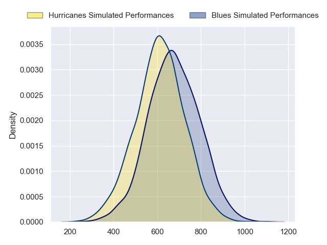
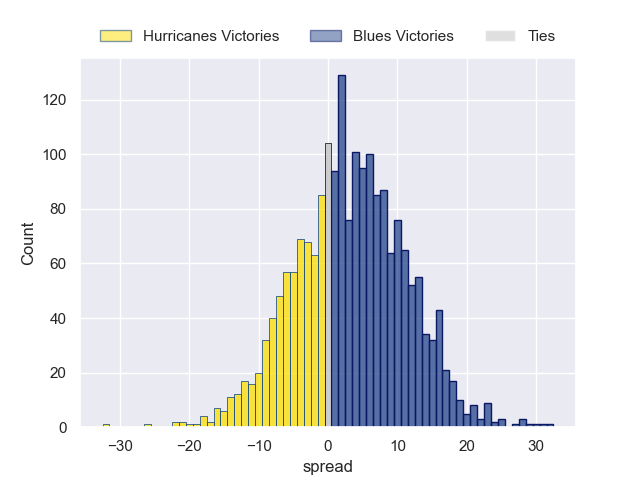

---  
layout: page  
title: Hurricanes at Blues  
date: 2024-05-11 18:00:00 -0500  
categories: "Super Rugby Pacific 2024" match projection  
---
# Hurricanes at Blues

# Club Level Predictions

The first set of predictions treats a club as the smallest object, as the club develops its members, organizes a gameplan, and deploys its players as needed for each match. This club model has a prediction of 0.54, which translates to predicting Blues to win by 4.7.

Our Over/Under is 57.5 - and combined with the spread above, we have a predicted scoreline of 26 to 31

Each club has a rating and a rating deviation (similar to a Glicko rating), and expected performances can be generated. This allows for simulated matches and spreads like the ones below.
## Projected Performances - Club Model

## Projected Spreads - Club Model

## Projected Results - Club Model

# Player Level Predictions

Treating teams instead as an entity made up of the currently active players, I have ratings for each player in an altogether different system. These can be combined to form team ratings once teamsheets are announced, weighting starters a bit higher than the reserves. After the match is played, players can be weighted by their minutes on the field, allowing for an accurate measure of the team's composition. With these compiled team ratings, we can make predictions, measure inaccuracy, and update the individual player ratings.
## Prediction without Player Minutes: Blues by 3.1

Hurricanes by 1.4 on a neutral pitch

## Projected Performances - Player Model

## Projected Spreads - Player Model

## Projected Results - Player Model

| Away Player          |   Away Percentile |   Number |   Home Percentile | Home Player       |
|:---------------------|------------------:|---------:|------------------:|:------------------|
| Xavier Numia         |             96.88 |        1 |             99.1  | Ofa Tu'ungafasi   |
| Kianu Kereru-Symes   |             80.9  |        2 |             88.21 | Ricky Riccitelli  |
| Tyrel Lomax          |             94.83 |        3 |             79.41 | Marcel Renata     |
| Caleb Delany         |             85.54 |        4 |             95.65 | Patrick Tuipulotu |
| Isaia Walker-Leawere |             97.17 |        5 |             39.13 | Sam Darry         |
| Brad Shields         |             92.68 |        6 |             97.89 | Akira Ioane       |
| Peter Lakai          |             95.29 |        7 |             99.1  | Dalton Papalii    |
| Brayden Iose         |              1.3  |        8 |             96.3  | Hoskins Sotutu    |
| TJ Perenara          |             97.69 |        9 |             29.72 | Taufa Funaki      |
| Brett Cameron        |             21.17 |       10 |             92.66 | Harry Plummer     |
| Kini Naholo          |             96.52 |       11 |             66.02 | Caleb Clarke      |
| Jordie Barrett       |             96.62 |       12 |             98.63 | Bryce Heem        |
| Billy Proctor        |             95.57 |       13 |             78.59 | AJ Lam            |
| Joshua Moorby        |             90.42 |       14 |             80.74 | Mark Tele'a       |
| Ruben Love           |             95.94 |       15 |             80.13 | Zarn Sullivan     |
| Raymond Tuputupu     |            nan    |       16 |             90.7  | Kurt Eklund       |
| Pouri Rakete-Stones  |             91.06 |       17 |             48.97 | Josh Fusitu'a     |
| Pasilio Tosi         |             51.11 |       18 |             96.47 | Angus Ta'avao     |
| Justin Sangster      |             77.96 |       19 |             80.99 | Josh Beehre       |
| Devan Flanders       |             88.87 |       20 |             64.19 | Adrian Choat      |
| Du'Plessis Kirifi    |             93.38 |       21 |             74.91 | Sam Nock          |
| Richard Judd         |             95.55 |       22 |             77.74 | Corey Evans       |
| Bailyn Sullivan      |             38.72 |       23 |             74.57 | Cole Forbes       |

