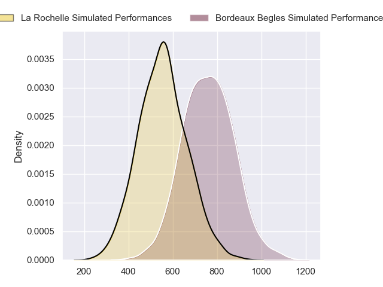
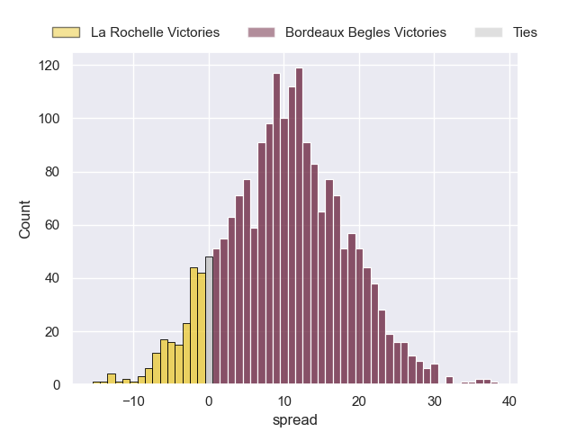
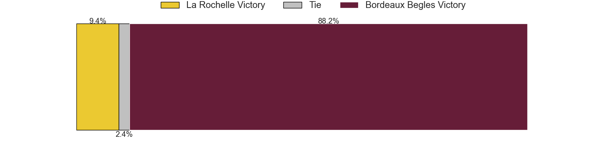

---  
layout: page  
title: La Rochelle at Bordeaux Begles  
date: 2024-05-11 18:00:00 -0500  
categories: "Top 14 2024" match projection  
---
# La Rochelle at Bordeaux Begles

# Club Level Predictions

The first set of predictions treats a club as the smallest object, as the club develops its members, organizes a gameplan, and deploys its players as needed for each match. This club model has a prediction of 0.441, which translates to predicting La Rochelle to win by -1.2.

Our Over/Under is 44.5 - and combined with the spread above, we have a predicted scoreline of 22 to 23

Each club has a rating and a rating deviation (similar to a Glicko rating), and expected performances can be generated. This allows for simulated matches and spreads like the ones below.
## Projected Performances - Club Model

## Projected Spreads - Club Model

## Projected Results - Club Model

# Player Level Predictions

Treating teams instead as an entity made up of the currently active players, I have ratings for each player in an altogether different system. These can be combined to form team ratings once teamsheets are announced, weighting starters a bit higher than the reserves. After the match is played, players can be weighted by their minutes on the field, allowing for an accurate measure of the team's composition. With these compiled team ratings, we can make predictions, measure inaccuracy, and update the individual player ratings.
## Prediction without Player Minutes: Bordeaux Begles by 10.4

Bordeaux Begles by 3.1 on a neutral pitch

## Projected Performances - Player Model

## Projected Spreads - Player Model

## Projected Results - Player Model

| Away Player           |   Away Percentile |   Number |   Home Percentile | Home Player               |
|:----------------------|------------------:|---------:|------------------:|:--------------------------|
| Alexandre Kaddouri    |             50.94 |        1 |             89.42 | Lekso Kaulashvili         |
| Quentin Lespiaucq     |             76.17 |        2 |             64.17 | Maxime Lamothe            |
| Uini Atonio           |             99.59 |        3 |             96.8  | Ben Tameifuna             |
| Thomas Lavault        |             92.21 |        4 |             92.52 | Cyril Cazeaux             |
| Will Skelton          |             98.48 |        5 |             98.89 | Adam Coleman              |
| Judicael Cancoriet    |             33.8  |        6 |             78.84 | Bastien Vergnes Taillefer |
| Levani Botia          |             97.39 |        7 |             80.64 | Mahamadou Diaby           |
| Gregory Alldritt      |             98.91 |        8 |             87.17 | Tevita Tatafu             |
| Thomas Berjon         |             85.26 |        9 |             99.47 | Maxime Lucu               |
| Antoine Hastoy        |             60.09 |       10 |             96.98 | Matthieu Jalibert         |
| Jules Favre           |             86.53 |       11 |             81.01 | Louis Bielle-Biarrey      |
| Jonathan Danty        |             92.41 |       12 |             81.45 | Yoram Moefana             |
| Ihaia West            |             54.48 |       13 |             83.03 | Nicolas Depoortere        |
| Teddy Thomas          |             89.53 |       14 |             96.32 | Damian Penaud             |
| Dillyn Leyds          |             98.5  |       15 |             97.64 | Romain Buros              |
| Tolu Latu             |             90.5  |       16 |             92.83 | Clement Maynadier         |
| Thierry Païva         |            nan    |       17 |             91.71 | Ugo Boniface              |
| Oscar Jegou           |             42.93 |       18 |             76.04 | Kane Douglas              |
| Matthias Haddad       |             49.75 |       19 |             89.89 | Guido Petti               |
| Yoan Tanga            |             70.87 |       20 |             91.47 | Pete Samu                 |
| Mathis Brunet         |            nan    |       21 |              5.68 | Yann Lesgourgues          |
| Jack Nowell           |             97.19 |       22 |              9.88 | Pablo Uberti              |
| Georges-Henri Colombe |              4.02 |       23 |             37.57 | Carlu Sadie               |

