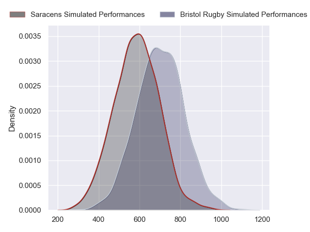
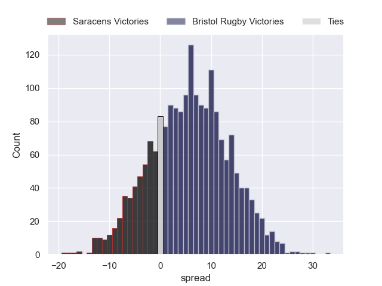

---  
layout: page  
title: Saracens at Bristol Rugby  
date: 2024-05-11 18:00:00 -0500  
categories: "Gallagher Premiership 2023" match projection  
---
# Saracens at Bristol Rugby

# Club Level Predictions

The first set of predictions treats a club as the smallest object, as the club develops its members, organizes a gameplan, and deploys its players as needed for each match. This club model has a prediction of 0.425, which translates to predicting Saracens to win by -0.7.

Our Over/Under is 40.5 - and combined with the spread above, we have a predicted scoreline of 20 to 20

Each club has a rating and a rating deviation (similar to a Glicko rating), and expected performances can be generated. This allows for simulated matches and spreads like the ones below.
## Projected Performances - Club Model

## Projected Spreads - Club Model

## Projected Results - Club Model

# Player Level Predictions

Treating teams instead as an entity made up of the currently active players, I have ratings for each player in an altogether different system. These can be combined to form team ratings once teamsheets are announced, weighting starters a bit higher than the reserves. After the match is played, players can be weighted by their minutes on the field, allowing for an accurate measure of the team's composition. With these compiled team ratings, we can make predictions, measure inaccuracy, and update the individual player ratings.
## Prediction without Player Minutes: Bristol Rugby by 6.0

Bristol Rugby by 1.0 on a neutral pitch

## Projected Performances - Player Model

## Projected Spreads - Player Model

## Projected Results - Player Model

| Away Player          |   Away Percentile |   Number |   Home Percentile | Home Player                |
|:---------------------|------------------:|---------:|------------------:|:---------------------------|
| Mako Vunipola        |             99.84 |        1 |             82.69 | Ellis Genge                |
| Jamie George         |             98.33 |        2 |             77.33 | Gabriel Oghre              |
| Marco Riccioni       |             40.61 |        3 |             93.77 | Kyle Sinckler              |
| Maro Itoje           |             95.05 |        4 |             92.92 | James Dun                  |
| Hugh Tizard          |             57.33 |        5 |             88.27 | Joe Batley                 |
| Juan Martin Gonzalez |             92.78 |        6 |             99.4  | Steven Luatua              |
| Ben Earl             |             96.79 |        7 |             94.28 | Fitz Harding               |
| Tom Willis           |             22.61 |        8 |             65.22 | Magnus Bradbury            |
| Ivan van Zyl         |             75.49 |        9 |             95.03 | Harry Randall              |
| Owen Farrell         |             99.35 |       10 |             97.41 | AJ MacGinty                |
| Tom Parton           |             92.64 |       11 |             94.09 | Gabriel Ibitoye            |
| Nick Tompkins        |             97.79 |       12 |             76.92 | James Williams             |
| Lucio Cinti          |             49.42 |       13 |             95.79 | Benhard Janse van Rensburg |
| Rotimi Segun         |             41.76 |       14 |             74.81 | Ratu Naulago               |
| Elliot Daly          |             83.26 |       15 |             60.73 | Max Malins                 |
| Theo Dan             |             52.5  |       16 |             87.33 | Harry Thacker              |
| Eroni Mawi           |             79.25 |       17 |             81.71 | Jake Woolmore              |
| Oli Hoskins          |            nan    |       18 |             57.1  | Max Lahiff                 |
| Nick Isiekwe         |             89.38 |       19 |             16.68 | Josh Caulfield             |
| Theo McFarland       |             31.85 |       20 |             62.49 | Jake Heenan                |
| Billy Vunipola       |             98.04 |       21 |             89.52 | Kieran Marmion             |
| Aled Davies          |             77.62 |       22 |             93.68 | Virimi Vakatawa            |
| Alex Goode           |             86.7  |       23 |             84.59 | Noah Heward                |

