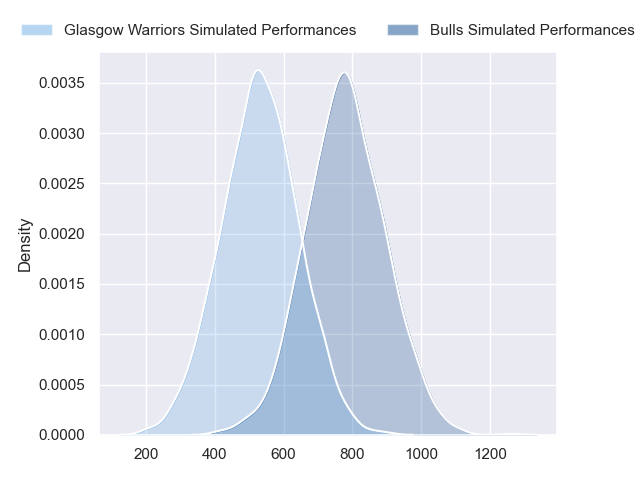
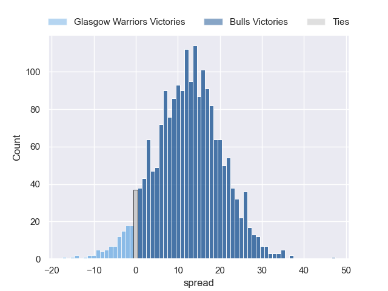

---  
layout: page  
title: Glasgow Warriors at Bulls  
date: 2024-05-11 18:00:00 -0500  
categories: "United Rugby Championship 2023" match projection  
---
# Glasgow Warriors at Bulls

# Club Level Predictions

The first set of predictions treats a club as the smallest object, as the club develops its members, organizes a gameplan, and deploys its players as needed for each match. This club model has a prediction of 0.525, which translates to predicting Bulls to win by 4.3.

Our Over/Under is 42.5 - and combined with the spread above, we have a predicted scoreline of 19 to 23

Each club has a rating and a rating deviation (similar to a Glicko rating), and expected performances can be generated. This allows for simulated matches and spreads like the ones below.
## Projected Performances - Club Model

## Projected Spreads - Club Model

## Projected Results - Club Model

# Player Level Predictions

Treating teams instead as an entity made up of the currently active players, I have ratings for each player in an altogether different system. These can be combined to form team ratings once teamsheets are announced, weighting starters a bit higher than the reserves. After the match is played, players can be weighted by their minutes on the field, allowing for an accurate measure of the team's composition. With these compiled team ratings, we can make predictions, measure inaccuracy, and update the individual player ratings.
## Prediction without Player Minutes: Bulls by 12.4

Bulls by 7.9 on a neutral pitch

## Projected Performances - Player Model

## Projected Spreads - Player Model

## Projected Results - Player Model

| Away Player           |   Away Percentile |   Number |   Home Percentile | Home Player         |
|:----------------------|------------------:|---------:|------------------:|:--------------------|
| Jamie Bhatti          |             95.65 |        1 |             94.01 | Gerhard Steenekamp  |
| Grant Stewart         |            nan    |        2 |             99.5  | Akker van der Merwe |
| Murphy Walker         |             47.25 |        3 |             99.51 | Wilco Louw          |
| Gregor Brown          |             53.06 |        4 |             16.99 | Ruan Vermaak        |
| Scott Cummings        |             97.88 |        5 |             91.1  | Ruan Nortje         |
| Matt Fagerson         |             96.19 |        6 |             93.38 | Marco van Staden    |
| Rory Darge            |             82.45 |        7 |             93.08 | Elrigh Louw         |
| Jack Dempsey          |             32.17 |        8 |             32.39 | Cameron Hanekom     |
| George Horne          |             99.29 |        9 |             95.2  | Embrose Papier      |
| Tom Jordan            |             39.44 |       10 |             36.42 | Chris William Smith |
| Sebastian Cancelliere |             98.84 |       11 |             98.55 | Kurt-Lee Arendse    |
| Sione Tuipulotu       |             64.7  |       12 |             96.52 | Harold Vorster      |
| Stafford McDowall     |             92.73 |       13 |             94.84 | David Kriel         |
| Kyle Steyn            |             96.61 |       14 |             99.32 | Canan Moodie        |
| Josh McKay            |             60.3  |       15 |             97.21 | Willie le Roux      |
| Johnny Matthews       |             24.5  |       16 |             96.17 | Johan Grobbelaar    |
| Nathan McBeth         |             49.38 |       17 |             80.15 | Simphiwe Matanzima  |
| Zander Fagerson       |             99.34 |       18 |            nan    | Francois Klopper    |
| Max Williamson        |             49.54 |       19 |             81.9  | Reinhardt Ludwig    |
| Euan Ferrie           |             57.27 |       20 |             93.58 | Nizaam Carr         |
| Henco Venter          |             97.39 |       21 |             88.28 | Zak Burger          |
| Jamie Dobie           |             75.67 |       22 |             69.4  | Jaco van der Walt   |
| Duncan Weir           |             82.54 |       23 |             85.84 | Devon Williams      |

