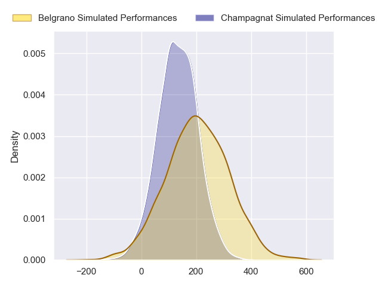
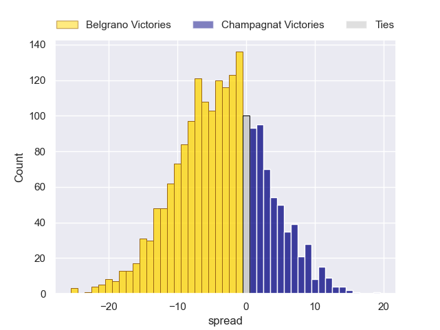
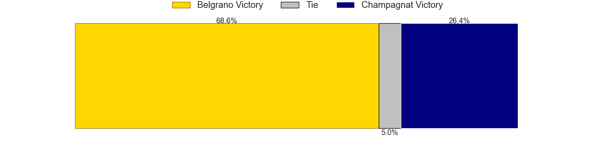

---  
layout: page  
title: Belgrano at Champagnat  
date: 2024-05-11 18:00:00 -0500  
categories: "URBA Top 12 2024" match projection  
---
# Belgrano at Champagnat

# Club Level Predictions

The first set of predictions treats a club as the smallest object, as the club develops its members, organizes a gameplan, and deploys its players as needed for each match. This club model has a prediction of 0.902, which translates to predicting Champagnat to win by 22.7.

Our Over/Under is 56.5 - and combined with the spread above, we have a predicted scoreline of 17 to 40

Each club has a rating and a rating deviation (similar to a Glicko rating), and expected performances can be generated. This allows for simulated matches and spreads like the ones below.
## Projected Performances - Club Model

## Projected Spreads - Club Model

## Projected Results - Club Model

# Player Level Predictions

Treating teams instead as an entity made up of the currently active players, I have ratings for each player in an altogether different system. These can be combined to form team ratings once teamsheets are announced, weighting starters a bit higher than the reserves. After the match is played, players can be weighted by their minutes on the field, allowing for an accurate measure of the team's composition. With these compiled team ratings, we can make predictions, measure inaccuracy, and update the individual player ratings.
## Prediction without Player Minutes: Belgrano by 3.2

Belgrano by 5.7 on a neutral pitch

## Projected Performances - Player Model

## Projected Spreads - Player Model

## Projected Results - Player Model

| Away Player            |   Away Percentile |   Number |   Home Percentile | Home Player                   |
|:-----------------------|------------------:|---------:|------------------:|:------------------------------|
| Francisco Ferronato    |             55.37 |        1 |             43.15 | Tomas Distel                  |
| Francisco Lusarreta    |             57.67 |        2 |             46.17 | Fernando Rodriguez Pascarella |
| Lisandro Garcia Dragui |             49.22 |        3 |            nan    | nan                           |
| Luciano Tecca          |             61.98 |        4 |            nan    | nan                           |
| Mikael Quesada         |             37.41 |        5 |            nan    | nan                           |
| Joaquin de la Serna    |             51.6  |        6 |            nan    | nan                           |
| Augusto Vaccarino      |             35.49 |        7 |            nan    | nan                           |
| Franco Vega            |             48.7  |        8 |            nan    | nan                           |
| Theo Blaksley          |            nan    |        9 |            nan    | nan                           |
| Joaquin Mihura         |             49.14 |       10 |            nan    | nan                           |
| Tobias Bernabe         |             35.47 |       11 |            nan    | nan                           |
| Ramon Arana            |             48.74 |       12 |            nan    | nan                           |
| Tomas Etchepare        |             48.74 |       13 |            nan    | nan                           |
| Ignacio Diaz           |             53.49 |       14 |            nan    | nan                           |
| Juan Lando             |             47.42 |       15 |            nan    | nan                           |
| Away Team 16           |            nan    |       16 |            nan    | nan                           |
| Away Team 17           |            nan    |       17 |            nan    | nan                           |
| Away Team 18           |            nan    |       18 |            nan    | nan                           |
| Away Team 19           |            nan    |       19 |            nan    | nan                           |
| Away Team 20           |            nan    |       20 |            nan    | nan                           |
| Away Team 21           |            nan    |       21 |            nan    | nan                           |
| Away Team 22           |            nan    |       22 |            nan    | nan                           |
| Away Team 23           |            nan    |       23 |            nan    | nan                           |

