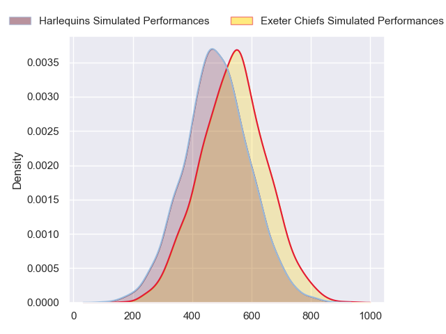
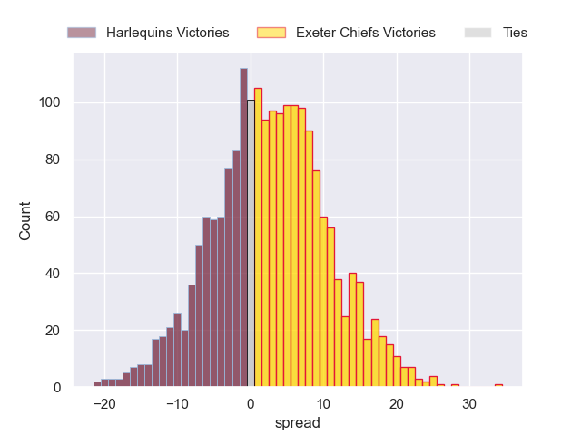

---  
layout: page  
title: Harlequins at Exeter Chiefs  
date: 2024-05-11 18:00:00 -0500  
categories: "Gallagher Premiership 2023" match projection  
---
# Harlequins at Exeter Chiefs

# Club Level Predictions

The first set of predictions treats a club as the smallest object, as the club develops its members, organizes a gameplan, and deploys its players as needed for each match. This club model has a prediction of 0.476, which translates to predicting Harlequins to win by -2.6.

Our Over/Under is 63.5 - and combined with the spread above, we have a predicted scoreline of 31 to 33

Each club has a rating and a rating deviation (similar to a Glicko rating), and expected performances can be generated. This allows for simulated matches and spreads like the ones below.
## Projected Performances - Club Model

## Projected Spreads - Club Model

## Projected Results - Club Model

# Player Level Predictions

Treating teams instead as an entity made up of the currently active players, I have ratings for each player in an altogether different system. These can be combined to form team ratings once teamsheets are announced, weighting starters a bit higher than the reserves. After the match is played, players can be weighted by their minutes on the field, allowing for an accurate measure of the team's composition. With these compiled team ratings, we can make predictions, measure inaccuracy, and update the individual player ratings.
## Prediction without Player Minutes: Exeter Chiefs by 3.0

Harlequins by 2.1 on a neutral pitch

## Projected Performances - Player Model

## Projected Spreads - Player Model

## Projected Results - Player Model

| Away Player               |   Away Percentile |   Number |   Home Percentile | Home Player          |
|:--------------------------|------------------:|---------:|------------------:|:---------------------|
| Joe Marler                |             98.03 |        1 |             97.95 | Scott Sio            |
| Jack Walker               |             29.17 |        2 |             95    | Jack Yeandle         |
| Will Collier              |             94.5  |        3 |             34.95 | Marcus Street        |
| Irne Herbst               |             78.77 |        4 |             44.99 | Jack Dunne           |
| Stephan Lewies            |             87.77 |        5 |             92.72 | Dafydd Jenkins       |
| Chandler Cunningham-South |             81.54 |        6 |             85.46 | Ethan Roots          |
| James Chisholm            |             92.17 |        7 |             88.26 | Jacques Vermeulen    |
| Alex Dombrandt            |             90.43 |        8 |             78.04 | Greg Fisilau         |
| Will Porter               |             35.35 |        9 |             83.84 | Tom Cairns           |
| Marcus Smith              |             89.87 |       10 |             61.42 | Harvey Skinner       |
| Cadan Murley              |             47.87 |       11 |             92.44 | Olly Woodburn        |
| Luke Northmore            |             86.3  |       12 |             52.9  | Joe Hawkins          |
| Oscar Beard               |             73.55 |       13 |             97.15 | Henry Slade          |
| Louis Lynagh              |             88.76 |       14 |             86.72 | Immanuel Feyi-Waboso |
| Tyrone Green              |             78.76 |       15 |             52.15 | Dan John             |
| Sam Riley                 |             68.5  |       16 |            nan    | Max Norey            |
| Fin Baxter                |             51.19 |       17 |            nan    | Billy Keast          |
| Dillon Lewis              |             94.59 |       18 |             70.55 | Ehren Painter        |
| George Hammond            |             20.63 |       19 |             47.34 | Christ Tshiunza      |
| Jack Kenningham           |            nan    |       20 |             79.57 | Ross Vintcent        |
| Will Evans                |             83.15 |       21 |            nan    | Niall Armstrong      |
| Danny Care                |             99.82 |       22 |            nan    | Will Haydon-Wood     |
| Jarrod Evans              |             89.01 |       23 |             53.42 | Zack Wimbush         |

