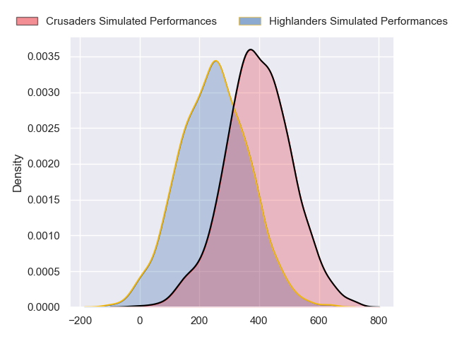
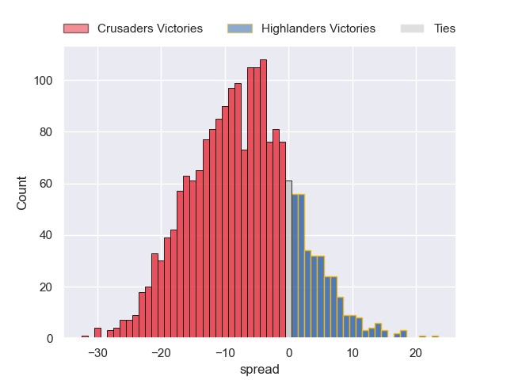

---  
layout: page  
title: Crusaders at Highlanders  
date: 2024-05-11 18:00:00 -0500  
categories: "Super Rugby Pacific 2024" match projection  
---
# Crusaders at Highlanders

# Club Level Predictions

The first set of predictions treats a club as the smallest object, as the club develops its members, organizes a gameplan, and deploys its players as needed for each match. This club model has a prediction of 0.328, which translates to predicting Crusaders to win by 2.9.

Our Over/Under is 40.5 - and combined with the spread above, we have a predicted scoreline of 22 to 19

Each club has a rating and a rating deviation (similar to a Glicko rating), and expected performances can be generated. This allows for simulated matches and spreads like the ones below.
## Projected Performances - Club Model

## Projected Spreads - Club Model

## Projected Results - Club Model

# Player Level Predictions

Treating teams instead as an entity made up of the currently active players, I have ratings for each player in an altogether different system. These can be combined to form team ratings once teamsheets are announced, weighting starters a bit higher than the reserves. After the match is played, players can be weighted by their minutes on the field, allowing for an accurate measure of the team's composition. With these compiled team ratings, we can make predictions, measure inaccuracy, and update the individual player ratings.
## Prediction without Player Minutes: Crusaders by 7.7

Crusaders by 12.4 on a neutral pitch

## Projected Performances - Player Model

## Projected Spreads - Player Model

## Projected Results - Player Model

| Away Player          |   Away Percentile |   Number |   Home Percentile | Home Player                   |
|:---------------------|------------------:|---------:|------------------:|:------------------------------|
| Tamaiti Williams     |             84.66 |        1 |             54.39 | Ethan de Groot                |
| Codie Taylor         |             99.17 |        2 |             21.17 | Henry Bell                    |
| Fletcher Newell      |              1.31 |        3 |             62.67 | Jermaine Ainsley              |
| Scott Barrett        |             94.64 |        4 |             86.05 | Mitchell Dunshea              |
| Quinten Strange      |             90.6  |        5 |             72.9  | Fabian Holland                |
| Cullen Grace         |             80.04 |        6 |             56.87 | Oliver Haig                   |
| Corey Kellow         |             66    |        7 |             11.13 | Sean Withy                    |
| Christian Lio-Willie |             36.09 |        8 |             21.52 | Nikora Broughton              |
| Noah Hotham          |             64.83 |        9 |             63.23 | Folau Fakatava                |
| David Havili         |             93.32 |       10 |             62.07 | Cameron Millar                |
| Sevu Reece           |             82.27 |       11 |             61.63 | Martin Bogado                 |
| Dallas McLeod        |             62.91 |       12 |             16.54 | Jake Te Hiwi                  |
| Levi Aumua           |             68.6  |       13 |             43.62 | Tanielu Tele'a                |
| Chay Fihaki          |             11.37 |       14 |             18.51 | Timoci Tavatavanawai          |
| Johnny McNicholl     |             82.85 |       15 |             95.49 | Jacob Ratumaitavuki-Kneepkens |
| George Bell          |              9    |       16 |             51.67 | Jack Taylor                   |
| George Bower         |              6.89 |       17 |             94.75 | Ayden Johnstone               |
| Owen Franks          |             76.54 |       18 |             28.96 | Saula Ma'u                    |
| Jamie Hannah         |             31.24 |       19 |             12.54 | Will Tucker                   |
| Tom Christie         |             60.68 |       20 |            nan    | Will Stodart                  |
| Mitchell Drummond    |             87.74 |       21 |              5.15 | James Arscott                 |
| Rivez Reihana        |             52.37 |       22 |             14.33 | Sam Gilbert                   |
| Macca Springer       |             21.9  |       23 |            nan    | Finn Hurley                   |

