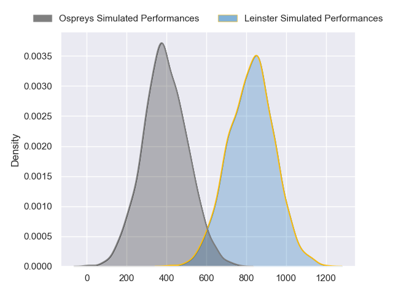
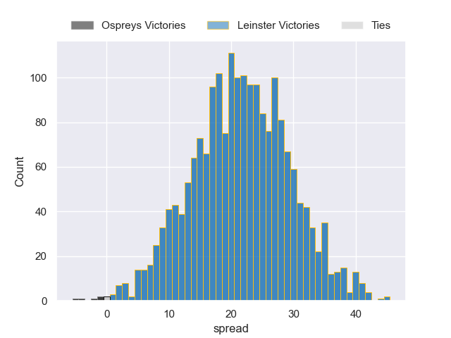
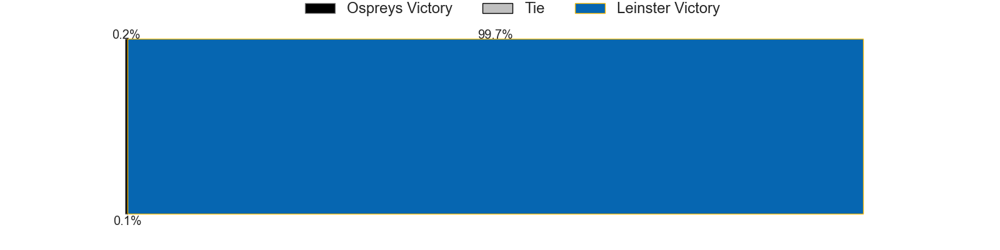

---  
layout: page  
title: Ospreys at Leinster  
date: 2024-05-11 18:00:00 -0500  
categories: "United Rugby Championship 2023" match projection  
---
# Ospreys at Leinster

# Club Level Predictions

The first set of predictions treats a club as the smallest object, as the club develops its members, organizes a gameplan, and deploys its players as needed for each match. This club model has a prediction of 0.771, which translates to predicting Leinster to win by 13.6.

Our Over/Under is 51.5 - and combined with the spread above, we have a predicted scoreline of 19 to 32

Each club has a rating and a rating deviation (similar to a Glicko rating), and expected performances can be generated. This allows for simulated matches and spreads like the ones below.
## Projected Performances - Club Model

## Projected Spreads - Club Model

## Projected Results - Club Model

# Player Level Predictions

Treating teams instead as an entity made up of the currently active players, I have ratings for each player in an altogether different system. These can be combined to form team ratings once teamsheets are announced, weighting starters a bit higher than the reserves. After the match is played, players can be weighted by their minutes on the field, allowing for an accurate measure of the team's composition. With these compiled team ratings, we can make predictions, measure inaccuracy, and update the individual player ratings.
## Prediction without Player Minutes: Leinster by 22.1

Leinster by 15.9 on a neutral pitch

## Projected Performances - Player Model

## Projected Spreads - Player Model

## Projected Results - Player Model

| Away Player            |   Away Percentile |   Number |   Home Percentile | Home Player         |
|:-----------------------|------------------:|---------:|------------------:|:--------------------|
| Nicky Smith            |             78.01 |        1 |             93.11 | Andrew Porter       |
| Dewi Lake              |             57.07 |        2 |             94.17 | Ronan Kelleher      |
| Rhys Henry             |             88.84 |        3 |             97.7  | Tadhg Furlong       |
| James Ratti            |             78.64 |        4 |             94.34 | Ross Molony         |
| Huw Owen-Sutton        |             66.84 |        5 |             71.39 | Jason Jenkins       |
| Harri Deaves           |             89.07 |        6 |             89.27 | Ryan Baird          |
| Justin Tipuric         |             97.59 |        7 |             85.36 | Will Connors        |
| Morgan Morris          |             15.43 |        8 |             96.09 | Caelan Doris        |
| Reuben Morgan-Williams |             79.57 |        9 |             98.76 | Luke McGrath        |
| Dan Edwards            |             64.66 |       10 |             96.34 | Ross Byrne          |
| Keelan Giles           |             16.57 |       11 |             93.41 | Jimmy O'Brien       |
| Keiran Williams        |             88.3  |       12 |             92.2  | Robbie Henshaw      |
| Owen Watkin            |             98.74 |       13 |             91.46 | Jamie Osborne       |
| Luke Morgan            |             24.9  |       14 |             91.86 | Jordan Larmour      |
| Max Nagy               |             81.97 |       15 |             54.29 | Ciaran Frawley      |
| Sam Parry              |             73.5  |       16 |             78.17 | Dan Sheehan         |
| Gareth Thomas          |             64.07 |       17 |             68.66 | Michael Milne       |
| Tom Botha              |             81.21 |       18 |             80.97 | Thomas Clarkson     |
| Victor Sekekete        |             72.09 |       19 |             99.13 | Jack Conan          |
| Jac Morgan             |             94.58 |       20 |             98.6  | Josh van der Flier  |
| Luke Davies            |             64.65 |       21 |             96.8  | Jamison Gibson-Park |
| Jack Walsh             |             74.57 |       22 |             89.36 | Charlie Ngatai      |
| Evardi Boshoff         |              2.95 |       23 |             52.81 | Tommy O'Brien       |

