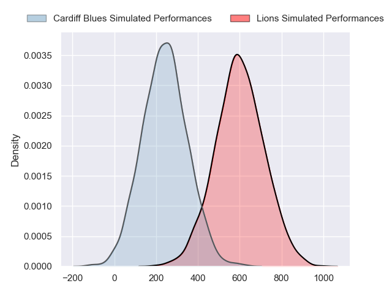
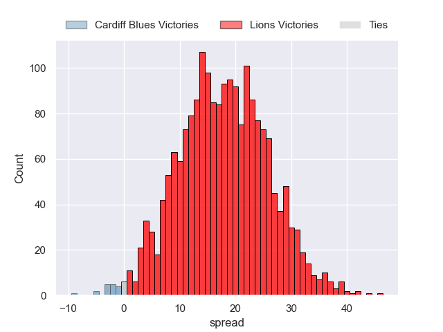
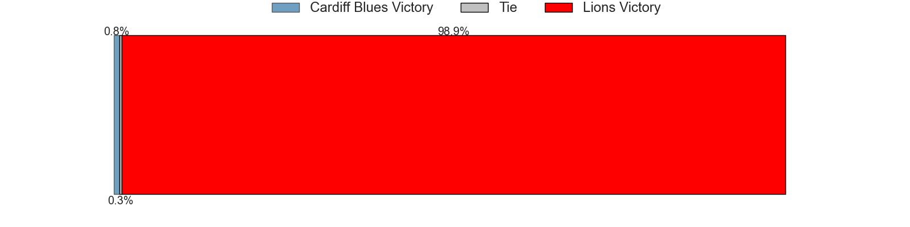

---  
layout: page  
title: Cardiff Blues at Lions  
date: 2024-05-11 18:00:00 -0500  
categories: "United Rugby Championship 2023" match projection  
---
# Cardiff Blues at Lions

# Club Level Predictions

The first set of predictions treats a club as the smallest object, as the club develops its members, organizes a gameplan, and deploys its players as needed for each match. This club model has a prediction of 0.684, which translates to predicting Lions to win by 10.1.

Our Over/Under is 63.5 - and combined with the spread above, we have a predicted scoreline of 27 to 37

Each club has a rating and a rating deviation (similar to a Glicko rating), and expected performances can be generated. This allows for simulated matches and spreads like the ones below.
## Projected Performances - Club Model

## Projected Spreads - Club Model

## Projected Results - Club Model

# Player Level Predictions

Treating teams instead as an entity made up of the currently active players, I have ratings for each player in an altogether different system. These can be combined to form team ratings once teamsheets are announced, weighting starters a bit higher than the reserves. After the match is played, players can be weighted by their minutes on the field, allowing for an accurate measure of the team's composition. With these compiled team ratings, we can make predictions, measure inaccuracy, and update the individual player ratings.
## Prediction without Player Minutes: Lions by 18.5

Lions by 14.7 on a neutral pitch

## Projected Performances - Player Model

## Projected Spreads - Player Model

## Projected Results - Player Model

| Away Player        |   Away Percentile |   Number |   Home Percentile | Home Player          |
|:-------------------|------------------:|---------:|------------------:|:---------------------|
| Rhys Carré         |             14.68 |        1 |             98.85 | Ruan Dreyer          |
| Evan Lloyd         |            nan    |        2 |             85.17 | PJ Botha             |
| Keiron Assiratti   |             31.01 |        3 |             75.88 | Asenathi Ntlabakanye |
| Seb Davies         |             22.04 |        4 |             91.71 | Willem Alberts       |
| Rory Thornton      |              5.76 |        5 |             49.34 | Ruan Delport         |
| Ben Donnell        |             94.54 |        6 |             85.26 | JC Pretorius         |
| James Botham       |             80.94 |        7 |             88.06 | Ruan Venter          |
| Mackenzie Martin   |             42.39 |        8 |             99.35 | Francke Horn         |
| Gonzalo Bertranou  |             70.34 |        9 |             89.7  | Morne van den Berg   |
| Tinus de Beer      |             67.03 |       10 |             95.04 | Sanele Nohamba       |
| Theo Cabango       |             49.32 |       11 |             92.25 | Edwill van der Merwe |
| Ben Thomas         |             60.59 |       12 |             94.42 | Marius Louw          |
| Mason Grady        |             83.46 |       13 |             12.43 | Erich Cronje         |
| Gabriel Hamer-Webb |             91.38 |       14 |             65.79 | Richard Kriel        |
| Cameron Winnett    |             21.67 |       15 |             92.27 | Quan Horn            |
| Liam Belcher       |             69.67 |       16 |             74.33 | Jaco Visagie         |
| Corey Domachowski  |             88.43 |       17 |             83.02 | Jean-Pierre Smith    |
| Rhys Litterick     |            nan    |       18 |             53.81 | Conraad van Vuuren   |
| Shane Lewis-Hughes |              8.19 |       19 |             92.11 | Reinhard Nothnagel   |
| Alun Lawrence      |            nan    |       20 |             73.62 | Emmanuel Tshituka    |
| Ellis Bevan        |             58.97 |       21 |             95.65 | Hanru Sirgel         |
| Jacob Beetham      |             15.67 |       22 |             66.09 | Jordan Hendrikse     |
| Max Clark          |             86.62 |       23 |             79.31 | Gianni Lombard       |

