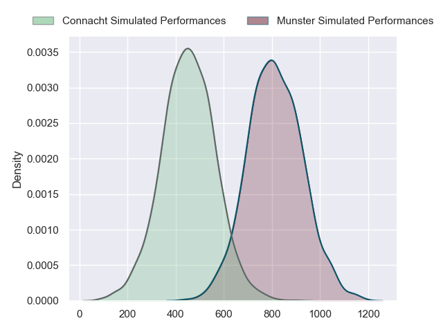
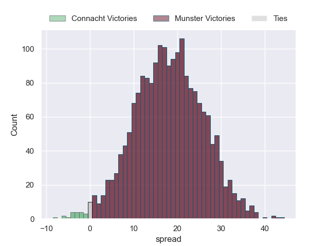
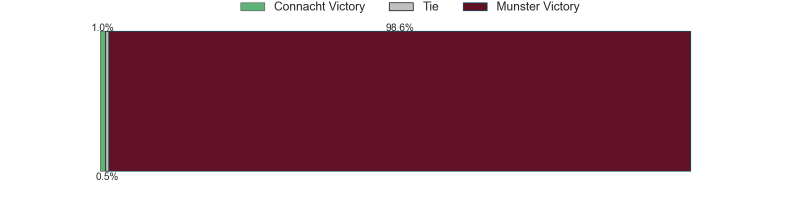

---  
layout: page  
title: Connacht at Munster  
date: 2024-05-11 18:00:00 -0500  
categories: "United Rugby Championship 2023" match projection  
---
# Connacht at Munster

# Club Level Predictions

The first set of predictions treats a club as the smallest object, as the club develops its members, organizes a gameplan, and deploys its players as needed for each match. This club model has a prediction of 0.658, which translates to predicting Munster to win by 9.0.

Our Over/Under is 43.5 - and combined with the spread above, we have a predicted scoreline of 17 to 26

Each club has a rating and a rating deviation (similar to a Glicko rating), and expected performances can be generated. This allows for simulated matches and spreads like the ones below.
## Projected Performances - Club Model

## Projected Spreads - Club Model

## Projected Results - Club Model

# Player Level Predictions

Treating teams instead as an entity made up of the currently active players, I have ratings for each player in an altogether different system. These can be combined to form team ratings once teamsheets are announced, weighting starters a bit higher than the reserves. After the match is played, players can be weighted by their minutes on the field, allowing for an accurate measure of the team's composition. With these compiled team ratings, we can make predictions, measure inaccuracy, and update the individual player ratings.
## Prediction without Player Minutes: Munster by 18.3

Munster by 12.0 on a neutral pitch

## Projected Performances - Player Model

## Projected Spreads - Player Model

## Projected Results - Player Model

| Away Player           |   Away Percentile |   Number |   Home Percentile | Home Player     |
|:----------------------|------------------:|---------:|------------------:|:----------------|
| Peter Dooley          |             97.79 |        1 |             96.23 | Jeremy Loughman |
| Dave Heffernan        |             68.67 |        2 |             94.33 | Niall Scannell  |
| Finlay Bealham        |             96.72 |        3 |             98.69 | Stephen Archer  |
| Joe Joyce             |             95.75 |        4 |             99.29 | RG Snyman       |
| Oisin Dowling         |             64.31 |        5 |             99.09 | Tadhg Beirne    |
| Shamus Hurley-Langton |             62.19 |        6 |             97.99 | Peter O'Mahony  |
| Conor Oliver          |             85.86 |        7 |             84.15 | Alex Kendellen  |
| Paul Boyle            |             56.52 |        8 |             82.17 | Jack O'Donoghue |
| Matthew Devine        |             48.31 |        9 |             81.53 | Craig Casey     |
| Jack Carty            |             93.97 |       10 |             58.62 | Jack Crowley    |
| Byron Ralston         |              9.5  |       11 |             97.09 | Shane Daly      |
| Bundee Aki            |             98.95 |       12 |             27.4  | Sean O'Brien    |
| Tom Farrell           |             55.64 |       13 |             94.1  | Alex Nankivell  |
| Shane Jennings        |             61.92 |       14 |             94.96 | Calvin Nash     |
| Tiernan O'Halloran    |             89.06 |       15 |             95.71 | Simon Zebo      |
| Dylan Tierney-Martin  |             64.5  |       16 |            nan    | Eoghan Clarke   |
| Jordan Duggan         |             28.63 |       17 |            nan    | Mark Donnelly   |
| Jack Aungier          |             74.9  |       18 |             91.3  | Oli Jager       |
| Niall Murray          |             91    |       19 |             55.71 | Thomas Ahern    |
| Sean Jansen           |             21.74 |       20 |             81.3  | Gavin Coombes   |
| Caolin Blade          |             79.22 |       21 |             98.58 | Conor Murray    |
| Cathal Forde          |             20.86 |       22 |             78.02 | Joey Carbery    |
| Jarrad Butler         |             86.52 |       23 |             91.04 | Antoine Frisch  |

