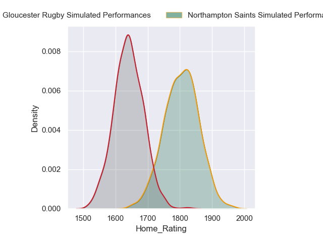
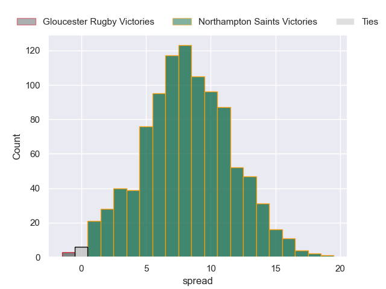
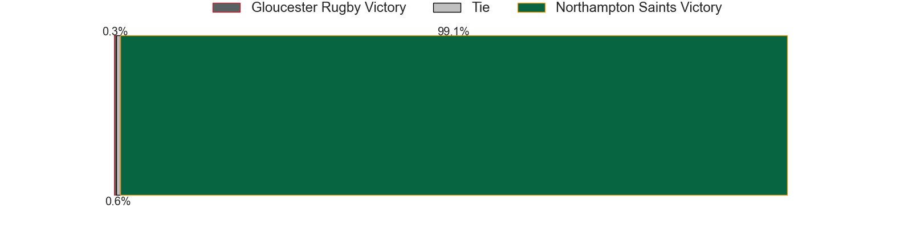
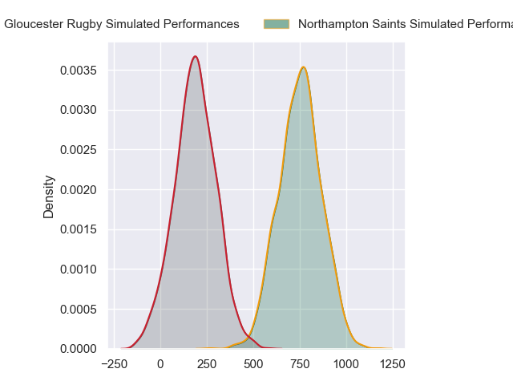
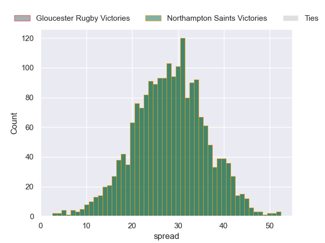

---  
layout: page  
title: Gloucester Rugby at Northampton Saints  
date: 2024-05-11 18:00:00 -0500  
categories: "Gallagher Premiership 2023" match projection  
---
# Gloucester Rugby at Northampton Saints

# Club Level Predictions

The first set of predictions treats a club as the smallest object, as the club develops its members, organizes a gameplan, and deploys its players as needed for each match. This club model has a prediction of 0.638, which translates to predicting Northampton Saints to win by 8.2.

Our Over/Under is 63.5 - and combined with the spread above, we have a predicted scoreline of 28 to 36

Each club has a rating and a rating deviation (similar to a Glicko rating), and expected performances can be generated. This allows for simulated matches and spreads like the ones below.
## Projected Performances - Club Model

## Projected Spreads - Club Model

## Projected Results - Club Model

# Player Level Predictions

Treating teams instead as an entity made up of the currently active players, I have ratings for each player in an altogether different system. These can be combined to form team ratings once teamsheets are announced, weighting starters a bit higher than the reserves. After the match is played, players can be weighted by their minutes on the field, allowing for an accurate measure of the team's composition. With these compiled team ratings, we can make predictions, measure inaccuracy, and update the individual player ratings.
## Prediction without Player Minutes: Northampton Saints by 28.8

Northampton Saints by 20.5 on a neutral pitch

## Projected Performances - Player Model

## Projected Spreads - Player Model

## Projected Results - Player Model

| Away Player           |   Away Percentile |   Number |   Home Percentile | Home Player         |
|:----------------------|------------------:|---------:|------------------:|:--------------------|
| Harry Elrington       |             22.64 |        1 |             98.36 | Alex Waller         |
| Santiago Socino       |             79.83 |        2 |             95.67 | Curtis Langdon      |
| Ciaran Knight         |             45.45 |        3 |              5.5  | Trevor Davison      |
| Arthur Clark          |             37.01 |        4 |             97.98 | Alex Moon           |
| Freddie Thomas        |             84.33 |        5 |             39.13 | Alex Coles          |
| Albert Tuisue         |             90.17 |        6 |             98.5  | Courtney Lawes      |
| Lewis Ludlow          |             61.58 |        7 |             66.9  | Angus Scott-Young   |
| Jack Clement          |             64.09 |        8 |             74.13 | Juarno Augustus     |
| Stephen Varney        |              8.35 |        9 |             96.45 | Alex Mitchell       |
| Charlie Atkinson      |             58.41 |       10 |             86.64 | Fin Smith           |
| Jake Morris           |             65.45 |       11 |             95.54 | Ollie Sleightholme  |
| Jack Reeves           |              9.48 |       12 |             93.36 | Fraser Dingwall     |
| Louis Hillman-Cooper  |             24.76 |       13 |             97.26 | Tommy Freeman       |
| Alex Hearle           |             59.21 |       14 |             90.41 | George Hendy        |
| Josh Hathaway         |             51.5  |       15 |             97    | George Furbank      |
| Sam Scarfe            |            nan    |       16 |             83.83 | Sam Matavesi        |
| Mayco Vivas           |             12.06 |       17 |             48.81 | Emmanuel Iyogun     |
| Fraser Balmain        |             23.95 |       18 |             75.47 | Elliot Millar-Mills |
| Danny Eite            |            nan    |       19 |             91.51 | Temo Mayanavanua    |
| Robert Nixon          |            nan    |       20 |             98.9  | Sam Graham          |
| Charlie Chapman       |             36.41 |       21 |             24.87 | Tom James           |
| Morgan Adderley-Jones |            nan    |       22 |             86.72 | Burger Odendaal     |
| Ioan Jones            |            nan    |       23 |              9.98 | Tom Seabrook        |

