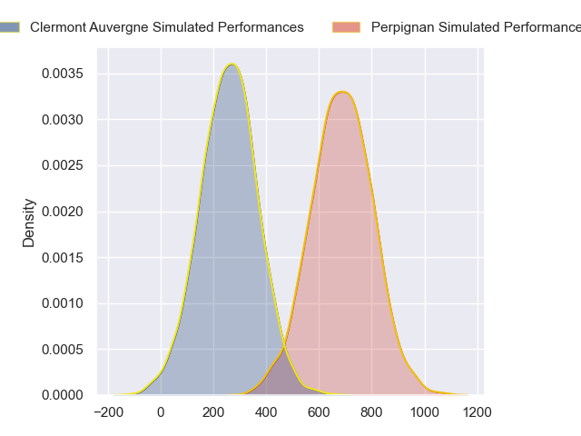
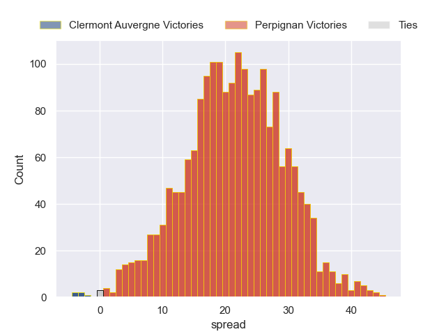
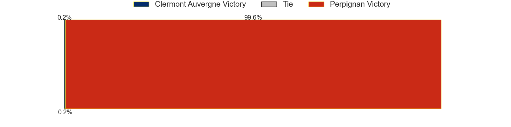

---  
layout: page  
title: Clermont Auvergne at Perpignan  
date: 2024-05-11 18:00:00 -0500  
categories: "Top 14 2024" match projection  
---
# Clermont Auvergne at Perpignan

# Club Level Predictions

The first set of predictions treats a club as the smallest object, as the club develops its members, organizes a gameplan, and deploys its players as needed for each match. This club model has a prediction of 0.397, which translates to predicting Clermont Auvergne to win by 0.4.

Our Over/Under is 57.5 - and combined with the spread above, we have a predicted scoreline of 29 to 29

Each club has a rating and a rating deviation (similar to a Glicko rating), and expected performances can be generated. This allows for simulated matches and spreads like the ones below.
## Projected Performances - Club Model

## Projected Spreads - Club Model

## Projected Results - Club Model

# Player Level Predictions

Treating teams instead as an entity made up of the currently active players, I have ratings for each player in an altogether different system. These can be combined to form team ratings once teamsheets are announced, weighting starters a bit higher than the reserves. After the match is played, players can be weighted by their minutes on the field, allowing for an accurate measure of the team's composition. With these compiled team ratings, we can make predictions, measure inaccuracy, and update the individual player ratings.
## Prediction without Player Minutes: Perpignan by 21.8

Perpignan by 12.9 on a neutral pitch

## Projected Performances - Player Model

## Projected Spreads - Player Model

## Projected Results - Player Model

| Away Player             |   Away Percentile |   Number |   Home Percentile | Home Player           |
|:------------------------|------------------:|---------:|------------------:|:----------------------|
| Giorgi Beria            |             49.06 |        1 |             72.27 | Sacha Lotrian         |
| Yohan Beheregaray       |             31    |        2 |             92    | Seilala Lam           |
| Rabah Slimani           |             85.56 |        3 |             80.48 | Nemo Roelofse         |
| Thibaud Lanen           |             80.59 |        4 |             76.64 | Mathieu Tanguy        |
| Paul Jedrasiak          |              9.61 |        5 |             43.48 | Posolo Tuilagi        |
| Lucas Dessaigne         |             81.04 |        6 |             95.49 | Patrick Sobela        |
| Marcos Kremer           |             84.95 |        7 |             84.65 | Alan Brazo            |
| Peceli Yato             |             34.3  |        8 |             86.74 | Joaquin Oviedo        |
| Baptiste Jauneau        |             50.44 |        9 |             91.12 | Tom Ecochard          |
| Anthony Belleau         |             94.4  |       10 |             94.83 | Jake McIntyre         |
| Joris Jurand            |             77.81 |       11 |             86.92 | Lucas Dubois          |
| Leon Darricarrere       |             68.7  |       12 |             99.47 | Jeronimo de la Fuente |
| Julien Heriteau         |             65.02 |       13 |             38.04 | Alivereti Duguivalu   |
| Yerim Fall              |             29.84 |       14 |             88.47 | Tavite Veredamu       |
| Alex Newsome            |             80.9  |       15 |             77.47 | Louis Dupichot        |
| Etienne Fourcade        |             61.5  |       16 |             89.33 | Ignacio Ruiz          |
| Etienne Falgoux         |            nan    |       17 |             68.42 | Xavier Chiocci        |
| Anthime Hemery          |             67.4  |       18 |             92.32 | Marvin Orie           |
| Killian Tixeront        |             65.3  |       19 |             94.57 | So'otala Fa'aso'o     |
| Théo Giral              |            nan    |       20 |            nan    | Mattéo Rodor          |
| Benjamin Urdapilleta    |             84.48 |       21 |             82.4  | Tommaso Allan         |
| Mathys Belaubre         |             58.27 |       22 |             51.42 | Apisai Naqalevu       |
| Giorgi Dzmanashvili (2) |            nan    |       23 |             77.85 | Pietro Ceccarelli     |

