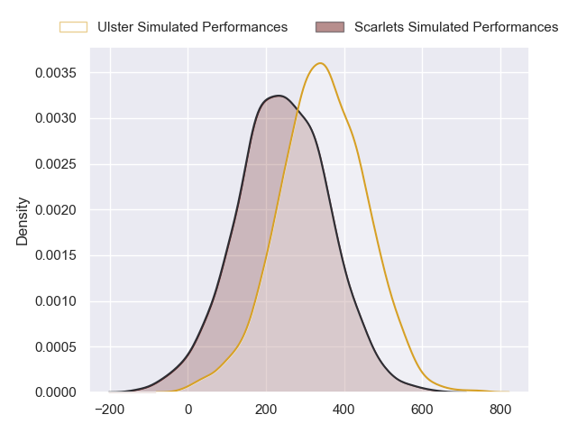
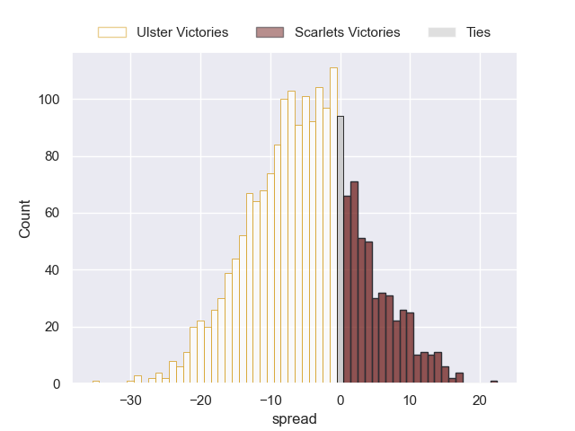

---  
layout: page  
title: Ulster at Scarlets  
date: 2024-05-11 18:00:00 -0500  
categories: "United Rugby Championship 2023" match projection  
---
# Ulster at Scarlets

# Club Level Predictions

The first set of predictions treats a club as the smallest object, as the club develops its members, organizes a gameplan, and deploys its players as needed for each match. This club model has a prediction of 0.253, which translates to predicting Ulster to win by 5.8.

Our Over/Under is 45.5 - and combined with the spread above, we have a predicted scoreline of 25 to 20

Each club has a rating and a rating deviation (similar to a Glicko rating), and expected performances can be generated. This allows for simulated matches and spreads like the ones below.
## Projected Performances - Club Model

## Projected Spreads - Club Model

## Projected Results - Club Model

# Player Level Predictions

Treating teams instead as an entity made up of the currently active players, I have ratings for each player in an altogether different system. These can be combined to form team ratings once teamsheets are announced, weighting starters a bit higher than the reserves. After the match is played, players can be weighted by their minutes on the field, allowing for an accurate measure of the team's composition. With these compiled team ratings, we can make predictions, measure inaccuracy, and update the individual player ratings.
## Prediction without Player Minutes: Ulster by 5.7

Ulster by 11.5 on a neutral pitch

## Projected Performances - Player Model

## Projected Spreads - Player Model

## Projected Results - Player Model

| Away Player      |   Away Percentile |   Number |   Home Percentile | Home Player      |
|:-----------------|------------------:|---------:|------------------:|:-----------------|
| Eric O'Sullivan  |             80.56 |        1 |             60.21 | Kemsley Mathias  |
| Rob Herring      |             93.33 |        2 |             92.67 | Ryan Elias       |
| Scott Wilson     |             69.32 |        3 |              7.38 | Harri O'Connor   |
| Kieran Treadwell |             59.25 |        4 |              2.93 | Morgan Jones     |
| Alan O'Connor    |             71.49 |        5 |              4.75 | Jac Price        |
| Cormac Izuchukwu |             53.49 |        6 |             65.4  | Taine Plumtree   |
| David McCann     |             67.39 |        7 |             64.99 | Dan Davis        |
| Nick Timoney     |             86.09 |        8 |             45.22 | Carwyn Tuipulotu |
| John Cooney      |             91.83 |        9 |             33.75 | Gareth Davies    |
| Billy Burns      |             48.92 |       10 |             51.94 | Sam Costelow     |
| Jacob Stockdale  |             40.7  |       11 |             18.9  | Ryan Conbeer     |
| Stuart McCloskey |             78.08 |       12 |             21.71 | Eddie James      |
| Will Addison     |             85.88 |       13 |             74.39 | Johnny Williams  |
| Ethan McIlroy    |             82.17 |       14 |             81.49 | Tomi Lewis       |
| Mike Lowry       |             38.84 |       15 |              7.94 | Ioan Nicholas    |
| Tom Stewart      |              4.33 |       16 |              4.67 | Shaun Evans      |
| Andrew Warwick   |             11.32 |       17 |             58.16 | Wyn Jones        |
| James French     |            nan    |       18 |             15.91 | Sam Wainwright   |
| Harry Sheridan   |             87.26 |       19 |            nan    | Ben Williams     |
| Reuben Crothers  |             51.15 |       20 |            nan    | Jarrod Taylor    |
| Nathan Doak      |             23.27 |       21 |             67.5  | Kieran Hardy     |
| Stewart Moore    |             87.77 |       22 |              4.74 | Ioan Lloyd       |
| Dave Ewers       |             92.28 |       23 |            nan    | Scott Williams   |

