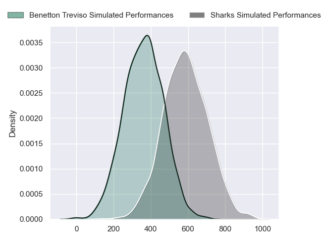
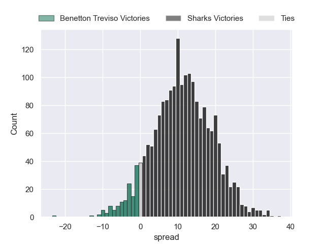
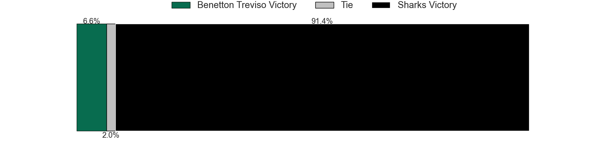

---  
layout: page  
title: Benetton Treviso at Sharks  
date: 2024-05-11 18:00:00 -0500  
categories: "United Rugby Championship 2023" match projection  
---
# Benetton Treviso at Sharks

# Club Level Predictions

The first set of predictions treats a club as the smallest object, as the club develops its members, organizes a gameplan, and deploys its players as needed for each match. This club model has a prediction of 0.511, which translates to predicting Sharks to win by 4.0.

Our Over/Under is 48.5 - and combined with the spread above, we have a predicted scoreline of 22 to 26

Each club has a rating and a rating deviation (similar to a Glicko rating), and expected performances can be generated. This allows for simulated matches and spreads like the ones below.
## Projected Performances - Club Model

## Projected Spreads - Club Model

## Projected Results - Club Model

# Player Level Predictions

Treating teams instead as an entity made up of the currently active players, I have ratings for each player in an altogether different system. These can be combined to form team ratings once teamsheets are announced, weighting starters a bit higher than the reserves. After the match is played, players can be weighted by their minutes on the field, allowing for an accurate measure of the team's composition. With these compiled team ratings, we can make predictions, measure inaccuracy, and update the individual player ratings.
## Prediction without Player Minutes: Sharks by 11.3

Sharks by 6.9 on a neutral pitch

## Projected Performances - Player Model

## Projected Spreads - Player Model

## Projected Results - Player Model

| Away Player         |   Away Percentile |   Number |   Home Percentile | Home Player         |
|:--------------------|------------------:|---------:|------------------:|:--------------------|
| Federico Zani       |             22.81 |        1 |             99.67 | Ox Nche             |
| Gianmarco Lucchesi  |             87.67 |        2 |             96.67 | Bongi Mbonambi      |
| Simone Ferrari      |             95.24 |        3 |             49.47 | Vincent Koch        |
| Niccolo Cannone     |             68.05 |        4 |             98.38 | Eben Etzebeth       |
| Eli Snyman          |             75.63 |        5 |             62.39 | Corne Rahl          |
| Alessandro Izekor   |             50.95 |        6 |             69.31 | James Venter        |
| Sebastian Negri     |             87.66 |        7 |             18    | Gerbrandt Grobler   |
| Lorenzo Cannone     |             89.78 |        8 |             86.26 | Vincent Tshituka    |
| Andy Uren           |             13.68 |        9 |             57.19 | Grant Williams      |
| Leonardo Marin      |             69.28 |       10 |             54.74 | Siya Masuku         |
| Onisi Ratave        |             27.91 |       11 |             99.42 | Makazole Mapimpi    |
| Juan Ignacio Brex   |             93.26 |       12 |             59.01 | Francois Venter     |
| Tommaso Menoncello  |             85.56 |       13 |             85.46 | Lukhanyo Am         |
| Ignacio Mendy       |             12.98 |       14 |             73.26 | Werner Kok          |
| Rhyno Smith         |             87.55 |       15 |             90.77 | Aphelele Fassi      |
| Bautista Bernasconi |            nan    |       16 |             90.33 | Fez Mbatha          |
| Destiny Aminu       |            nan    |       17 |             45.53 | Ntuthuko Mchunu     |
| Giosue Zilocchi     |             72.19 |       18 |             60.13 | Hanru Jacobs        |
| Edoardo Iachizzi    |             72.19 |       19 |             48.95 | Jeandre Labuschagne |
| Riccardo Favretto   |             33.97 |       20 |             49.15 | Tinotenda Mavesere  |
| Dewaldt Duvenage    |            nan    |       21 |              3.2  | Cameron Wright      |
| Jacob Umaga         |             72.96 |       22 |             53.65 | Boeta Chamberlain   |
| Marco Zanon         |             61.43 |       23 |            nan    | Diego Appollis      |

