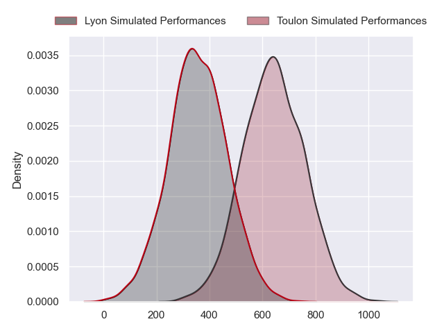
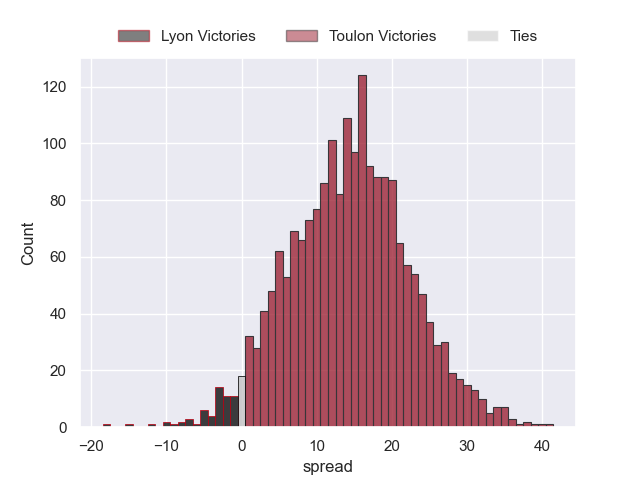

---  
layout: page  
title: Lyon at Toulon  
date: 2024-05-11 18:00:00 -0500  
categories: "Top 14 2024" match projection  
---
# Lyon at Toulon

# Club Level Predictions

The first set of predictions treats a club as the smallest object, as the club develops its members, organizes a gameplan, and deploys its players as needed for each match. This club model has a prediction of 0.563, which translates to predicting Toulon to win by 5.5.

Our Over/Under is 42.5 - and combined with the spread above, we have a predicted scoreline of 18 to 24

Each club has a rating and a rating deviation (similar to a Glicko rating), and expected performances can be generated. This allows for simulated matches and spreads like the ones below.
## Projected Performances - Club Model

## Projected Spreads - Club Model

## Projected Results - Club Model

# Player Level Predictions

Treating teams instead as an entity made up of the currently active players, I have ratings for each player in an altogether different system. These can be combined to form team ratings once teamsheets are announced, weighting starters a bit higher than the reserves. After the match is played, players can be weighted by their minutes on the field, allowing for an accurate measure of the team's composition. With these compiled team ratings, we can make predictions, measure inaccuracy, and update the individual player ratings.
## Prediction without Player Minutes: Toulon by 14.7

Toulon by 7.8 on a neutral pitch

## Projected Performances - Player Model

## Projected Spreads - Player Model

## Projected Results - Player Model

| Away Player           |   Away Percentile |   Number |   Home Percentile | Home Player            |
|:----------------------|------------------:|---------:|------------------:|:-----------------------|
| Sebastien Taofifenua  |             15.59 |        1 |             97.37 | Jean-Baptiste Gros     |
| Guillaume Marchand    |             19.83 |        2 |             65    | Teddy Baubigny         |
| Demba Bamba           |             92.12 |        3 |             79.33 | Beka Gigashvili        |
| Felix Lambey          |             84.23 |        4 |             76.95 | Swan Rebbadj           |
| Romain Taofifenua     |             47.93 |        5 |             90.5  | David Ribbans          |
| Theo William          |             26.29 |        6 |             69.41 | Matteo Le Corvec       |
| Liam Allen            |             68.71 |        7 |             75.93 | Esteban Abadie         |
| Mickael Guillard      |             63.91 |        8 |             98.26 | Charles Ollivon        |
| Martin Page-Relo      |             78.33 |        9 |             96.63 | Baptiste Serin         |
| Paddy Jackson         |             82.97 |       10 |             85.13 | Paolo Garbisi          |
| Ethan Dumortier       |             63.76 |       11 |             92.83 | Gabin Villiere         |
| Semi Radradra         |             99.26 |       12 |             43.73 | Maelan Rabut           |
| Alfred Parisien       |             66.91 |       13 |             93.05 | Leicester Fainga'anuku |
| Xavier Mignot         |             63.18 |       14 |             74.13 | Seta Tuicuvu           |
| Davit Niniashvili     |             89.48 |       15 |            nan    | Marius Domon           |
| Yanis Charcosset      |             53.67 |       16 |             93    | Jack Singleton         |
| Jerome Rey            |             27.56 |       17 |             93.36 | Dany Priso             |
| Killian Géraci        |            nan    |       18 |             35.19 | Matthias Halagahu      |
| Pierre-Samuel Pacheco |            nan    |       19 |             83.55 | Selevasio Tolofua      |
| Baptiste Couilloud    |             93.43 |       20 |             98.06 | Dan Biggar             |
| Leo Berdeu            |             74.35 |       21 |             84.37 | Ben White              |
| Vincent Rattez        |             96.12 |       22 |             89.92 | Jiuta Wainiqolo        |
| Valentin Simutoga     |            nan    |       23 |             22.4  | Kieran Brookes         |

