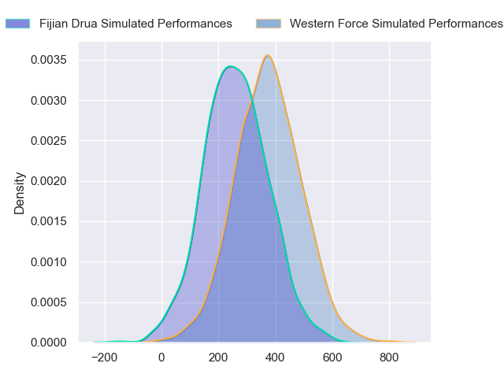
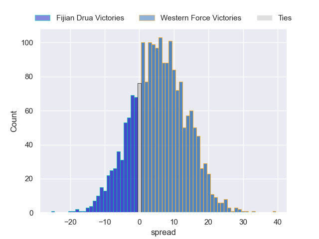
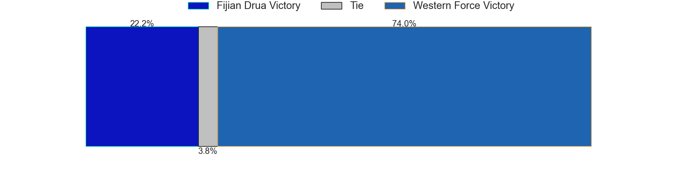

---  
layout: page  
title: Fijian Drua at Western Force  
date: 2024-05-11 18:00:00 -0500  
categories: "Super Rugby Pacific 2024" match projection  
---
# Fijian Drua at Western Force

# Club Level Predictions

The first set of predictions treats a club as the smallest object, as the club develops its members, organizes a gameplan, and deploys its players as needed for each match. This club model has a prediction of 0.486, which translates to predicting Fijian Drua to win by -2.8.

Our Over/Under is 54.5 - and combined with the spread above, we have a predicted scoreline of 26 to 29

Each club has a rating and a rating deviation (similar to a Glicko rating), and expected performances can be generated. This allows for simulated matches and spreads like the ones below.
## Projected Performances - Club Model

## Projected Spreads - Club Model

## Projected Results - Club Model

# Player Level Predictions

Treating teams instead as an entity made up of the currently active players, I have ratings for each player in an altogether different system. These can be combined to form team ratings once teamsheets are announced, weighting starters a bit higher than the reserves. After the match is played, players can be weighted by their minutes on the field, allowing for an accurate measure of the team's composition. With these compiled team ratings, we can make predictions, measure inaccuracy, and update the individual player ratings.
## Prediction without Player Minutes: Western Force by 5.4

Western Force by 1.4 on a neutral pitch

## Projected Performances - Player Model

## Projected Spreads - Player Model

## Projected Results - Player Model

| Away Player             |   Away Percentile |   Number |   Home Percentile | Home Player      |
|:------------------------|------------------:|---------:|------------------:|:-----------------|
| Haereiti Hetet          |             94.5  |        1 |             27.97 | Marley Pearce    |
| Tevita Ikanivere        |             89.7  |        2 |             48.84 | Tom Horton       |
| Mesake Doge             |             40.53 |        3 |              7.22 | Santiago Medrano |
| Mesake Vocevoce         |             73.31 |        4 |             15.07 | Jeremy Williams  |
| Isoa Nasilasila         |             78.36 |        5 |             85.24 | Izack Rodda      |
| Vilive Miramira         |             70.41 |        6 |             68    | Will Harris      |
| Kitione Salawa          |             11.43 |        7 |             10.13 | Carlo Tizzano    |
| Meli Derenalagi         |             36.3  |        8 |             86.3  | Reed Prinsep     |
| Peni Matawalu           |             66.19 |        9 |             99.11 | Nic White        |
| Isaiah Armstrong-Ravula |             43.41 |       10 |             42.55 | Ben Donaldson    |
| Taniela Rakuro          |             50.05 |       11 |             76.09 | Chase Tiatia     |
| Michael Naitokani       |             40.72 |       12 |             80.8  | Hamish Stewart   |
| Iosefo Masi             |             82.38 |       13 |              5.42 | Bayley Kuenzle   |
| Selestino Ravutaumada   |             81.41 |       14 |            nan    | George Poolman   |
| Ilaisa Droasese         |             68.8  |       15 |             94.66 | Kurtley Beale    |
| Zuriel Togiatama        |             36.71 |       16 |             23.26 | Feleti Kaitu'u   |
| Emosi Tuqiri            |            nan    |       17 |            nan    | Harry Hoopert    |
| Samu Tawake             |            nan    |       18 |            nan    | Tiaan Tauakipulu |
| Ratu Rotuisolia         |             47.32 |       19 |             17.9  | Lopeti Faifua    |
| Motikiai Murray         |            nan    |       20 |              1.81 | Michael Wells    |
| Simione Kuruvoli        |             19.04 |       21 |            nan    | Henry Robertson  |
| Kemu Valetini           |             49.26 |       22 |             23.73 | Sam Spink        |
| Epeli Momo              |             23.33 |       23 |            nan    | Henry O'Donnell  |

