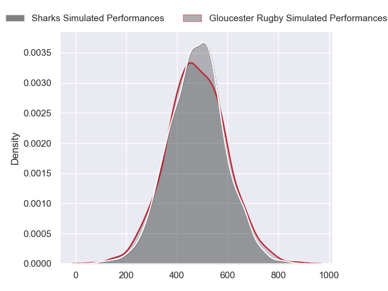
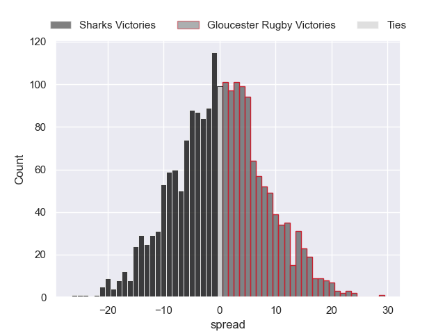

---  
layout: page  
title: Sharks at Gloucester Rugby  
date: 2024-05-24 18:00:00 -0500  
categories: "European Rugby Challenge Cup 2023" match projection  
---
# Sharks at Gloucester Rugby

# Club Level Predictions

The first set of predictions treats a club as the smallest object, as the club develops its members, organizes a gameplan, and deploys its players as needed for each match. This club model has a prediction of 0.657, which translates to predicting Gloucester Rugby to win by 5.7.

Each club has a rating and a rating deviation (similar to a Glicko rating), and expected performances can be generated. This allows for simulated matches and spreads like the ones below.
## Projected Performances - Club Model

## Projected Spreads - Club Model

## Projected Results - Club Model

# Player Level Predictions

Treating teams instead as an entity made up of the currently active players, I have ratings for each player in an altogether different system. These can be combined to form team ratings once teamsheets are announced, weighting starters a bit higher than the reserves. After the match is played, players can be weighted by their minutes on the field, allowing for an accurate measure of the team's composition. With these compiled team ratings, we can make predictions, measure inaccuracy, and update the individual player ratings.
## Prediction without Player Minutes: Sharks by 0.0

Sharks by 8.3 on a neutral pitch

## Projected Performances - Player Model

## Projected Spreads - Player Model

## Projected Results - Player Model

| Away Player         |   Away Percentile |   Number |   Home Percentile | Home Player         |
|:--------------------|------------------:|---------:|------------------:|:--------------------|
| Ox Nche             |             99.51 |        1 |             28.71 | Jamal Ford-Robinson |
| Bongi Mbonambi      |             96.72 |        2 |             56.07 | Seb Blake           |
| Vincent Koch        |             47.88 |        3 |             23    | Fraser Balmain      |
| Eben Etzebeth       |             98.58 |        4 |             80.12 | Freddie Clarke      |
| Gerbrandt Grobler   |              8.86 |        5 |             34.69 | Arthur Clark        |
| James Venter        |             65.65 |        6 |             91.54 | Ruan Ackermann      |
| Vincent Tshituka    |             80.75 |        7 |             66.14 | Lewis Ludlow        |
| Phepsi Buthelezi    |             49.37 |        8 |             55.86 | Zach Mercer         |
| Grant Williams      |             53.23 |        9 |             88.48 | Caolan Englefield   |
| Siya Masuku         |             49.68 |       10 |             98.51 | Adam Hastings       |
| Makazole Mapimpi    |             99.42 |       11 |             83.65 | Ollie Thorley       |
| Francois Venter     |             59.85 |       12 |             52.62 | Seb Atkinson        |
| Ethan Hooker        |             47.9  |       13 |             79.66 | Chris Harris        |
| Werner Kok          |             70.19 |       14 |             64.81 | Jonny May           |
| Aphelele Fassi      |             89.74 |       15 |             92.09 | Santiago Carreras   |
| Fez Mbatha          |             90.66 |       16 |             74.1  | Santiago Socino     |
| Ntuthuko Mchunu     |             46.33 |       17 |             11.01 | Mayco Vivas         |
| Hanru Jacobs        |             60.44 |       18 |             90.95 | Kirill Gotovtsev    |
| Jeandre Labuschagne |             50.39 |       19 |             90.55 | Albert Tuisue       |
| Dylan Richardson    |             23.77 |       20 |             62.34 | Jack Clement        |
| Cameron Wright      |              3.49 |       21 |              8.73 | Stephen Varney      |
| Curwin Bosch        |             88.11 |       22 |             92.14 | Max Llewellyn       |
| Eduan Keyter        |             29.77 |       23 |             56.62 | Josh Hathaway       |

