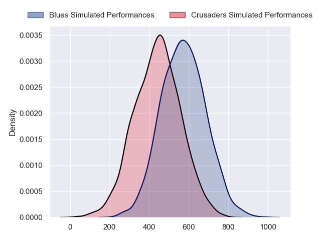
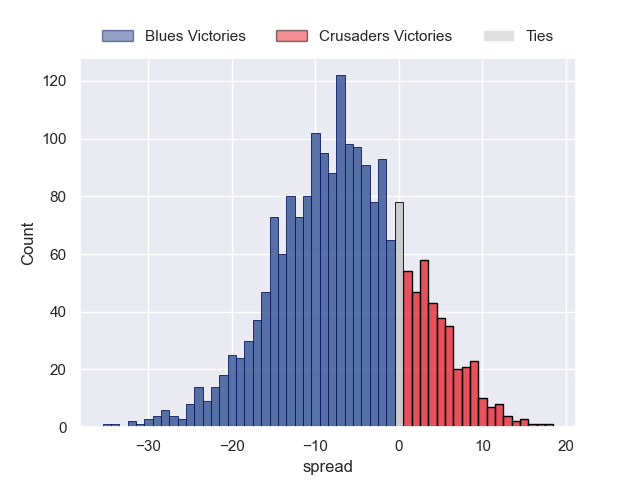

---  
layout: page  
title: Blues at Crusaders  
date: 2024-05-25 18:00:00 -0500  
categories: "Super Rugby Pacific 2024" match projection  
---
# Blues at Crusaders

# Club Level Predictions

The first set of predictions treats a club as the smallest object, as the club develops its members, organizes a gameplan, and deploys its players as needed for each match. This club model has a prediction of 0.22, which translates to predicting Blues to win by 7.3.

Our Over/Under is 64.5 - and combined with the spread above, we have a predicted scoreline of 36 to 28

Each club has a rating and a rating deviation (similar to a Glicko rating), and expected performances can be generated. This allows for simulated matches and spreads like the ones below.
## Projected Performances - Club Model

## Projected Spreads - Club Model

## Projected Results - Club Model

# Player Level Predictions

Treating teams instead as an entity made up of the currently active players, I have ratings for each player in an altogether different system. These can be combined to form team ratings once teamsheets are announced, weighting starters a bit higher than the reserves. After the match is played, players can be weighted by their minutes on the field, allowing for an accurate measure of the team's composition. With these compiled team ratings, we can make predictions, measure inaccuracy, and update the individual player ratings.
## Prediction without Player Minutes: Blues by 6.9

Blues by 11.2 on a neutral pitch

## Projected Performances - Player Model

## Projected Spreads - Player Model

## Projected Results - Player Model

| Away Player       |   Away Percentile |   Number |   Home Percentile | Home Player          |
|:------------------|------------------:|---------:|------------------:|:---------------------|
| Ofa Tu'ungafasi   |             99.18 |        1 |             54.49 | Joe Moody            |
| Kurt Eklund       |             91.8  |        2 |             99.34 | Codie Taylor         |
| Angus Ta'avao     |             97.31 |        3 |              1.31 | Fletcher Newell      |
| Patrick Tuipulotu |             95.94 |        4 |             11.87 | Antonio Shalfoon     |
| Sam Darry         |             46.65 |        5 |             90.57 | Quinten Strange      |
| Akira Ioane       |             96.86 |        6 |             80.41 | Cullen Grace         |
| Adrian Choat      |             69.98 |        7 |             98.13 | Ethan Blackadder     |
| Hoskins Sotutu    |             95.61 |        8 |             36.19 | Christian Lio-Willie |
| Taufa Funaki      |             29.32 |        9 |             63.53 | Noah Hotham          |
| Harry Plummer     |             93.21 |       10 |             32.48 | Fergus Burke         |
| AJ Lam            |             79.77 |       11 |             82.02 | Sevu Reece           |
| Corey Evans       |             79.98 |       12 |             94.65 | David Havili         |
| Rieko Ioane       |             88.26 |       13 |             67.3  | Levi Aumua           |
| Mark Tele'a       |             80.67 |       14 |             12.88 | Chay Fihaki          |
| Stephen Perofeta  |             97.45 |       15 |             79.49 | Johnny McNicholl     |
| Ricky Riccitelli  |             88.36 |       16 |              9.34 | George Bell          |
| Josh Fusitu'a     |             49.43 |       17 |              6.77 | George Bower         |
| PJ Sheck          |             87.6  |       18 |             83.2  | Tamaiti Williams     |
| Josh Beehre       |             81.03 |       19 |             21.91 | Jamie Hannah         |
| Cameron Suafoa    |             67.24 |       20 |             62.3  | Tom Christie         |
| Sam Nock          |             82.2  |       21 |             87.78 | Mitchell Drummond    |
| Cole Forbes       |             75.64 |       22 |              7.64 | Taha Kemara          |
| Caleb Tangitau    |            nan    |       23 |             60.69 | Dallas McLeod        |

